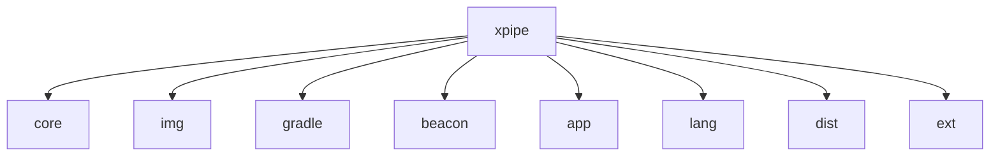

# 基础信息

|      |      |
|------|------|
| 名称 | xpipe |
| 编码语言 | .java |
| 代码路径 | xpipe |
| 概述说明 | XPipe核心功能集合，含安全加密、跨平台适配、交互界面等。  

Beacon接口的Java API服务系统，客户端-服务端架构，提供系统交互功能。  

XPipe应用核心实现，跨平台桌面框架，含安全存储、终端管理、文件传输等。  

综合性基础设施管理平台，含容器管理、系统管理、基础扩展模块。 |

# 说明

## 概述

XPipe是一个综合性的跨平台基础设施管理平台，采用现代化Java技术栈构建，包含多个功能模块组成的完整生态系统。系统采用分层架构设计，核心特点包括：

1. **安全体系**：
   - 端到端加密（AES-128/GCM）
   - 敏感数据全生命周期管理
   - 自动脱敏序列化机制

2. **跨平台能力**：
   - 统一文件系统抽象层
   - 智能路径标准化转换
   - 多Shell方言适配

3. **扩展架构**：
   - 模块化设计（JPMS）
   - 容器化支持（LXD/Podman/Incus）
   - 插件式扩展接口

4. **交互系统**：
   - 类型安全输入验证
   - 动态流程控制引擎
   - JavaFX响应式UI框架

## 主要业务场景

### 1. 安全运维管理
- **凭证管理**：加密存储SSH密钥/API密钥
- **安全审计**：操作日志记录与反混淆
- **容器安全**：镜像验证与权限控制

### 2. 跨平台自动化
- **智能路径转换**：Windows/Unix路径自动适配
- **统一文件操作**：跨系统文件管理API
- **混合环境编排**：同时管理Windows/Linux/macOS节点

### 3. 终端控制中心
- **连接管理**：
  - SSH多跳隧道
  - 会话持久化
  - 断线自动恢复
- **Shell适配**：
  - Bash/PowerShell自动检测
  - 命令转换
  - 输出解析

### 4. 开发运维一体化
- **DevOps支持**：
  - 容器化开发环境管理
  - CI/CD流程集成
  - 基础设施即代码
- **调试支持**：
  - 测试桩实现
  - 环境隔离
  - 状态快照

### 5. 系统管理套件
- **服务监控**：
  - 进程管理
  - 资源监控
  - 告警通知
- **批量操作**：
  - 并行命令执行
  - 脚本编排
  - 结果汇总

### 6. 用户工作台
- **统一界面**：
  - 主题定制
  - 多语言支持
  - 辅助功能
- **工具集成**：
  - 密码管理器对接
  - 外部工具调用
  - 剪贴板管理

各模块通过标准化接口协作，核心模块包括：
- `xpipe/core`：提供基础加密、跨平台等核心能力
- `xpipe/beacon`：处理客户端-服务端通信
- `xpipe/app`：实现桌面应用功能
- `xpipe/ext`：提供容器管理等扩展功能

系统采用不可变对象和纯函数设计保障线程安全，所有核心操作均包含完整的异常处理链路，支持从开发到生产的全生命周期管理。

### 包内部结构视图

该流程图展示了xpipe项目的模块结构，根节点为xpipe，包含8个直接子模块：core、img、gradle、beacon、app、lang、dist和ext。每个子模块与主项目形成清晰的层级关系，体现了项目的一级目录组织结构，没有嵌套更深层次的子目录。所有节点名称均采用路径最后一级元素，符合简洁明了的可视化要求。

# 文件列表 File List

| 名称   | 类型  | 说明 |
|-------|------|-------------|
| [ext](ext/base/src/main/java/io/_module.md) | folder | Java容器管理系统，支持LXD/Podman/Incus统一管理，含生命周期、配置、监控功能。  

Java系统管理框架，提供身份认证、服务控制、脚本执行、存储和文件操作。 |
| [app](app/src/main/java/io/_module.md) | folder | XPipe核心框架：模块化跨平台JavaFX应用，含基础框架、数据加密、终端控制、服务组件及扩展体系，支持多模式运行、企业级安全及动态模块加载。 |
| [beacon](beacon/src/main/java/io/_module.md) | folder | 基于Beacon接口的Java API服务系统，提供客户端-服务端交互框架，支持连接管理、文件操作和终端控制。 |
| [core](core/src/main/java/io/_module.md) | folder | XPipe核心模块提供安全加密、跨平台文件管理、交互对话框、终端控制等功能，支持多种业务场景。 |

