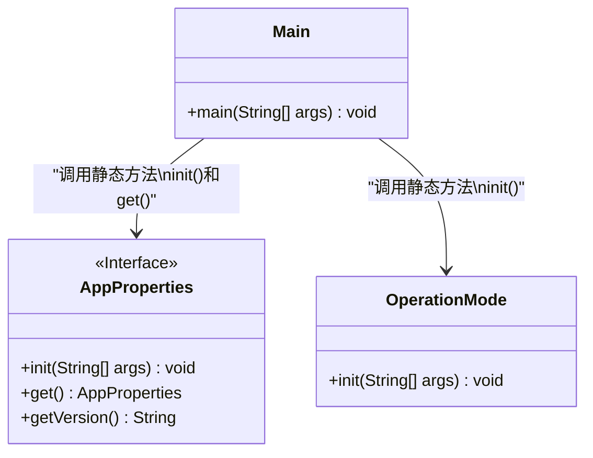
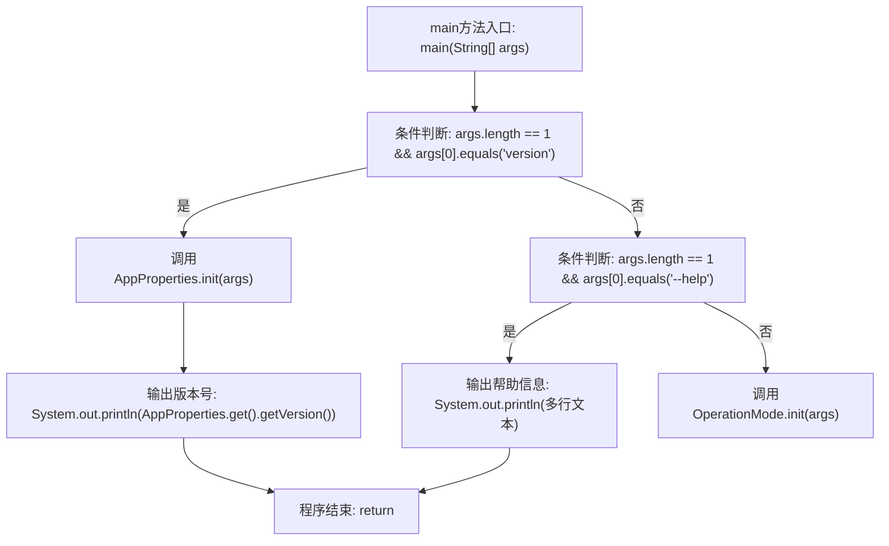

# 基础信息

|      |      |
|------|------|
| 名称 | Main |
| 编码语言 | .java |
| 代码路径 | xpipe/app/src/main/java/io/xpipe/app/Main.java |
| 包名 | io.xpipe.app |
| 依赖项 | ['io.xpipe.app.core.AppProperties', 'io.xpipe.app.core.mode.OperationMode'] |
| 概述说明 | Java主类，处理命令行参数version和--help，否则初始化操作模式。 |

# 说明

该Java类Main包含主程序入口，主要处理命令行参数。当参数为"version"时，初始化应用属性并输出版本号；当参数为"--help"时，显示帮助信息，说明该守护进程不接受命令行参数，并指引用户查阅CLI文档链接。其他情况下初始化操作模式。程序在Windows控制台运行时不会输出内容。

# 类列表 Class Summary

| 名称   | 类型  | 说明 |
|-------|------|-------------|
| Main | class | Java主类，处理版本查询和帮助参数，否则初始化操作模式。 |

## 类 Main

|      |      |
|------|------|
| 访问范围 | public |
| 类型 | class |
| 名称 | Main |
| 说明 | Java主类，处理版本查询和帮助参数，否则初始化操作模式。 |

### UML类图

这段类图展示了Main类与AppProperties接口、OperationMode类之间的静态方法调用关系。Main作为程序入口，根据命令行参数的不同情况分别调用AppProperties的版本信息获取功能或OperationMode的初始化功能。AppProperties被定义为接口，包含初始化、获取实例和版本号的方法；OperationMode则提供初始化方法。整个设计体现了命令行参数的分派处理逻辑，支持版本查询(--help)和运行模式初始化两种核心功能。

### 内部方法调用关系图

这段代码流程图描述了主程序的执行逻辑。程序首先检查命令行参数，如果参数是"version"则初始化应用属性并打印版本号后退出；如果是"--help"则输出帮助信息后退出；否则初始化操作模式。流程清晰展示了三种不同参数路径的处理方式，包括条件分支、方法调用和终止控制，覆盖了所有可能的执行路径。

### 字段列表 Field List

| 名称  | 类型  | 说明 |
|-------|-------|------|

### 方法列表 Method List

| 名称  | 类型  | 说明 |
|-------|-------|------|
| main | void | Java主函数，处理version和help参数，否则初始化操作模式。 |

