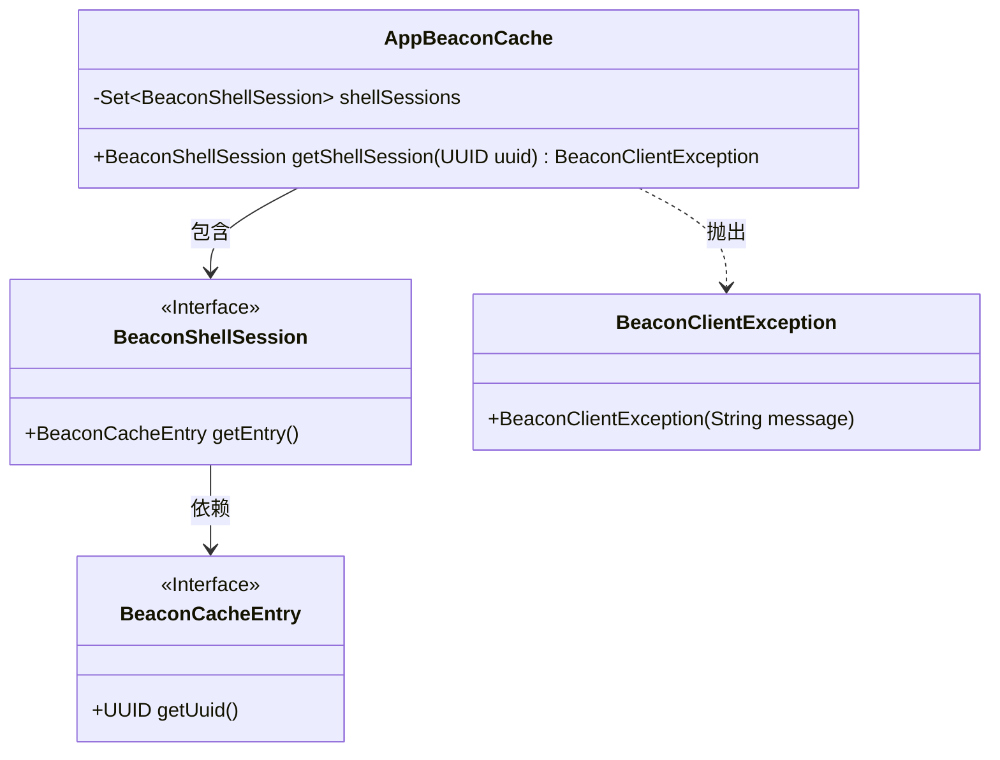
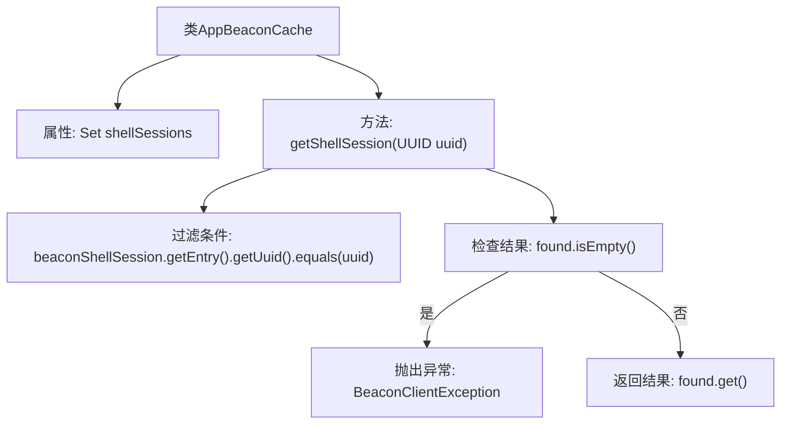

# 基础信息

|      |      |
|------|------|
| 名称 | AppBeaconCache |
| 编码语言 | .java |
| 代码路径 | xpipe/app/src/main/java/io/xpipe/app/beacon/AppBeaconCache.java |
| 包名 | io.xpipe.app.beacon |
| 依赖项 | ['io.xpipe.beacon.BeaconClientException', 'lombok.Value', 'java.util.HashSet', 'java.util.Set', 'java.util.UUID'] |
| 概述说明 | AppBeaconCache类管理BeaconShellSession集合，提供按UUID查找会话功能，找不到时抛出异常。 |

# 说明

AppBeaconCache类管理一组BeaconShellSession对象，存储在shellSessions集合中。提供了getShellSession方法，通过UUID查找对应的会话。若找不到匹配会话，抛出BeaconClientException异常，提示无活跃会话。方法使用流式操作筛选匹配项，确保精确检索。

# 类列表 Class Summary

| 名称   | 类型  | 说明 |
|-------|------|-------------|
| AppBeaconCache | class | 存储BeaconShellSession集合，通过UUID查找会话，不存在则抛异常。 |

## 类 AppBeaconCache

|      |      |
|------|------|
| 访问范围 | @Value;public |
| 类型 | class |
| 名称 | AppBeaconCache |
| 说明 | 存储BeaconShellSession集合，通过UUID查找会话，不存在则抛异常。 |

### UML类图

这段代码展示了一个应用信标缓存类(AppBeaconCache)，它管理一组BeaconShellSession对象。核心功能是通过UUID查找特定的shell会话，若不存在则抛出BeaconClientException。类图中包含四个主要元素：AppBeaconCache作为主类，依赖BeaconShellSession接口获取会话信息，而BeaconShellSession又依赖BeaconCacheEntry接口获取UUID，异常处理通过BeaconClientException实现。整个设计体现了清晰的层级关系和职责划分。

### 内部方法调用关系图

这段代码流程图展示了AppBeaconCache类的核心结构和工作流程。该类通过HashSet存储BeaconShellSession对象，并提供getShellSession方法根据UUID查找会话。方法首先通过流式过滤匹配指定UUID的会话，若未找到则抛出异常，否则返回找到的会话对象。流程清晰展现了数据查询、条件判断和异常处理的分支逻辑。

### 字段列表 Field List

| 名称  | 类型  | 说明 |
|-------|-------|------|
| shellSessions = new HashSet<>() | Set<BeaconShellSession> | 创建存储BeaconShellSession的HashSet集合。 |

### 方法列表 Method List

| 名称  | 类型  | 说明 |
|-------|-------|------|
| getShellSession | BeaconShellSession | 通过UUID获取BeaconShellSession，不存在则抛出异常。 |

