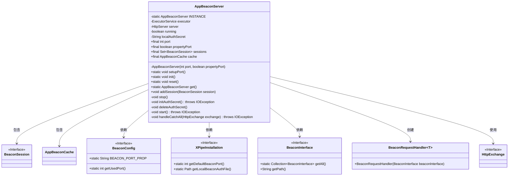

# 基础信息

|      |      |
|------|------|
| 名称 | AppBeaconServer |
| 编码语言 | .java |
| 代码路径 | xpipe/app/src/main/java/io/xpipe/app/beacon/AppBeaconServer.java |
| 包名 | io.xpipe.app.beacon |
| 依赖项 | ['io.xpipe.app.issue.ErrorEvent', 'io.xpipe.app.issue.TrackEvent', 'io.xpipe.app.util.DocumentationLink', 'io.xpipe.beacon.BeaconConfig', 'io.xpipe.beacon.BeaconInterface', 'io.xpipe.core.process.OsType', 'io.xpipe.core.util.XPipeInstallation', 'com.sun.net.httpserver.HttpExchange', 'com.sun.net.httpserver.HttpServer', 'lombok.Getter', 'java.io.IOException', 'java.net.HttpURLConnection', 'java.net.Inet4Address', 'java.net.InetSocketAddress', 'java.nio.file.Files', 'java.nio.file.attribute.PosixFilePermissions', 'java.util', 'java.util.concurrent.ExecutorService', 'java.util.concurrent.Executors', 'java.util.concurrent.TimeUnit'] |
| 概述说明 | AppBeaconServer类管理HTTP服务器，处理端口设置、会话和认证，支持启动、停止和重置操作。 |

# 说明

该内容描述了一个名为AppBeaconServer的单例类，用于管理本地HTTP信标服务器。类中包含端口号、属性端口标志、运行状态、线程池、HTTP服务器实例等核心属性。提供了初始化端口、启动服务器、停止服务、重置实例、管理会话等方法。启动时会生成随机认证密钥文件并设置权限，创建固定线程池和本地HTTP服务器，绑定特定IP和端口，处理不同路径的请求。异常情况下会记录错误事件但不会终止程序。支持通过系统属性配置端口，默认使用安装包指定端口。

# 类列表 Class Summary

| 名称   | 类型  | 说明 |
|-------|------|-------------|
| AppBeaconServer | class | AppBeaconServer类：单例HTTP服务器，管理端口、会话和认证，支持启动/停止操作。 |

## 类 AppBeaconServer

|      |      |
|------|------|
| 访问范围 | public |
| 类型 | class |
| 名称 | AppBeaconServer |
| 说明 | AppBeaconServer类：单例HTTP服务器，管理端口、会话和认证，支持启动/停止操作。 |

### UML类图

该代码实现了一个单例模式的HTTP信标服务器，负责管理端口配置、会话缓存、认证密钥和请求处理。核心功能包括通过系统属性或默认值初始化端口，启动/停止HTTP服务，处理信标接口请求，以及重定向未匹配请求。类图展示了与配置接口、会话管理、缓存系统之间的交互关系，体现了模块化设计和依赖倒置原则。

### 内部方法调用关系图

流程图描述：该流程图展示了AppBeaconServer类的完整结构，包括静态属性INSTANCE、各类成员变量、构造方法和关键方法调用关系。核心流程包括setupPort初始化端口、init启动服务、reset重置服务、start创建HTTP服务器等。私有方法处理认证密钥管理、服务启停和请求处理等细节，通过清晰的箭头连接展示了各方法间的调用顺序和依赖关系。

### 字段列表 Field List

| 名称  | 类型  | 说明 |
|-------|-------|------|
| sessions = new HashSet<>() | Set<BeaconSession> | 私有不可变会话集合，使用HashSet存储BeaconSession对象。 |
| port | int | 私有整型端口变量，带Getter方法。 |
| executor | ExecutorService | 私有线程池服务实例。 |
| server | HttpServer | 私有HTTP服务器实例 |
| INSTANCE | AppBeaconServer | 私有静态单例实例 |
| localAuthSecret | String | 私有字符串类型变量localAuthSecret的Getter方法。 |
| running | boolean | 私有布尔变量running |
| propertyPort | boolean | 私有布尔类型只读属性propertyPort。 |
| cache = new AppBeaconCache() | AppBeaconCache | 私有终态缓存实例，类型为AppBeaconCache。 |

### 方法列表 Method List

| 名称  | 类型  | 说明 |
|-------|-------|------|
| init | void | 初始化HTTP服务器，记录启动或错误事件。 |
| get | AppBeaconServer | 获取AppBeaconServer单例实例 |
| addSession | void | 添加会话到集合中。 |
| reset | void | 静态方法reset()：停止实例、删除密钥并置空。 |
| setupPort | void | 静态方法setupPort设置端口，优先读取系统属性，否则使用默认端口，创建AppBeaconServer实例。 |
| stop | void | 停止服务：检查运行状态，关闭服务器和线程池，等待30秒终止。 |
| initAuthSecret | void | 初始化认证密钥：生成UUID写入文件，非Windows系统设置权限为rw-rw----。 |
| deleteAuthSecret | void | 删除本地认证文件，忽略异常。 |
| start | void | 创建5线程HTTP服务器，处理特定路径请求，默认异常处理，监听本地端口。 |
| handleCatchAll | void | 处理未定义路由，重定向至API文档链接并关闭连接。 |

