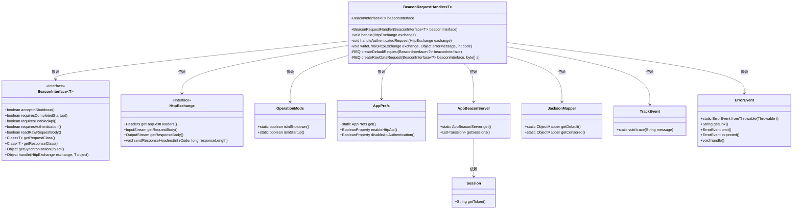
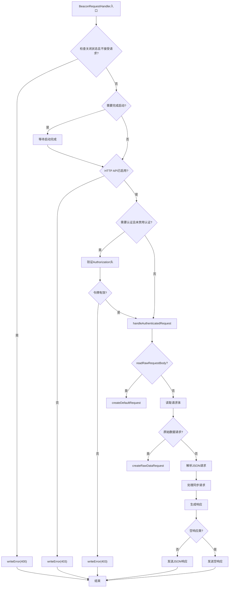

# 基础信息

|      |      |
|------|------|
| 名称 | BeaconRequestHandler |
| 编码语言 | .java |
| 代码路径 | xpipe/app/src/main/java/io/xpipe/app/beacon/BeaconRequestHandler.java |
| 包名 | io.xpipe.app.beacon |
| 依赖项 | ['io.xpipe.app.core.mode.OperationMode', 'io.xpipe.app.issue.ErrorEvent', 'io.xpipe.app.issue.TrackEvent', 'io.xpipe.app.prefs.AppPrefs', 'io.xpipe.app.util.ThreadHelper', 'io.xpipe.beacon', 'io.xpipe.core.util.JacksonMapper', 'com.sun.net.httpserver.HttpExchange', 'com.sun.net.httpserver.HttpHandler', 'lombok.SneakyThrows', 'java.io.IOException', 'java.io.InputStream', 'java.io.OutputStream', 'java.nio.charset.StandardCharsets', 'java.util.Arrays'] |
| 概述说明 | Beacon请求处理器，处理HTTP请求，验证权限并返回响应。 |

# 说明

BeaconRequestHandler是一个实现了HttpHandler接口的泛型类，用于处理HTTP请求。它通过BeaconInterface接口进行请求处理，支持多种验证和错误处理机制。主要功能包括：检查系统状态（如关闭或启动阶段）、验证API启用状态、处理认证请求（包括Bearer令牌验证）、解析请求体（支持原始数据和JSON格式）、同步处理请求、生成响应（包括错误响应和成功响应）。此外，还包含对请求和响应的序列化与反序列化处理，以及详细的错误日志记录和事件跟踪。

# 类列表 Class Summary

| 名称   | 类型  | 说明 |
|-------|------|-------------|
| BeaconRequestHandler | class | Beacon请求处理器，处理HTTP请求，验证授权、状态和API设置，返回响应或错误。 |

## 类 BeaconRequestHandler

|      |      |
|------|------|
| 访问范围 | public |
| 类型 | class |
| 名称 | BeaconRequestHandler |
| 说明 | Beacon请求处理器，处理HTTP请求，验证授权、状态和API设置，返回响应或错误。 |

### UML类图

这段代码展示了一个泛型HTTP请求处理器BeaconRequestHandler，它实现了HttpHandler接口，主要用于处理不同类型的Beacon请求。该类通过依赖BeaconInterface接口来定义具体请求处理逻辑，同时与OperationMode、AppPrefs等辅助类交互来检查系统状态和配置。处理器包含完整的请求生命周期管理，包括身份验证、请求解析、同步控制、错误处理和响应生成等功能，通过JacksonMapper进行JSON序列化/反序列化，并使用TrackEvent和ErrorEvent进行日志记录和错误跟踪。

### 内部方法调用关系图

这段代码是BeaconRequestHandler类的实现，主要处理HTTP请求的分发和响应。流程图展示了从请求接收到响应返回的完整流程，包括状态检查、认证验证、请求解析、同步处理、响应生成等关键步骤。该处理器支持多种请求处理模式（原始数据/JSON），实现了完善的错误处理机制，并能根据接口配置自动适配不同的处理逻辑。整个流程包含15个主要判断节点和10个处理步骤，展现了高度结构化的请求处理逻辑。

### 字段列表 Field List

| 名称  | 类型  | 说明 |
|-------|-------|------|
| beaconInterface | BeaconInterface<T> | 私有BeaconInterface对象beaconInterface。 |

### 方法列表 Method List

| 名称  | 类型  | 说明 |
|-------|-------|------|
| writeError | void | 私有方法：发送HTTP错误响应，包含状态码和JSON消息，异常时处理错误。 |
| createDefaultRequest | REQ | 通过反射创建默认请求对象，调用构建器方法并返回实例。 |
| handle | void | 处理HTTP请求，检查关闭状态、启动完成、API启用及认证，通过后执行请求。 |
| handleAuthenticatedRequest | void | 处理认证请求，解析输入并生成响应，捕获异常并返回错误信息。 |
| createRawDataRequest | REQ | 通过反射调用构建器方法创建请求对象，设置字节数组参数并返回结果。 |

