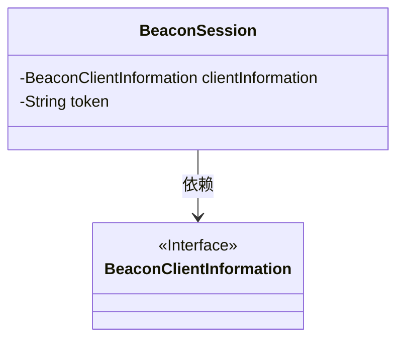
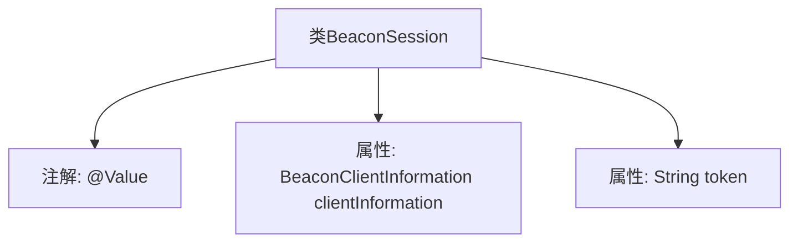

# 基础信息

|      |      |
|------|------|
| 名称 | BeaconSession |
| 编码语言 | .java |
| 代码路径 | xpipe/app/src/main/java/io/xpipe/app/beacon/BeaconSession.java |
| 包名 | io.xpipe.app.beacon |
| 依赖项 | ['io.xpipe.beacon.BeaconClientInformation', 'lombok.Value'] |
| 概述说明 | BeaconSession类包含客户端信息和令牌字段。 |

# 说明

这是一个名为BeaconSession的公开类，使用@Value注解标记。该类包含两个成员变量：clientInformation和token。clientInformation是BeaconClientInformation类型的对象，用于存储客户端相关信息；token是一个字符串类型的变量，用于存储会话令牌。这个类结构简洁，主要用于封装与信标会话相关的数据。

# 类列表 Class Summary

| 名称   | 类型  | 说明 |
|-------|------|-------------|
| BeaconSession | class | BeaconSession类包含客户端信息和令牌字段。 |

## 类 BeaconSession

|      |      |
|------|------|
| 访问范围 | @Value;public |
| 类型 | class |
| 名称 | BeaconSession |
| 说明 | BeaconSession类包含客户端信息和令牌字段。 |

### UML类图

这段类图展示了BeaconSession类与BeaconClientInformation接口之间的关系。BeaconSession包含两个私有成员变量：一个实现了BeaconClientInformation接口的对象和一个字符串类型的token。BeaconSession依赖于BeaconClientInformation接口，表明它使用了该接口定义的功能或属性。这是一个典型的值对象(Value Object)设计，用于封装相关数据，其中BeaconClientInformation作为接口提供了客户端信息的抽象规范。

### 内部方法调用关系图

这段代码展示了一个名为BeaconSession的类，该类使用了Spring框架的@Value注解，表明其属性可能通过依赖注入进行初始化。类中包含两个属性：clientInformation（BeaconClientInformation类型）和token（String类型）。流程图清晰地呈现了类结构与注解的关联关系，体现了Spring配置类的基本特征，但未展示具体方法逻辑。

### 字段列表 Field List

| 名称  | 类型  | 说明 |
|-------|-------|------|
| clientInformation | BeaconClientInformation | Beacon客户端信息对象。 |
| token | String | 声明字符串变量token。 |

### 方法列表 Method List

| 名称  | 类型  | 说明 |
|-------|-------|------|

