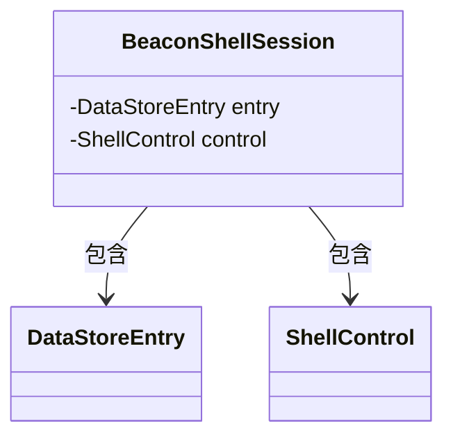
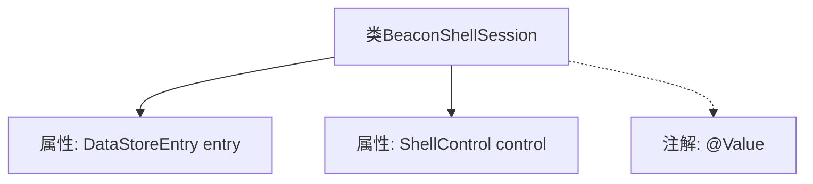

# 基础信息

|      |      |
|------|------|
| 名称 | BeaconShellSession |
| 编码语言 | .java |
| 代码路径 | xpipe/app/src/main/java/io/xpipe/app/beacon/BeaconShellSession.java |
| 包名 | io.xpipe.app.beacon |
| 依赖项 | ['io.xpipe.app.storage.DataStoreEntry', 'io.xpipe.core.process.ShellControl', 'lombok.Value'] |
| 概述说明 | BeaconShellSession类包含DataStoreEntry和ShellControl两个成员变量。 |

# 说明

这是一个名为BeaconShellSession的公开类，包含两个成员变量：entry和control。entry的类型为DataStoreEntry，control的类型为ShellControl。该类可能用于管理与信标或Shell会话相关的数据和操作。

# 类列表 Class Summary

| 名称   | 类型  | 说明 |
|-------|------|-------------|
| BeaconShellSession | class | BeaconShellSession类包含DataStoreEntry和ShellControl两个成员变量。 |

## 类 BeaconShellSession

|      |      |
|------|------|
| 访问范围 | @Value;public |
| 类型 | class |
| 名称 | BeaconShellSession |
| 说明 | BeaconShellSession类包含DataStoreEntry和ShellControl两个成员变量。 |

### UML类图

这段类图展示了BeaconShellSession类与DataStoreEntry和ShellControl类之间的关系。BeaconShellSession作为核心类，包含两个私有成员变量：entry（DataStoreEntry类型）和control（ShellControl类型）。通过依赖关系箭头可以看出，BeaconShellSession依赖于这两个类来实现其功能，形成了明确的组合关系。该结构表明BeaconShellSession需要借助DataStoreEntry进行数据存储操作，同时通过ShellControl来管理shell会话控制逻辑。

### 内部方法调用关系图

这段流程图展示了BeaconShellSession类的结构，包含两个核心属性（DataStoreEntry类型的entry和ShellControl类型的control）以及一个类级别的@Value注解。图中清晰地呈现了类与属性之间的包含关系，以及注解与类的关联方式，属性用实线箭头连接表示直接成员变量，注解用虚线箭头表示元数据修饰关系。

### 字段列表 Field List

| 名称  | 类型  | 说明 |
|-------|-------|------|
| entry | DataStoreEntry | 数据存储条目定义 |
| control | ShellControl | ShellControl控件实例声明。 |

### 方法列表 Method List

| 名称  | 类型  | 说明 |
|-------|-------|------|

