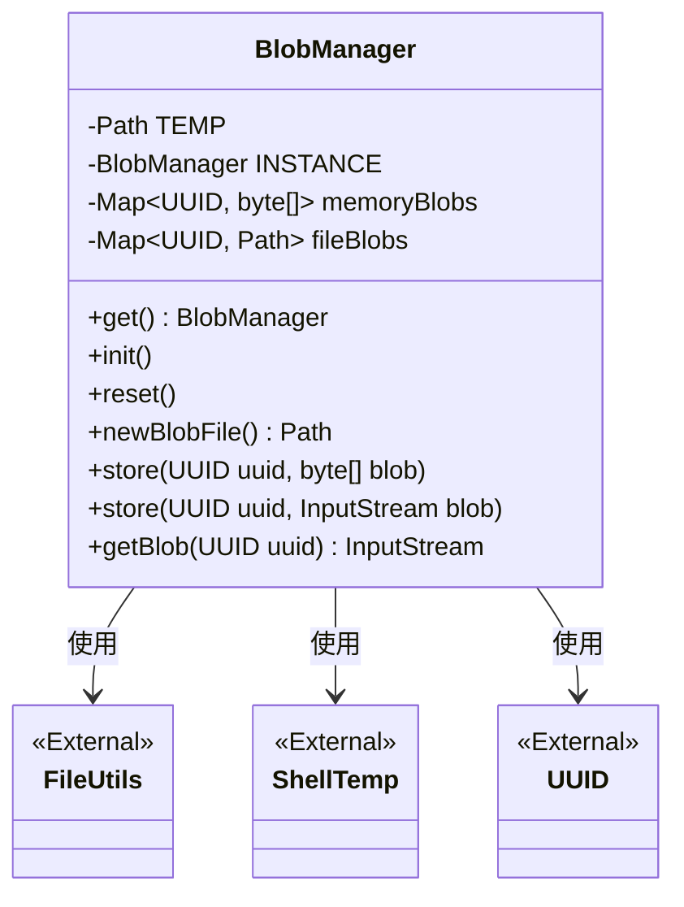
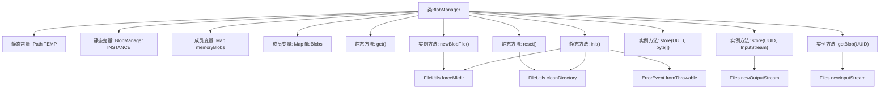

# 基础信息

|      |      |
|------|------|
| 名称 | BlobManager |
| 编码语言 | .java |
| 代码路径 | xpipe/app/src/main/java/io/xpipe/app/beacon/BlobManager.java |
| 包名 | io.xpipe.app.beacon |
| 依赖项 | ['io.xpipe.app.issue.ErrorEvent', 'io.xpipe.app.util.ShellTemp', 'io.xpipe.beacon.BeaconClientException', 'org.apache.commons.io.FileUtils', 'java.io.ByteArrayInputStream', 'java.io.IOException', 'java.io.InputStream', 'java.nio.file.Files', 'java.nio.file.Path', 'java.util.Map', 'java.util.UUID', 'java.util.concurrent.ConcurrentHashMap'] |
| 概述说明 | BlobManager管理内存和文件二进制数据，提供存储和读取功能。 |

# 说明

BlobManager是一个管理二进制大对象（Blob）的类，采用单例模式实现。它使用内存映射（ConcurrentHashMap）和临时文件存储两种方式保存Blob数据。初始化时会创建并清空临时目录，提供重置功能清理数据。主要功能包括生成新Blob文件路径、存储Blob到内存或文件、通过UUID获取Blob输入流。内存存储使用字节数组，文件存储使用临时目录下的UUID命名文件。获取数据时优先检查内存，不存在时查找文件，未找到则抛出异常。

# 类列表 Class Summary

| 名称   | 类型  | 说明 |
|-------|------|-------------|
| BlobManager | class | BlobManager管理内存和文件二进制数据，支持存储、获取和清理操作。 |

## 类 BlobManager

|      |      |
|------|------|
| 访问范围 | public |
| 类型 | class |
| 名称 | BlobManager |
| 说明 | BlobManager管理内存和文件二进制数据，支持存储、获取和清理操作。 |

### UML类图

该代码实现了一个BlobManager类，用于管理二进制大对象（Blob）的存储和检索。它提供了两种存储方式：内存存储（使用ConcurrentHashMap）和文件存储（使用临时目录），并通过UUID进行标识。类图展示了BlobManager与外部工具类FileUtils、ShellTemp以及UUID类的关系，体现了其依赖关系。BlobManager采用单例模式，提供初始化、重置、创建新文件、存储和获取Blob等方法，具有线程安全的特性。

### 内部方法调用关系图

该流程图展示了BlobManager类的完整结构，包含静态初始化、资源管理和数据存取三大功能模块。类通过双重存储机制（内存和文件系统）管理二进制大对象，使用ConcurrentHashMap保证线程安全，并通过UUID进行对象标识。初始化流程包含临时目录创建和清理操作，存储方法支持字节数组和输入流两种形式，读取方法能自动判断数据存储位置并统一返回输入流。异常处理机制通过ErrorEvent统一捕获IO操作错误。

### 字段列表 Field List

| 名称  | 类型  | 说明 |
|-------|-------|------|
| INSTANCE | BlobManager | 私有静态BlobManager单例实例 |
| memoryBlobs = new ConcurrentHashMap<>() | Map<UUID, byte[]> | 私有并发哈希表存储UUID与字节数组映射。 |
| TEMP = ShellTemp.getLocalTempDataDirectory("blob") | Path | 私有静态路径TEMP指向本地临时目录"blob"。 |
| fileBlobs = new ConcurrentHashMap<>() | Map<UUID, Path> | 私有并发映射，键为UUID，值为Path。 |

### 方法列表 Method List

| 名称  | 类型  | 说明 |
|-------|-------|------|
| getBlob | InputStream | 根据UUID获取二进制流，优先内存后文件，无数据抛异常。 |
| get | BlobManager | 获取BlobManager单例实例。 |
| init | void | 初始化BlobManager，创建并清空临时目录，异常时处理错误。 |
| store | void | 存储UUID和字节数组到内存映射。 |
| newBlobFile | Path | 创建临时文件并确保父目录存在。 |
| store | void | 存储UUID对应的输入流到临时文件并记录映射。 |
| reset | void | 静态方法reset()清空临时目录并置空INSTANCE实例。 |

