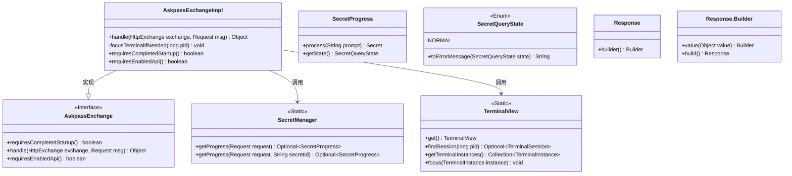
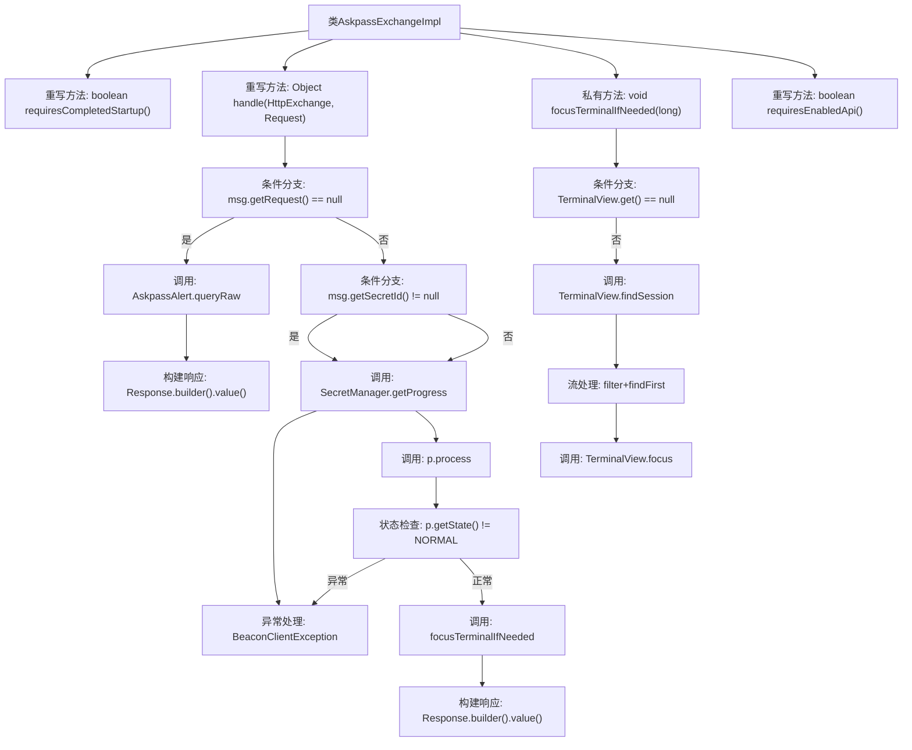

# 基础信息

|      |      |
|------|------|
| 名称 | AskpassExchangeImpl |
| 编码语言 | .java |
| 代码路径 | xpipe/app/src/main/java/io/xpipe/app/beacon/impl/AskpassExchangeImpl.java |
| 包名 | io.xpipe.app.beacon.impl |
| 依赖项 | ['io.xpipe.app.terminal.TerminalView', 'io.xpipe.app.util.AskpassAlert', 'io.xpipe.app.util.SecretManager', 'io.xpipe.app.util.SecretQueryState', 'io.xpipe.beacon.BeaconClientException', 'io.xpipe.beacon.api.AskpassExchange', 'com.sun.net.httpserver.HttpExchange'] |
| 概述说明 | AskpassExchangeImpl处理密码请求，验证秘密ID并返回响应，必要时聚焦终端。 |

# 说明

AskpassExchangeImpl类继承自AskpassExchange，实现了密码请求处理逻辑。主要功能包括：处理HTTP交换请求，若请求为空则直接查询原始密码；否则通过SecretManager获取密码进度，验证状态后返回处理结果。包含终端聚焦辅助方法，根据进程ID定位并激活对应终端窗口。类重写方法表明无需等待启动完成或启用API即可运行。异常处理涵盖未知请求和密码查询状态错误情况。

# 类列表 Class Summary

| 名称   | 类型  | 说明 |
|-------|------|-------------|
| AskpassExchangeImpl | class | AskpassExchangeImpl处理密码请求，验证密钥状态并返回响应，必要时聚焦终端。 |

## 类 AskpassExchangeImpl

|      |      |
|------|------|
| 访问范围 | public |
| 类型 | class |
| 名称 | AskpassExchangeImpl |
| 说明 | AskpassExchangeImpl处理密码请求，验证密钥状态并返回响应，必要时聚焦终端。 |

### UML类图

这段代码展示了一个实现`AskpassExchange`接口的`AskpassExchangeImpl`类，主要处理密码请求和终端聚焦逻辑。类图清晰地呈现了核心类之间的关系：`AskpassExchangeImpl`通过`SecretManager`查询密码状态，使用`TerminalView`管理终端会话，并依赖`SecretProgress`和`SecretQueryState`枚举处理密码状态转换。整个设计体现了职责分离，接口实现类专注于业务逻辑，静态工具类提供辅助功能。

### 内部方法调用关系图

流程图描述：该流程图描述了AskpassExchangeImpl类的核心逻辑流程，主要包括handle请求处理方法的分支决策链。当请求无内容时直接返回密码查询结果，否则通过SecretManager处理密钥状态，异常时抛出错误，正常时聚焦终端窗口并返回处理结果。focusTerminalIfNeeded方法实现了基于PID的终端窗口查找和聚焦逻辑，包含多层空值检查和流式过滤操作。

### 字段列表 Field List

| 名称  | 类型  | 说明 |
|-------|-------|------|

### 方法列表 Method List

| 名称  | 类型  | 说明 |
|-------|-------|------|
| handle | Object | 处理HTTP请求，检查请求和密钥状态，返回响应或异常。 |
| requiresCompletedStartup | boolean | 重写方法，启动完成前可执行。 |
| focusTerminalIfNeeded | void | 检查并聚焦指定PID的终端会话。 |
| requiresEnabledApi | boolean | 重写方法，返回false表示无需启用API。 |

