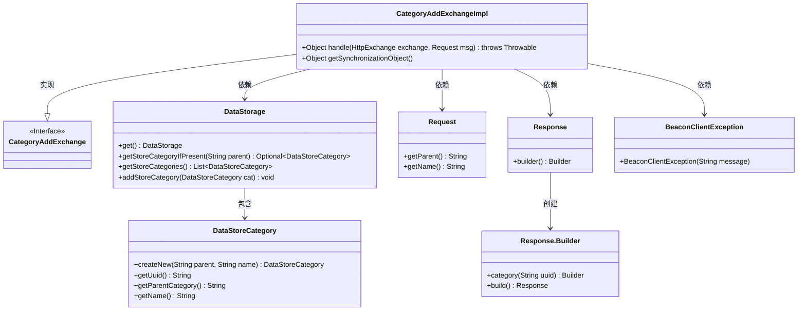
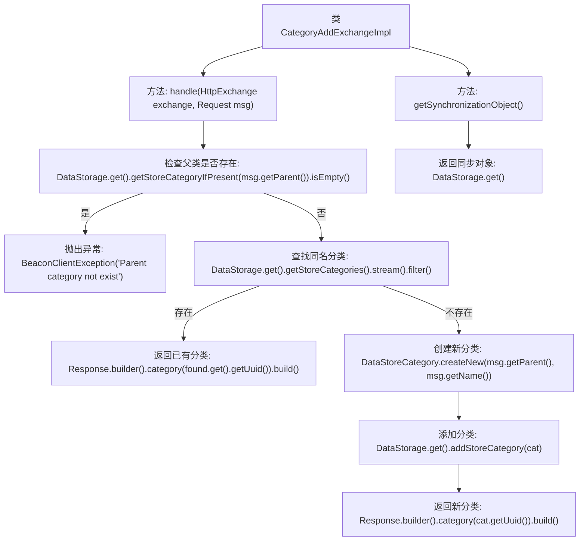

# 基础信息

|      |      |
|------|------|
| 名称 | CategoryAddExchangeImpl |
| 编码语言 | .java |
| 代码路径 | xpipe/app/src/main/java/io/xpipe/app/beacon/impl/CategoryAddExchangeImpl.java |
| 包名 | io.xpipe.app.beacon.impl |
| 依赖项 | ['io.xpipe.app.storage.DataStorage', 'io.xpipe.app.storage.DataStoreCategory', 'io.xpipe.beacon.BeaconClientException', 'io.xpipe.beacon.api.CategoryAddExchange', 'com.sun.net.httpserver.HttpExchange'] |
| 概述说明 | 类处理添加分类逻辑，检查父类存在性及名称重复，返回新分类ID或现有ID。 |

# 说明

CategoryAddExchangeImpl类继承自CategoryAddExchange，实现了处理HTTP交换的方法。首先检查父类目是否存在，若不存在则抛出异常。接着在现有类目中查找同名同父类目的记录，若存在则返回其UUID。若不存在则创建新类目并添加到存储中，返回新类目的UUID。此外还提供了获取同步对象的方法，返回数据存储实例。整个过程涉及类目存在性验证、重复检查和新建操作。

# 类列表 Class Summary

| 名称   | 类型  | 说明 |
|-------|------|-------------|
| CategoryAddExchangeImpl | class | 类实现添加分类逻辑，检查父类存在性及名称重复，返回新分类ID或现有ID。 |

## 类 CategoryAddExchangeImpl

|      |      |
|------|------|
| 访问范围 | public |
| 类型 | class |
| 名称 | CategoryAddExchangeImpl |
| 说明 | 类实现添加分类逻辑，检查父类存在性及名称重复，返回新分类ID或现有ID。 |

### UML类图

这段类图展示了`CategoryAddExchangeImpl`类及其相关依赖关系。该类实现了`CategoryAddExchange`接口，主要处理通过HTTP交换添加分类的逻辑。它依赖`DataStorage`进行数据存储操作，使用`Request`获取输入参数，并通过`Response`返回结果。当父分类不存在时抛出`BeaconClientException`异常。图中还展示了`DataStoreCategory`实体类以及`Response`的建造者模式实现，清晰地呈现了各类之间的交互和层级关系。

### 内部方法调用关系图

该流程图展示了CategoryAddExchangeImpl类的核心处理逻辑。主要包含两个方法：handle()用于处理分类添加请求，首先验证父类是否存在，然后检查是否已有同名分类，最后创建或返回分类；getSynchronizationObject()提供线程同步对象。流程清晰展现了异常处理、条件分支和数据存储操作，完整覆盖了分类添加的业务场景。

### 字段列表 Field List

| 名称  | 类型  | 说明 |
|-------|-------|------|

### 方法列表 Method List

| 名称  | 类型  | 说明 |
|-------|-------|------|
| getSynchronizationObject | Object | 重写getSynchronizationObject方法，返回DataStorage.get()结果。 |
| handle | Object | 检查父类存在性，避免重复创建存储分类，返回新分类ID。 |

