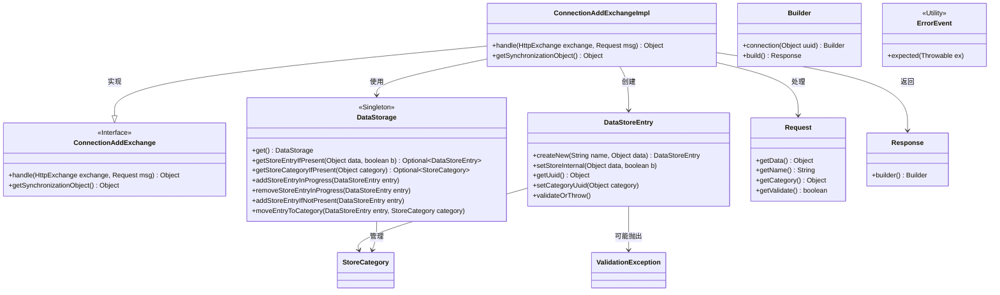
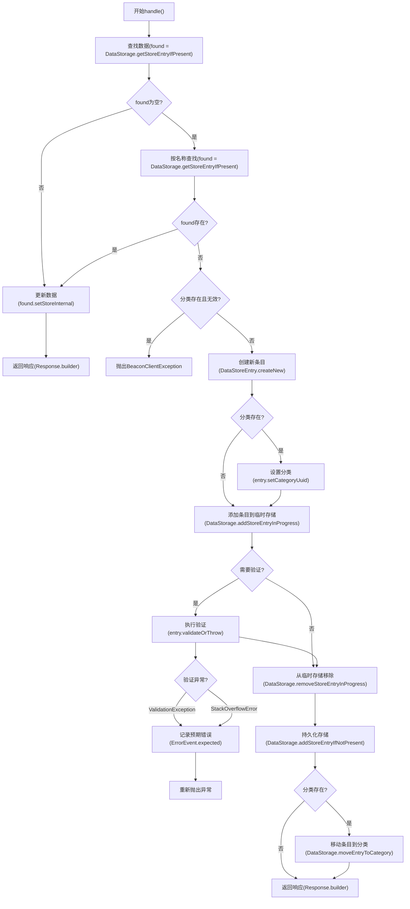
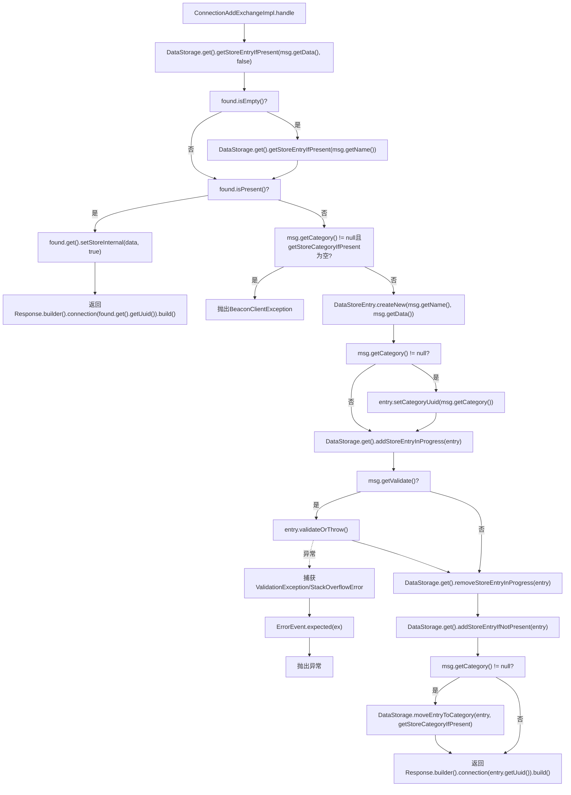

# 基础信息

|      |      |
|------|------|
| 名称 | ConnectionAddExchangeImpl |
| 编码语言 | .java |
| 代码路径 | xpipe/app/src/main/java/io/xpipe/app/beacon/impl/ConnectionAddExchangeImpl.java |
| 包名 | io.xpipe.app.beacon.impl |
| 依赖项 | ['io.xpipe.app.issue.ErrorEvent', 'io.xpipe.app.storage.DataStorage', 'io.xpipe.app.storage.DataStoreEntry', 'io.xpipe.beacon.BeaconClientException', 'io.xpipe.beacon.api.ConnectionAddExchange', 'io.xpipe.core.util.ValidationException', 'com.sun.net.httpserver.HttpExchange'] |
| 概述说明 | 处理HTTP请求，管理数据存储条目，验证并返回连接响应。 |

# 说明

ConnectionAddExchangeImpl类继承自ConnectionAddExchange，重写了handle方法处理HTTP交换请求。该方法首先检查数据存储中是否存在指定数据或名称的条目，若存在则更新数据并返回连接响应。若不存在且指定分类ID无效，抛出异常。接着创建新数据条目，设置分类ID（如有），并尝试添加到存储中，期间进行验证处理，捕获验证异常或堆栈溢出错误。最后确保条目添加完成并分配分类，返回包含新条目UUID的响应。此外，重写getSynchronizationObject方法返回数据存储实例。整个过程包含数据查找、验证、异常处理和分类管理。

# 类列表 Class Summary

| 名称   | 类型  | 说明 |
|-------|------|-------------|
| ConnectionAddExchangeImpl | class | 处理HTTP请求，检查数据存储，验证并添加新条目，返回连接UUID。 |

## 类 ConnectionAddExchangeImpl

|      |      |
|------|------|
| 访问范围 | public |
| 类型 | class |
| 名称 | ConnectionAddExchangeImpl |
| 说明 | 处理HTTP请求，检查数据存储，验证并添加新条目，返回连接UUID。 |

### UML类图

这段代码实现了一个连接添加交换处理器，主要处理HTTP交换请求，通过数据存储管理数据条目。类图展示了核心类关系，包括单例数据存储、数据条目、请求响应模型等。流程图详细描述了处理逻辑：先尝试查找现有数据，不存在则创建新条目，处理验证和分类关联，最后返回包含UUID的响应。特别注意了异常处理和临时存储管理机制。

### 内部方法调用关系图

这段流程图描述了ConnectionAddExchangeImpl类中handle方法的完整执行逻辑。该方法首先尝试通过数据或名称查找现有存储条目，若存在则更新数据并返回响应；否则会检查分类有效性，创建新条目并进行验证处理，最后将条目添加到存储系统并可能关联到指定分类。整个过程包含异常处理和资源清理，最终返回新建条目的UUID响应。

### 字段列表 Field List

| 名称  | 类型  | 说明 |
|-------|-------|------|

### 方法列表 Method List

| 名称  | 类型  | 说明 |
|-------|-------|------|
| getSynchronizationObject | Object | 重写方法，返回DataStorage单例对象。 |
| handle | Object | 处理HTTP请求，查询或创建数据存储条目，验证并返回响应。 |

