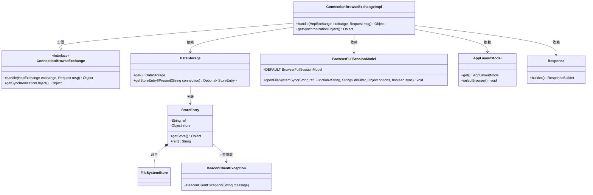
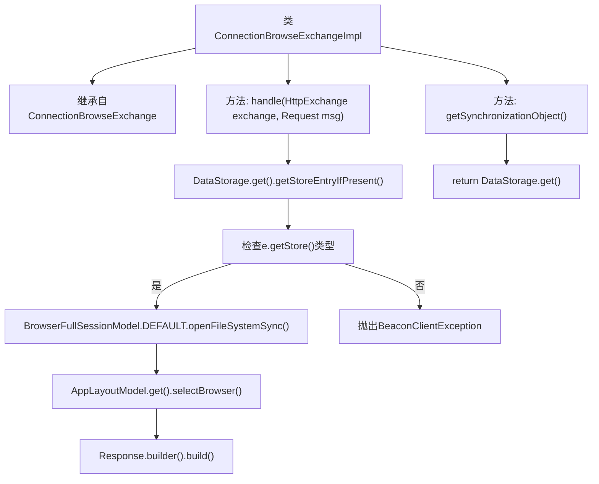

# 基础信息

|      |      |
|------|------|
| 名称 | ConnectionBrowseExchangeImpl |
| 编码语言 | .java |
| 代码路径 | xpipe/app/src/main/java/io/xpipe/app/beacon/impl/ConnectionBrowseExchangeImpl.java |
| 包名 | io.xpipe.app.beacon.impl |
| 依赖项 | ['io.xpipe.app.browser.BrowserFullSessionModel', 'io.xpipe.app.core.AppLayoutModel', 'io.xpipe.app.storage.DataStorage', 'io.xpipe.beacon.BeaconClientException', 'io.xpipe.beacon.api.ConnectionBrowseExchange', 'io.xpipe.core.store.FileSystemStore', 'com.sun.net.httpserver.HttpExchange'] |
| 概述说明 | 处理HTTP请求，验证连接类型为文件系统后打开目录并返回响应。同步对象为DataStorage。 |

# 说明

ConnectionBrowseExchangeImpl类继承自ConnectionBrowseExchange，实现了处理HTTP交换和请求的方法。其handle方法首先通过DataStorage获取存储条目，若不存在则抛出异常。检查存储类型是否为文件系统，否则抛出异常。随后使用BrowserFullSessionModel打开文件系统同步，并选择浏览器布局。最后返回空的响应。getSynchronizationObject方法返回DataStorage实例作为同步对象。整个过程涉及数据存储验证、文件系统操作和界面布局控制。

# 类列表 Class Summary

| 名称   | 类型  | 说明 |
|-------|------|-------------|
| ConnectionBrowseExchangeImpl | class | 处理HTTP请求，验证连接并打开文件系统浏览会话。 |

## 类 ConnectionBrowseExchangeImpl

|      |      |
|------|------|
| 访问范围 | public |
| 类型 | class |
| 名称 | ConnectionBrowseExchangeImpl |
| 说明 | 处理HTTP请求，验证连接并打开文件系统浏览会话。 |

### UML类图

这段代码展示了一个实现`ConnectionBrowseExchange`接口的`ConnectionBrowseExchangeImpl`类，主要用于处理文件系统浏览请求。类图清晰地呈现了其继承关系、依赖组件（如数据存储`DataStorage`、会话模型`BrowserFullSessionModel`）以及异常处理。核心逻辑通过验证连接类型、打开文件系统同步会话并更新UI布局来完成请求，体现了模块化设计和对文件系统操作的安全校验机制。

### 内部方法调用关系图

这段代码流程图展示了ConnectionBrowseExchangeImpl类的核心逻辑。主要包含两个方法：handle()处理HTTP请求，通过DataStorage验证连接类型并操作文件系统；getSynchronizationObject()返回数据存储实例。handle()方法首先检查连接有效性，若非文件系统类型则报错，否则执行文件系统同步操作并更新UI，最后返回响应。流程中严格处理了异常情况，确保类型安全性和操作原子性。

### 字段列表 Field List

| 名称  | 类型  | 说明 |
|-------|-------|------|

### 方法列表 Method List

| 名称  | 类型  | 说明 |
|-------|-------|------|
| getSynchronizationObject | Object | 重写方法返回DataStorage单例对象。 |
| handle | Object | 处理HTTP请求，检查连接类型并打开文件系统，最后返回响应。 |

