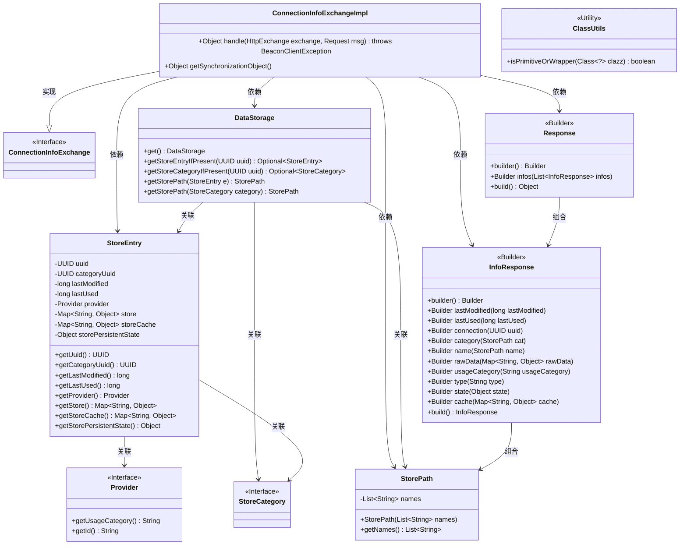
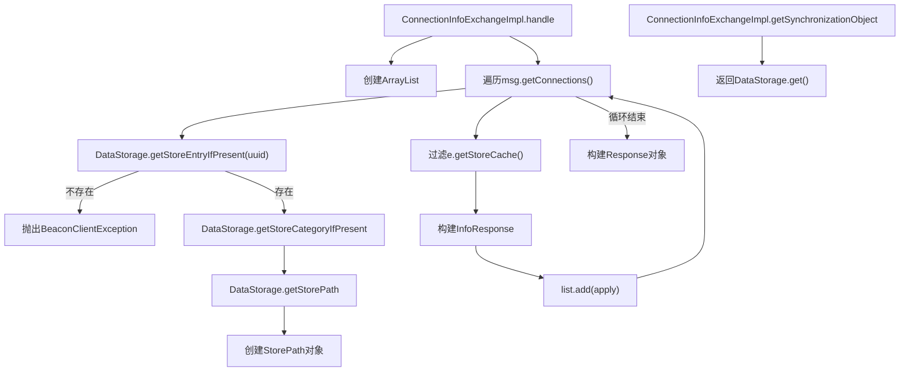
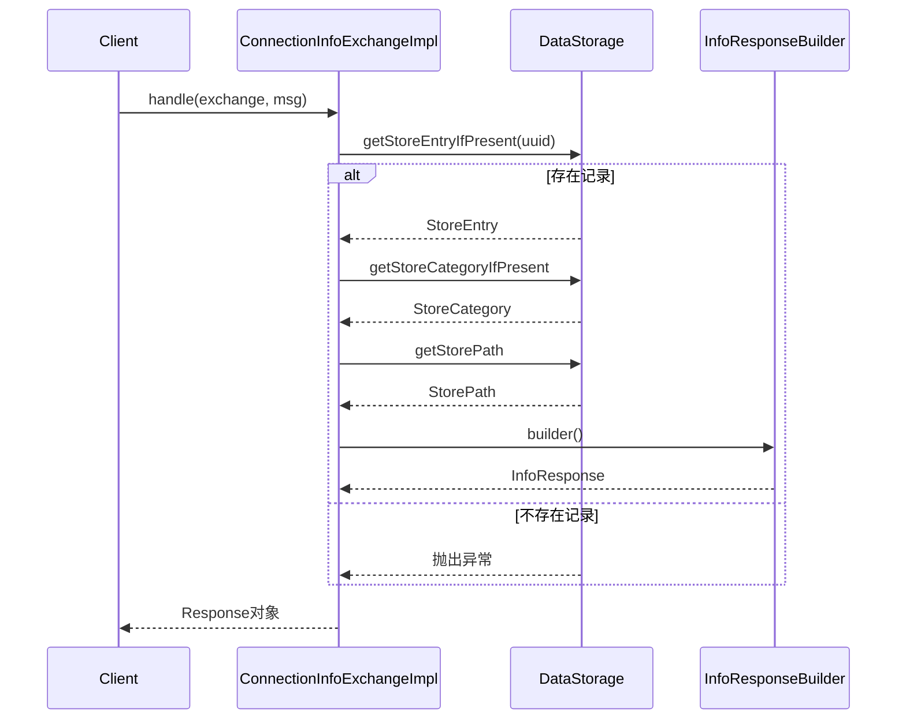

# 基础信息

|      |      |
|------|------|
| 名称 | ConnectionInfoExchangeImpl |
| 编码语言 | .java |
| 代码路径 | xpipe/app/src/main/java/io/xpipe/app/beacon/impl/ConnectionInfoExchangeImpl.java |
| 包名 | io.xpipe.app.beacon.impl |
| 依赖项 | ['io.xpipe.app.storage.DataStorage', 'io.xpipe.beacon.BeaconClientException', 'io.xpipe.beacon.api.ConnectionInfoExchange', 'io.xpipe.core.store.StorePath', 'com.sun.net.httpserver.HttpExchange', 'org.apache.commons.lang3.ClassUtils', 'java.util.ArrayList', 'java.util.UUID', 'java.util.stream.Collectors'] |
| 概述说明 | 处理HTTP请求，获取连接信息并构建响应列表。 |

# 说明

ConnectionInfoExchangeImpl类继承ConnectionInfoExchange，重写handle方法处理HTTP请求。该方法遍历请求中的UUID列表，从DataStorage获取对应连接信息，构造包含最后修改时间、使用时间、连接UUID、分类路径、原始数据等信息的InfoResponse对象列表，最终返回包含这些信息的Response对象。此外，重写getSynchronizationObject方法返回DataStorage实例作为同步对象。

# 类列表 Class Summary

| 名称   | 类型  | 说明 |
|-------|------|-------------|
| ConnectionInfoExchangeImpl | class | 处理HTTP请求，获取连接信息并构建响应列表。 |

## 类 ConnectionInfoExchangeImpl

|      |      |
|------|------|
| 访问范围 | public |
| 类型 | class |
| 名称 | ConnectionInfoExchangeImpl |
| 说明 | 处理HTTP请求，获取连接信息并构建响应列表。 |

### UML类图

这段代码实现了一个连接信息交换服务，主要处理HTTP请求并返回连接信息响应。ConnectionInfoExchangeImpl类通过DataStorage获取存储的各类信息（包括连接条目、分类、路径等），构建InfoResponse对象列表，最终封装成Response返回。该实现涉及多个数据实体类（StoreEntry、StorePath等）和工具类（ClassUtils），通过Builder模式构建复杂响应对象，同时处理了空值检查和基本类型验证等边缘情况。

### 内部方法调用关系图

这段代码实现了一个连接信息交换服务，主要处理HTTP请求并返回连接相关信息。流程图展示了两个主要方法：handle()方法通过多层数据查询和过滤构建响应列表，getSynchronizationObject()方法返回数据存储实例。时序图详细描述了handle()方法中客户端与服务端、数据存储层之间的交互过程，包括异常处理和数据转换逻辑。代码通过DataStorage获取连接元数据，过滤有效缓存条目，最终构建标准化的InfoResponse对象列表返回给客户端。

### 字段列表 Field List

| 名称  | 类型  | 说明 |
|-------|-------|------|

### 方法列表 Method List

| 名称  | 类型  | 说明 |
|-------|-------|------|
| getSynchronizationObject | Object | 重写方法，返回DataStorage的单例对象。 |
| handle | Object | 处理HTTP请求，获取连接信息并构建响应列表。 |

