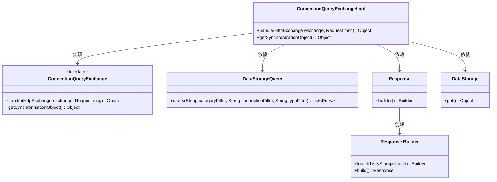
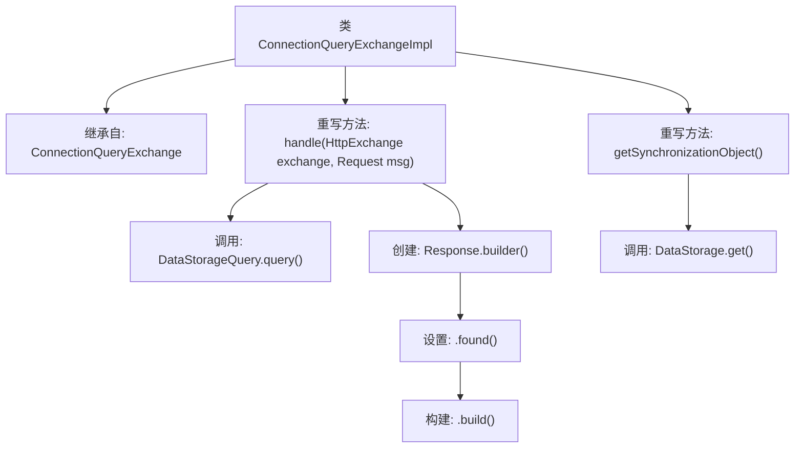

# 基础信息

|      |      |
|------|------|
| 名称 | ConnectionQueryExchangeImpl |
| 编码语言 | .java |
| 代码路径 | xpipe/app/src/main/java/io/xpipe/app/beacon/impl/ConnectionQueryExchangeImpl.java |
| 包名 | io.xpipe.app.beacon.impl |
| 依赖项 | ['io.xpipe.app.storage.DataStorage', 'io.xpipe.app.storage.DataStorageQuery', 'io.xpipe.beacon.api.ConnectionQueryExchange', 'com.sun.net.httpserver.HttpExchange'] |
| 概述说明 | Java类实现查询处理，返回过滤结果UUID列表，同步对象为DataStorage。 |

# 说明

该内容描述了一个名为ConnectionQueryExchangeImpl的类，继承自ConnectionQueryExchange。类中包含两个方法：handle方法处理HTTP交换和请求消息，通过DataStorageQuery查询符合过滤条件的数据，并返回包含UUID列表的响应；getSynchronizationObject方法返回DataStorage的单例实例用于同步。整个实现专注于数据查询和响应构建功能。

# 类列表 Class Summary

| 名称   | 类型  | 说明 |
|-------|------|-------------|
| ConnectionQueryExchangeImpl | class | Java类实现查询处理，返回匹配UUID列表，同步对象为DataStorage。 |

## 类 ConnectionQueryExchangeImpl

|      |      |
|------|------|
| 访问范围 | public |
| 类型 | class |
| 名称 | ConnectionQueryExchangeImpl |
| 说明 | Java类实现查询处理，返回匹配UUID列表，同步对象为DataStorage。 |

### UML类图

这段类图展示了ConnectionQueryExchangeImpl类与其相关组件的关系。ConnectionQueryExchangeImpl实现了ConnectionQueryExchange接口，并依赖DataStorageQuery进行数据查询、Response构建响应、DataStorage获取同步对象。Response类通过内部Builder模式构造响应对象。整体结构体现了接口实现与数据查询/构建的职责分离，其中DataStorageQuery处理多条件查询，Response封装了链式构建模式。

### 内部方法调用关系图

这段代码展示了一个继承自ConnectionQueryExchange的类ConnectionQueryExchangeImpl，它重写了两个方法：handle()和getSynchronizationObject()。handle()方法处理HTTP交换请求，通过DataStorageQuery.query()查询数据，并构建包含查询结果的响应对象；getSynchronizationObject()方法则返回DataStorage的实例用于同步控制。流程图清晰地展示了类继承关系和方法调用链，突出了数据处理和响应构建的核心逻辑。

### 字段列表 Field List

| 名称  | 类型  | 说明 |
|-------|-------|------|

### 方法列表 Method List

| 名称  | 类型  | 说明 |
|-------|-------|------|
| handle | Object | 处理HTTP请求，查询数据存储并返回匹配的UUID列表。 |
| getSynchronizationObject | Object | 重写getSynchronizationObject方法，返回DataStorage实例。 |

