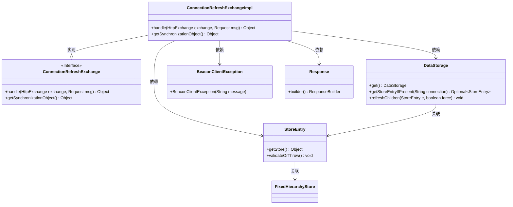
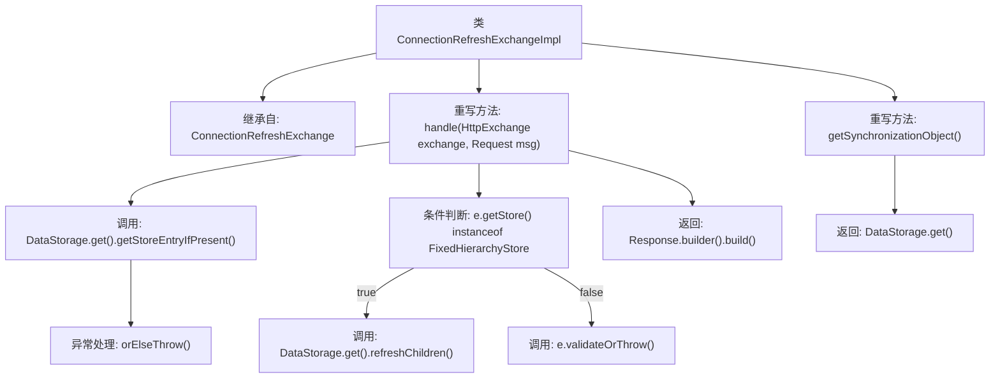

# 基础信息

|      |      |
|------|------|
| 名称 | ConnectionRefreshExchangeImpl |
| 编码语言 | .java |
| 代码路径 | xpipe/app/src/main/java/io/xpipe/app/beacon/impl/ConnectionRefreshExchangeImpl.java |
| 包名 | io.xpipe.app.beacon.impl |
| 依赖项 | ['io.xpipe.app.storage.DataStorage', 'io.xpipe.app.util.FixedHierarchyStore', 'io.xpipe.beacon.BeaconClientException', 'io.xpipe.beacon.api.ConnectionRefreshExchange', 'com.sun.net.httpserver.HttpExchange'] |
| 概述说明 | ConnectionRefreshExchangeImpl类处理连接刷新，验证或更新存储数据，同步对象为DataStorage。 |

# 说明

该代码定义了一个名为ConnectionRefreshExchangeImpl的类，继承自ConnectionRefreshExchange。主要功能是处理HTTP交换请求，通过DataStorage获取存储条目并进行验证或刷新操作。若存储类型为FixedHierarchyStore则刷新子节点，否则验证条目有效性。最后返回空响应。同步对象为DataStorage单例。异常处理包含未知连接错误提示。

# 类列表 Class Summary

| 名称   | 类型  | 说明 |
|-------|------|-------------|
| ConnectionRefreshExchangeImpl | class | 类ConnectionRefreshExchangeImpl继承ConnectionRefreshExchange，处理连接刷新，验证或更新数据存储，返回空响应。同步对象为DataStorage。 |

## 类 ConnectionRefreshExchangeImpl

|      |      |
|------|------|
| 访问范围 | public |
| 类型 | class |
| 名称 | ConnectionRefreshExchangeImpl |
| 说明 | 类ConnectionRefreshExchangeImpl继承ConnectionRefreshExchange，处理连接刷新，验证或更新数据存储，返回空响应。同步对象为DataStorage。 |

### UML类图

这段代码展示了一个连接刷新交换的实现类`ConnectionRefreshExchangeImpl`，它继承自接口`ConnectionRefreshExchange`。主要功能是通过`DataStorage`处理HTTP交换请求，验证或刷新存储条目，最终返回响应。类图中清晰地显示了实现关系、依赖关系以及关键类之间的交互，包括数据存储、存储条目和异常处理等组件。整个设计体现了对连接状态管理的封装，通过接口实现和多态性提供灵活的扩展能力。

### 内部方法调用关系图

该流程图展示了ConnectionRefreshExchangeImpl类的结构和方法调用关系。类继承自ConnectionRefreshExchange，重写了handle()和getSynchronizationObject()两个方法。handle()方法首先从DataStorage获取存储条目，若不存在则抛出异常；然后根据存储类型决定是刷新子节点还是验证条目，最后返回响应。getSynchronizationObject()方法直接返回DataStorage实例。流程清晰展现了条件分支和异常处理逻辑。

### 字段列表 Field List

| 名称  | 类型  | 说明 |
|-------|-------|------|

### 方法列表 Method List

| 名称  | 类型  | 说明 |
|-------|-------|------|
| handle | Object | 处理HTTP请求，验证连接并刷新数据存储或抛出异常。 |
| getSynchronizationObject | Object | 重写方法，返回DataStorage单例对象。 |

