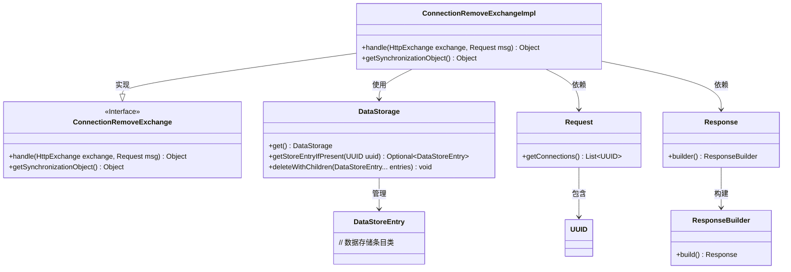
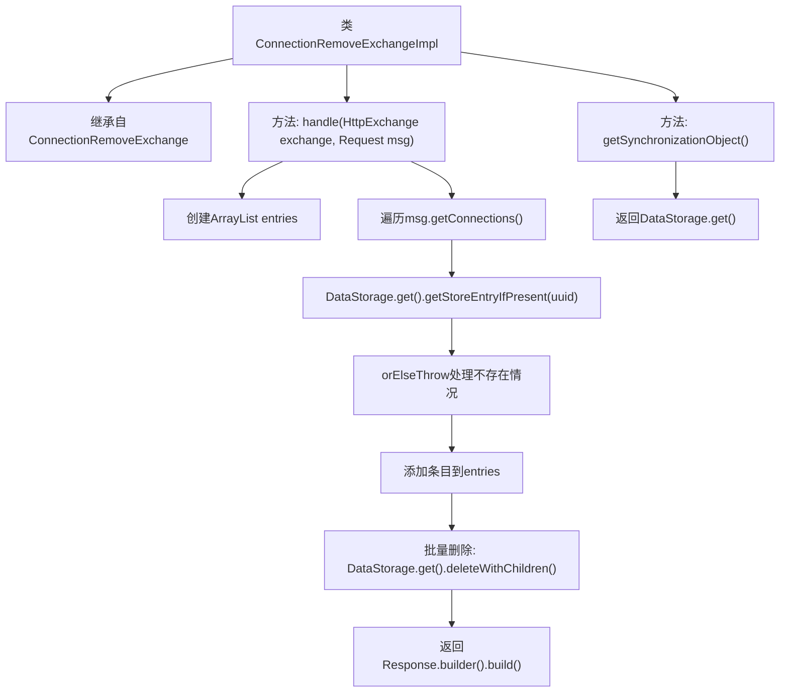

# 基础信息

|      |      |
|------|------|
| 名称 | ConnectionRemoveExchangeImpl |
| 编码语言 | .java |
| 代码路径 | xpipe/app/src/main/java/io/xpipe/app/beacon/impl/ConnectionRemoveExchangeImpl.java |
| 包名 | io.xpipe.app.beacon.impl |
| 依赖项 | ['io.xpipe.app.storage.DataStorage', 'io.xpipe.app.storage.DataStoreEntry', 'io.xpipe.beacon.BeaconClientException', 'io.xpipe.beacon.api.ConnectionRemoveExchange', 'com.sun.net.httpserver.HttpExchange', 'java.util.ArrayList', 'java.util.UUID'] |
| 概述说明 | 处理HTTP请求删除连接，验证并删除数据存储条目，返回空响应。同步对象为数据存储实例。 |

# 说明

该代码描述了一个名为ConnectionRemoveExchangeImpl的类，继承自ConnectionRemoveExchange。它重写了两个方法：handle和getSynchronizationObject。handle方法处理HTTP交换请求，接收Request消息，遍历消息中的连接UUID列表，通过DataStorage获取对应的数据存储条目，若条目不存在则抛出异常。获取所有条目后，调用DataStorage的deleteWithChildren方法删除这些条目及其子项，最后返回一个空的Response构建器。getSynchronizationObject方法返回DataStorage的单例实例作为同步对象。整个过程涉及数据存储操作和异常处理。

# 类列表 Class Summary

| 名称   | 类型  | 说明 |
|-------|------|-------------|
| ConnectionRemoveExchangeImpl | class | 处理HTTP请求删除连接，检查并删除数据存储中的条目，返回空响应。同步对象为数据存储。 |

## 类 ConnectionRemoveExchangeImpl

|      |      |
|------|------|
| 访问范围 | public |
| 类型 | class |
| 名称 | ConnectionRemoveExchangeImpl |
| 说明 | 处理HTTP请求删除连接，检查并删除数据存储中的条目，返回空响应。同步对象为数据存储。 |

### UML类图

这段代码展示了一个连接删除交换的实现类`ConnectionRemoveExchangeImpl`，它继承自接口`ConnectionRemoveExchange`。主要功能是通过HTTP交换处理请求，从数据存储中删除指定的连接条目。类图中清晰显示了实现关系（继承接口）、依赖关系（使用`DataStorage`、`Request`和`Response`类）以及数据存储管理的`DataStoreEntry`。核心逻辑是通过UUID查找并批量删除数据存储条目，最后返回构建的响应对象。整个设计体现了清晰的职责分离和模块化思想。

### 内部方法调用关系图

该流程图展示了ConnectionRemoveExchangeImpl类的核心处理逻辑。主要包含两个方法：handle()负责处理HTTP请求，通过遍历连接UUID列表获取数据存储条目，验证存在性后执行批量删除操作；getSynchronizationObject()提供线程同步对象。流程清晰体现了数据验证、异常处理和存储操作的关键步骤，特别是通过DataStorage单例进行数据管理的完整过程。箭头准确表示了方法调用顺序和数据处理流向。

### 字段列表 Field List

| 名称  | 类型  | 说明 |
|-------|-------|------|

### 方法列表 Method List

| 名称  | 类型  | 说明 |
|-------|-------|------|
| handle | Object | 重写handle方法，处理HTTP请求，获取并删除指定UUID的数据存储条目，返回空响应。 |
| getSynchronizationObject | Object | 重写方法返回DataStorage单例对象。 |

