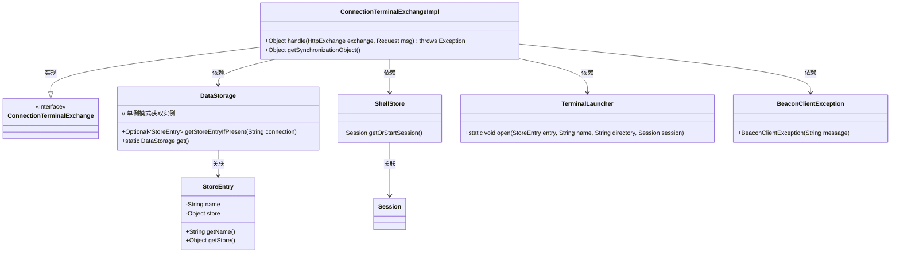
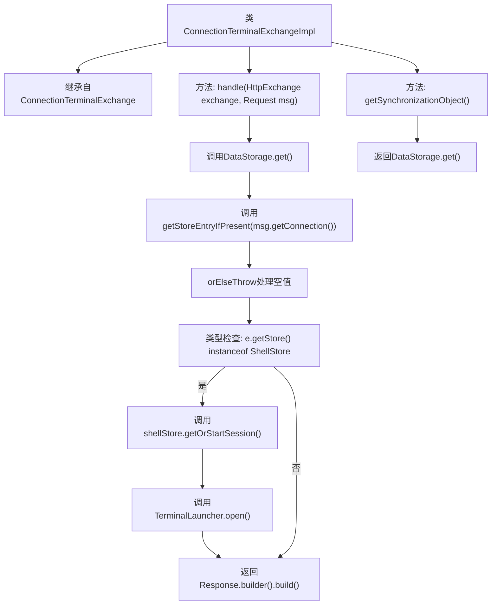

# 基础信息

|      |      |
|------|------|
| 名称 | ConnectionTerminalExchangeImpl |
| 编码语言 | .java |
| 代码路径 | xpipe/app/src/main/java/io/xpipe/app/beacon/impl/ConnectionTerminalExchangeImpl.java |
| 包名 | io.xpipe.app.beacon.impl |
| 依赖项 | ['io.xpipe.app.ext.ShellStore', 'io.xpipe.app.storage.DataStorage', 'io.xpipe.app.terminal.TerminalLauncher', 'io.xpipe.beacon.BeaconClientException', 'io.xpipe.beacon.api.ConnectionTerminalExchange', 'com.sun.net.httpserver.HttpExchange'] |
| 概述说明 | 处理HTTP交换，验证连接并启动终端会话。同步对象为数据存储。 |

# 说明

ConnectionTerminalExchangeImpl类继承自ConnectionTerminalExchange，实现了两个关键方法。handle方法处理HttpExchange和Request消息，首先通过DataStorage获取与消息关联的存储条目，若不存在则抛出异常。接着验证存储类型是否为ShellStore，否则抛出异常。随后获取或启动会话，并通过TerminalLauncher打开终端。最后返回空的Response对象。getSynchronizationObject方法返回DataStorage单例实例作为同步对象。

# 类列表 Class Summary

| 名称   | 类型  | 说明 |
|-------|------|-------------|
| ConnectionTerminalExchangeImpl | class | 处理HTTP请求，验证连接并启动终端会话。 |

## 类 ConnectionTerminalExchangeImpl

|      |      |
|------|------|
| 访问范围 | public |
| 类型 | class |
| 名称 | ConnectionTerminalExchangeImpl |
| 说明 | 处理HTTP请求，验证连接并启动终端会话。 |

### UML类图

类图描述：
该图展示了ConnectionTerminalExchangeImpl类与其依赖组件的关系。作为ConnectionTerminalExchange接口的实现类，它通过DataStorage获取连接存储条目，验证是否为ShellStore类型后，使用TerminalLauncher启动终端会话。关键依赖包括数据存储模块、Shell会话管理及异常处理组件，体现了终端连接处理的核心流程。类间通过明确的关联和依赖关系，构成了一个处理HTTP交换请求的终端连接体系。

### 内部方法调用关系图

这段代码流程图展示了ConnectionTerminalExchangeImpl类的核心逻辑。该类继承自ConnectionTerminalExchange，主要实现两个方法：handle()用于处理终端连接请求，首先从数据存储中获取连接信息，验证是否为Shell连接后创建或获取会话，最后打开终端；getSynchronizationObject()则简单返回数据存储实例作为同步对象。流程清晰展现了异常处理和分支判断逻辑。

### 字段列表 Field List

| 名称  | 类型  | 说明 |
|-------|-------|------|

### 方法列表 Method List

| 名称  | 类型  | 说明 |
|-------|-------|------|
| getSynchronizationObject | Object | 重写方法，返回DataStorage的单例对象。 |
| handle | Object | 处理HTTP请求，验证连接并启动终端会话。 |

