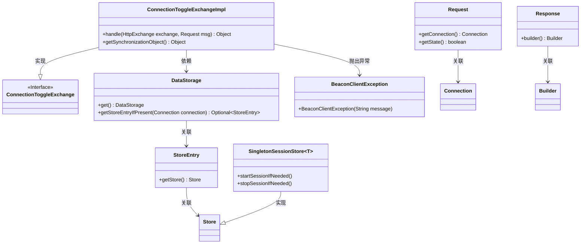

# 基础信息

|      |      |
|------|------|
| 名称 | ConnectionToggleExchangeImpl |
| 编码语言 | .java |
| 代码路径 | xpipe/app/src/main/java/io/xpipe/app/beacon/impl/ConnectionToggleExchangeImpl.java |
| 包名 | io.xpipe.app.beacon.impl |
| 依赖项 | ['io.xpipe.app.storage.DataStorage', 'io.xpipe.beacon.BeaconClientException', 'io.xpipe.beacon.api.ConnectionToggleExchange', 'io.xpipe.core.store.SingletonSessionStore', 'com.sun.net.httpserver.HttpExchange'] |
| 概述说明 | 处理连接切换请求，检查存储类型并控制会话启停。 |

# 说明

ConnectionToggleExchangeImpl类继承自ConnectionToggleExchange，实现了处理HTTP交换和请求的方法。在handle方法中，它首先通过DataStorage获取与请求关联的存储条目，若不存在则抛出异常。检查存储类型是否为SingletonSessionStore，否则抛出异常。根据请求状态启动或停止会话，最后返回空响应。getSynchronizationObject方法返回DataStorage实例作为同步对象。

# 类列表 Class Summary

| 名称   | 类型  | 说明 |
|-------|------|-------------|
| ConnectionToggleExchangeImpl | class | 处理连接切换请求，验证并控制会话启停。 |

## 类 ConnectionToggleExchangeImpl

|      |      |
|------|------|
| 访问范围 | public |
| 类型 | class |
| 名称 | ConnectionToggleExchangeImpl |
| 说明 | 处理连接切换请求，验证并控制会话启停。 |

### UML类图

这段代码展示了一个`ConnectionToggleExchangeImpl`类，它实现了`ConnectionToggleExchange`接口，用于处理HTTP交换请求并管理连接状态。主要功能包括：通过`DataStorage`获取存储条目，验证是否为可切换连接（`SingletonSessionStore`），并根据请求状态启动或停止会话。类图中清晰地展示了类之间的继承、实现和依赖关系，包括异常处理和数据存储的交互逻辑。核心组件涉及连接管理、会话存储和请求/响应处理，体现了模块化的设计思想。

### 内部方法调用关系图

这段代码流程图展示了ConnectionToggleExchangeImpl类的核心逻辑。主要流程包括：通过DataStorage获取连接存储条目并进行存在性检查，验证存储类型是否为SingletonSessionStore，根据请求状态决定启动或停止会话，最后返回统一响应。同步对象方法直接返回DataStorage单例。整个流程包含异常处理、类型检查和条件分支，体现了对连接状态管理的安全控制。

### 字段列表 Field List

| 名称  | 类型  | 说明 |
|-------|-------|------|

### 方法列表 Method List

| 名称  | 类型  | 说明 |
|-------|-------|------|
| getSynchronizationObject | Object | 重写getSynchronizationObject方法，返回DataStorage.get()结果。 |
| handle | Object | 处理HTTP请求，检查连接状态并控制会话开关。 |

