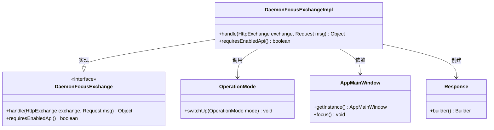
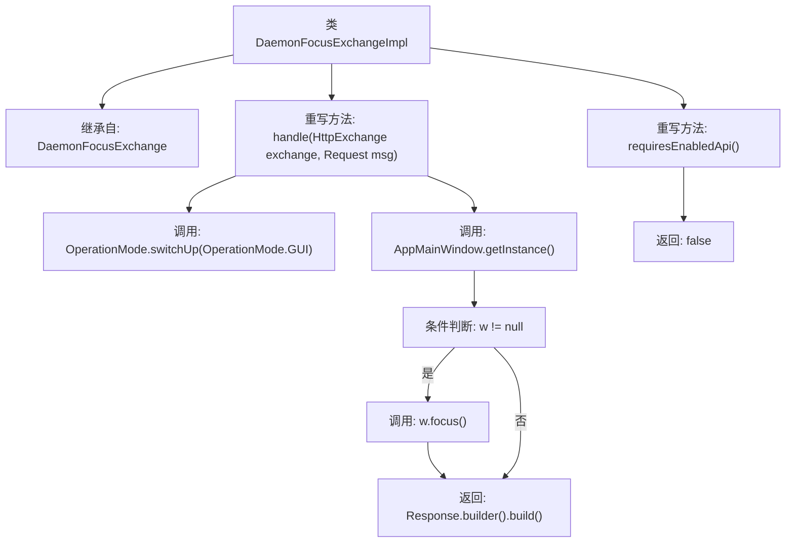

# 基础信息

|      |      |
|------|------|
| 名称 | DaemonFocusExchangeImpl |
| 编码语言 | .java |
| 代码路径 | xpipe/app/src/main/java/io/xpipe/app/beacon/impl/DaemonFocusExchangeImpl.java |
| 包名 | io.xpipe.app.beacon.impl |
| 依赖项 | ['io.xpipe.app.core.mode.OperationMode', 'io.xpipe.app.core.window.AppMainWindow', 'io.xpipe.beacon.api.DaemonFocusExchange', 'com.sun.net.httpserver.HttpExchange'] |
| 概述说明 | DaemonFocusExchangeImpl类处理HTTP请求，切换至GUI模式并聚焦主窗口。 |

# 说明

该代码描述了一个名为DaemonFocusExchangeImpl的类，继承自DaemonFocusExchange。它重写了handle方法，用于处理HTTP交换和请求，将操作模式切换为GUI模式，并获取AppMainWindow实例使其获得焦点。最后返回一个空的Response对象。此外，重写的requiresEnabledApi方法始终返回false，表示不需要启用API。

# 类列表 Class Summary

| 名称   | 类型  | 说明 |
|-------|------|-------------|
| DaemonFocusExchangeImpl | class | DaemonFocusExchangeImpl类处理HTTP请求，切换至GUI模式并聚焦主窗口，无需启用API。 |

## 类 DaemonFocusExchangeImpl

|      |      |
|------|------|
| 访问范围 | public |
| 类型 | class |
| 名称 | DaemonFocusExchangeImpl |
| 说明 | DaemonFocusExchangeImpl类处理HTTP请求，切换至GUI模式并聚焦主窗口，无需启用API。 |

### UML类图

这段代码展示了一个实现`DaemonFocusExchange`接口的`DaemonFocusExchangeImpl`类，主要用于处理HTTP交换请求并聚焦应用程序主窗口。类图中清晰地显示了实现关系、方法调用和依赖关系，包括与`OperationMode`、`AppMainWindow`和`Response`类的交互。该实现类重写了接口中的两个方法，分别用于处理请求和检查API启用状态，同时通过静态方法调用和实例操作完成窗口聚焦功能。

### 内部方法调用关系图

这段代码展示了一个继承自DaemonFocusExchange的DaemonFocusExchangeImpl类，主要功能是处理HTTP交换请求。当调用handle方法时，首先切换操作模式到GUI，然后获取应用主窗口实例并尝试聚焦窗口，最后返回一个空的响应对象。requiresEnabledApi方法则始终返回false，表示不需要启用API。流程图清晰地展示了方法调用链和条件分支逻辑。

### 字段列表 Field List

| 名称  | 类型  | 说明 |
|-------|-------|------|

### 方法列表 Method List

| 名称  | 类型  | 说明 |
|-------|-------|------|
| handle | Object | 重写方法，切换至GUI模式并聚焦主窗口，返回空响应。 |
| requiresEnabledApi | boolean | 重写方法，返回false表示无需启用API。 |

