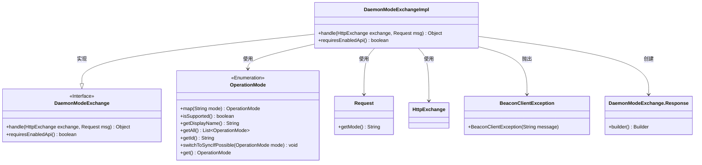
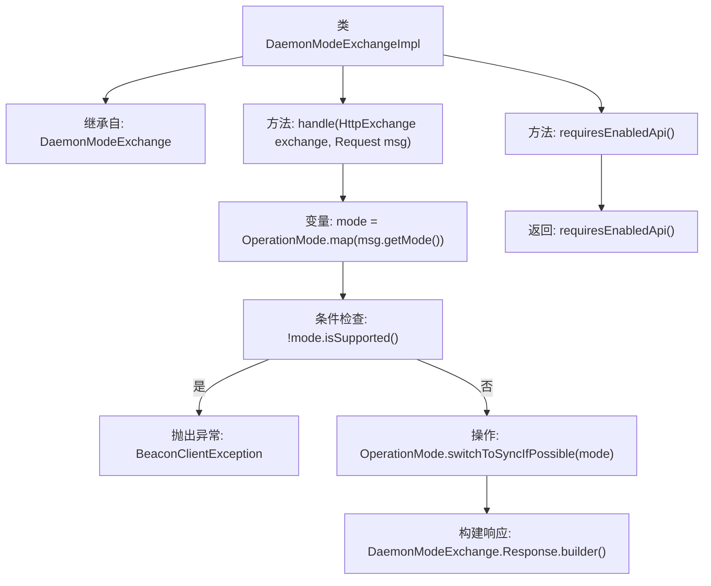

# 基础信息

|      |      |
|------|------|
| 名称 | DaemonModeExchangeImpl |
| 编码语言 | .java |
| 代码路径 | xpipe/app/src/main/java/io/xpipe/app/beacon/impl/DaemonModeExchangeImpl.java |
| 包名 | io.xpipe.app.beacon.impl |
| 依赖项 | ['io.xpipe.app.core.mode.OperationMode', 'io.xpipe.beacon.BeaconClientException', 'io.xpipe.beacon.api.DaemonModeExchange', 'com.sun.net.httpserver.HttpExchange'] |
| 概述说明 | DaemonModeExchangeImpl处理HTTP请求，验证并切换操作模式，返回当前模式。无需启用API。 |

# 说明

该代码描述了一个名为DaemonModeExchangeImpl的类，继承自DaemonModeExchange。它实现了handle方法，用于处理HTTP交换和请求消息。方法首先检查请求的操作模式是否受支持，若不支持则抛出异常并列出所有支持的模式。接着尝试切换到同步模式（如果可能），最后返回包含当前使用模式的响应对象。类还重写了requiresEnabledApi方法，始终返回false表示不需要启用API。

# 类列表 Class Summary

| 名称   | 类型  | 说明 |
|-------|------|-------------|
| DaemonModeExchangeImpl | class | DaemonModeExchangeImpl处理HTTP请求，验证操作模式并返回当前模式。无需启用API。 |

## 类 DaemonModeExchangeImpl

|      |      |
|------|------|
| 访问范围 | public |
| 类型 | class |
| 名称 | DaemonModeExchangeImpl |
| 说明 | DaemonModeExchangeImpl处理HTTP请求，验证操作模式并返回当前模式。无需启用API。 |

### UML类图

这段代码展示了一个守护模式交换接口的实现类`DaemonModeExchangeImpl`，它继承自`DaemonModeExchange`接口。主要功能是通过`handle`方法处理HTTP交换请求，验证操作模式是否受支持，并在支持时切换到同步模式。类图中清晰地展示了类之间的继承、实现和使用关系，包括与枚举类`OperationMode`的交互，以及对请求、响应和异常的处理。实现类通过方法重写提供了具体的业务逻辑，同时保持了接口定义的契约。

### 内部方法调用关系图

这段代码流程图展示了DaemonModeExchangeImpl类的核心逻辑。该类继承自DaemonModeExchange，主要包含两个方法：handle()用于处理HTTP交换请求，requiresEnabledApi()返回API启用状态。handle()方法首先映射请求模式，检查模式是否受支持，若不受支持则抛出详细异常；否则尝试同步切换模式，最后构建包含当前模式的响应对象。整个流程体现了模式验证、错误处理和响应构建的完整链路，且该类不强制要求启用API（requiresEnabledApi返回false）。

### 字段列表 Field List

| 名称  | 类型  | 说明 |
|-------|-------|------|

### 方法列表 Method List

| 名称  | 类型  | 说明 |
|-------|-------|------|
| requiresEnabledApi | boolean | 重写方法，返回false表示无需启用API。 |
| handle | Object | 重写方法处理HTTP请求，验证操作模式是否支持，返回当前模式响应。 |

