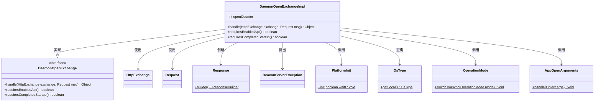
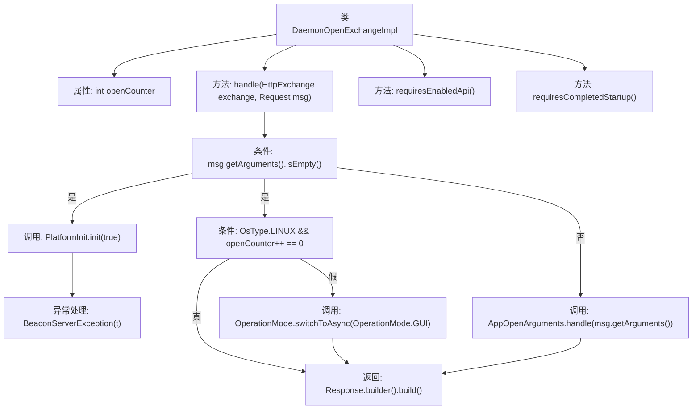

# 基础信息

|      |      |
|------|------|
| 名称 | DaemonOpenExchangeImpl |
| 编码语言 | .java |
| 代码路径 | xpipe/app/src/main/java/io/xpipe/app/beacon/impl/DaemonOpenExchangeImpl.java |
| 包名 | io.xpipe.app.beacon.impl |
| 依赖项 | ['io.xpipe.app.core.AppOpenArguments', 'io.xpipe.app.core.mode.OperationMode', 'io.xpipe.app.util.PlatformInit', 'io.xpipe.beacon.BeaconServerException', 'io.xpipe.beacon.api.DaemonOpenExchange', 'io.xpipe.core.process.OsType', 'com.sun.net.httpserver.HttpExchange'] |
| 概述说明 | DaemonOpenExchangeImpl类处理HTTP请求，初始化平台并根据参数切换操作模式或处理应用启动参数。 |

# 说明

DaemonOpenExchangeImpl类继承DaemonOpenExchange，处理HTTP交换和请求。当请求参数为空时，初始化平台并等待完成，若在Linux系统且首次调用则返回空响应，否则切换至GUI模式。若请求有参数则处理应用启动参数。该类不要求启用API或完成启动。

# 类列表 Class Summary

| 名称   | 类型  | 说明 |
|-------|------|-------------|
| DaemonOpenExchangeImpl | class | DaemonOpenExchangeImpl处理HTTP请求，初始化平台并根据参数切换操作模式或处理应用启动参数。 |

## 类 DaemonOpenExchangeImpl

|      |      |
|------|------|
| 访问范围 | public |
| 类型 | class |
| 名称 | DaemonOpenExchangeImpl |
| 说明 | DaemonOpenExchangeImpl处理HTTP请求，初始化平台并根据参数切换操作模式或处理应用启动参数。 |

### UML类图

这段代码展示了一个守护进程开放交换接口的实现类`DaemonOpenExchangeImpl`，它继承自接口`DaemonOpenExchange`。主要功能是处理HTTP交换请求，根据请求参数执行不同操作：无参数时初始化平台并可能切换操作模式，有参数时处理应用开放参数。实现中包含平台初始化、操作系统类型判断、异步模式切换等关键操作，并维护一个打开计数器用于Linux系统的特殊处理。类图中清晰地展示了该实现类与多个工具类之间的调用关系。

### 内部方法调用关系图

这段代码流程图展示了DaemonOpenExchangeImpl类的核心逻辑。该类继承自DaemonOpenExchange，主要处理HTTP交换请求。handle方法根据请求参数是否为空执行不同分支：若为空则初始化平台并检查Linux系统条件，否则处理应用打开参数。两个布尔方法表明该类不需要启用API或完成启动。流程清晰展现了异常处理、条件分支和返回响应的完整路径。

### 字段列表 Field List

| 名称  | 类型  | 说明 |
|-------|-------|------|
| openCounter = 0 | int | 私有整型变量openCounter初始值为0。 |

### 方法列表 Method List

| 名称  | 类型  | 说明 |
|-------|-------|------|
| handle | Object | 处理HTTP请求，初始化平台或切换操作模式，无参时等待初始化，有参时处理应用启动参数。 |
| requiresEnabledApi | boolean | 重写方法，返回false表示无需启用API。 |
| requiresCompletedStartup | boolean | 重写方法，启动无需完成即可执行。 |

