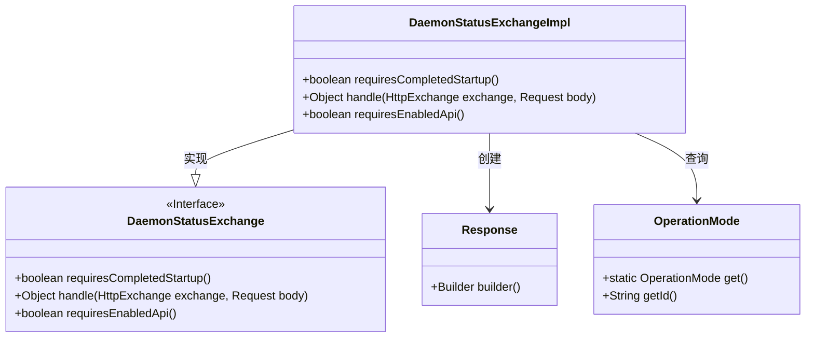
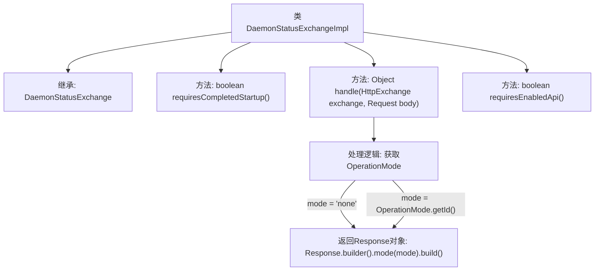

# 基础信息

|      |      |
|------|------|
| 名称 | DaemonStatusExchangeImpl |
| 编码语言 | .java |
| 代码路径 | xpipe/app/src/main/java/io/xpipe/app/beacon/impl/DaemonStatusExchangeImpl.java |
| 包名 | io.xpipe.app.beacon.impl |
| 依赖项 | ['io.xpipe.app.core.mode.OperationMode', 'io.xpipe.beacon.api.DaemonStatusExchange', 'com.sun.net.httpserver.HttpExchange'] |
| 概述说明 | DaemonStatusExchange实现类，返回操作模式，无需启动完成和API启用。 |

# 说明

该代码定义了一个名为DaemonStatusExchangeImpl的类，继承自DaemonStatusExchange。它重写了三个方法：requiresCompletedStartup返回false表示不需要完成启动；handle处理HTTP请求，根据OperationMode的当前状态返回包含模式信息的响应；requiresEnabledApi返回false表示不需要启用API。该类主要用于获取和返回守护进程的状态模式。

# 类列表 Class Summary

| 名称   | 类型  | 说明 |
|-------|------|-------------|
| DaemonStatusExchangeImpl | class | DaemonStatusExchangeImpl类实现DaemonStatusExchange接口，返回操作模式信息，不要求完成启动或启用API。 |

## 类 DaemonStatusExchangeImpl

|      |      |
|------|------|
| 访问范围 | public |
| 类型 | class |
| 名称 | DaemonStatusExchangeImpl |
| 说明 | DaemonStatusExchangeImpl类实现DaemonStatusExchange接口，返回操作模式信息，不要求完成启动或启用API。 |

### UML类图

这段代码展示了一个守护进程状态交换接口的实现类DaemonStatusExchangeImpl，它继承自DaemonStatusExchange接口。主要功能是通过HTTP交换处理请求，返回当前操作模式的状态响应。类图中清晰地体现了实现关系（DaemonStatusExchangeImpl实现接口）和依赖关系（依赖Response和OperationMode类）。实现类重写了三个接口方法，其中核心的handle()方法会检查操作模式并构建响应对象，其他两个方法返回固定的布尔值配置。整个设计简洁明确，符合单一职责原则。

### 内部方法调用关系图

这段代码流程图展示了DaemonStatusExchangeImpl类的结构和主要方法调用关系。该类继承自DaemonStatusExchange，包含三个核心方法：requiresCompletedStartup()返回false表示不需要完成启动，handle()方法处理HTTP请求并返回包含操作模式的响应，requiresEnabledApi()返回false表示不需要启用API。handle()方法会根据OperationMode状态返回不同的模式标识（'none'或实际模式ID），最终构建并返回Response对象。

### 字段列表 Field List

| 名称  | 类型  | 说明 |
|-------|-------|------|

### 方法列表 Method List

| 名称  | 类型  | 说明 |
|-------|-------|------|
| requiresCompletedStartup | boolean | 重写方法，启动无需完成初始化。 |
| handle | Object | 处理HTTP请求，返回当前操作模式或无模式响应。 |
| requiresEnabledApi | boolean | 重写方法，返回false表示无需启用API。 |

