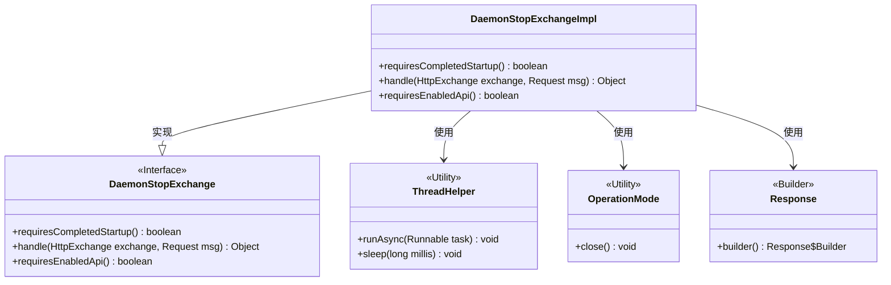
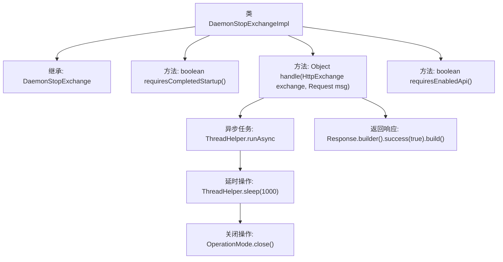

# 基础信息

|      |      |
|------|------|
| 名称 | DaemonStopExchangeImpl |
| 编码语言 | .java |
| 代码路径 | xpipe/app/src/main/java/io/xpipe/app/beacon/impl/DaemonStopExchangeImpl.java |
| 包名 | io.xpipe.app.beacon.impl |
| 依赖项 | ['io.xpipe.app.core.mode.OperationMode', 'io.xpipe.app.util.ThreadHelper', 'io.xpipe.beacon.api.DaemonStopExchange', 'com.sun.net.httpserver.HttpExchange'] |
| 概述说明 | DaemonStopExchangeImpl类实现守护进程停止功能，异步关闭操作模式，无需完成启动或启用API。 |

# 说明

DaemonStopExchangeImpl类继承自DaemonStopExchange，实现了三个关键方法。requiresCompletedStartup方法返回false，表示不需要等待启动完成。handle方法异步执行关闭操作，先等待1秒后调用OperationMode.close，并立即返回成功响应。requiresEnabledApi方法返回false，表明不依赖API启用状态。该类主要用于处理停止守护进程的HTTP请求。

# 类列表 Class Summary

| 名称   | 类型  | 说明 |
|-------|------|-------------|
| DaemonStopExchangeImpl | class | DaemonStopExchangeImpl类实现异步关闭操作，无需完成启动或启用API。 |

## 类 DaemonStopExchangeImpl

|      |      |
|------|------|
| 访问范围 | public |
| 类型 | class |
| 名称 | DaemonStopExchangeImpl |
| 说明 | DaemonStopExchangeImpl类实现异步关闭操作，无需完成启动或启用API。 |

### UML类图

这段代码展示了一个守护进程停止交换的实现类`DaemonStopExchangeImpl`，它实现了`DaemonStopExchange`接口。主要功能是通过异步线程延迟1秒后关闭操作模式，并返回成功响应。类图中清晰地展示了实现关系、工具类的使用以及响应构建器的依赖关系。该实现类重写了接口方法，表明它不需要完整的启动过程或启用的API即可运行。

### 内部方法调用关系图

这段代码展示了一个DaemonStopExchangeImpl类，继承自DaemonStopExchange，主要处理HTTP交换请求。核心功能在handle方法中，它会异步执行一个延时1秒后关闭操作模式的任务，并立即返回成功响应。类中还包含两个配置方法requiresCompletedStartup和requiresEnabledApi，都返回false表示不需要完成启动或启用API。流程图清晰地展示了类继承关系和方法调用链，特别是handle方法内部的异步处理流程。

### 字段列表 Field List

| 名称  | 类型  | 说明 |
|-------|-------|------|

### 方法列表 Method List

| 名称  | 类型  | 说明 |
|-------|-------|------|
| requiresCompletedStartup | boolean | 重写方法，启动无需完成初始化。 |
| handle | Object | 异步处理HTTP请求，延迟1秒后关闭操作模式并返回成功响应。 |
| requiresEnabledApi | boolean | 重写方法，返回false表示无需启用API。 |

