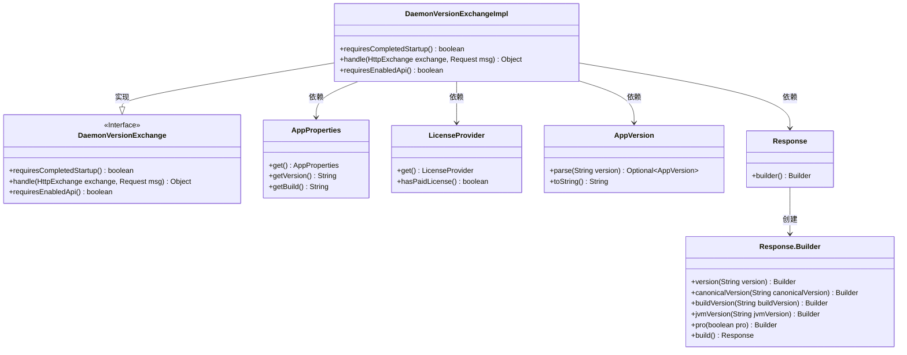
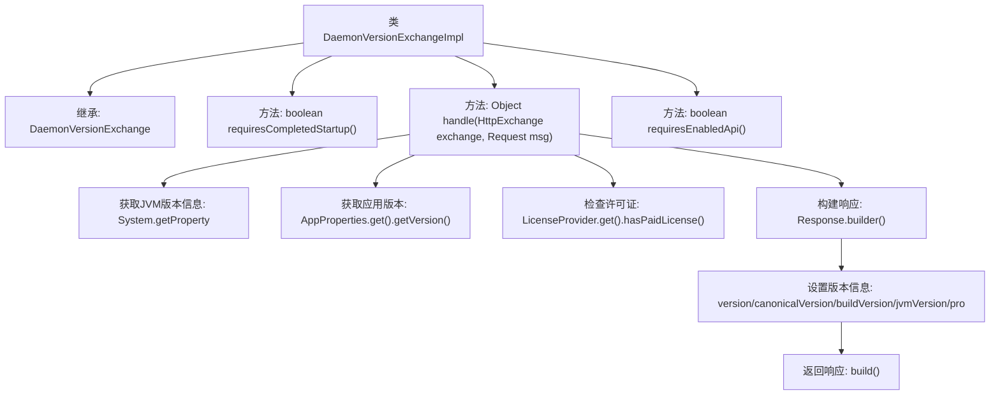

# 基础信息

|      |      |
|------|------|
| 名称 | DaemonVersionExchangeImpl |
| 编码语言 | .java |
| 代码路径 | xpipe/app/src/main/java/io/xpipe/app/beacon/impl/DaemonVersionExchangeImpl.java |
| 包名 | io.xpipe.app.beacon.impl |
| 依赖项 | ['io.xpipe.app.core.AppProperties', 'io.xpipe.app.core.AppVersion', 'io.xpipe.app.util.LicenseProvider', 'io.xpipe.beacon.api.DaemonVersionExchange', 'com.sun.net.httpserver.HttpExchange'] |
| 概述说明 | Daemon版本交换实现类，返回版本、构建、JVM及授权信息。 |

# 说明

该代码定义了一个名为DaemonVersionExchangeImpl的类，继承自DaemonVersionExchange。它重写了三个方法：requiresCompletedStartup返回false表示不需要完成启动；handle方法处理HTTP请求，收集JVM版本、应用版本、构建版本和专业版许可信息，构建并返回响应对象；requiresEnabledApi返回false表示不需要启用API。

# 类列表 Class Summary

| 名称   | 类型  | 说明 |
|-------|------|-------------|
| DaemonVersionExchangeImpl | class | DaemonVersionExchange实现类，返回版本信息，无需启动完成和启用API。 |

## 类 DaemonVersionExchangeImpl

|      |      |
|------|------|
| 访问范围 | public |
| 类型 | class |
| 名称 | DaemonVersionExchangeImpl |
| 说明 | DaemonVersionExchange实现类，返回版本信息，无需启动完成和启用API。 |

### UML类图

这段代码展示了一个实现`DaemonVersionExchange`接口的类`DaemonVersionExchangeImpl`，主要用于处理HTTP交换请求并返回包含JVM版本、应用版本和许可证信息的响应。类图中清晰地展示了各个类之间的关系，包括实现接口、依赖关系以及构建器模式的使用。`DaemonVersionExchangeImpl`通过调用`AppProperties`、`LicenseProvider`和`AppVersion`等辅助类获取必要信息，最终使用`Response.Builder`构建并返回响应对象。

### 内部方法调用关系图

这段代码是DaemonVersionExchangeImpl类的实现，继承自DaemonVersionExchange。主要功能是处理HTTP交换请求，收集JVM版本、应用版本和许可证信息，构建并返回包含这些信息的响应对象。类中包含三个方法：requiresCompletedStartup()返回false表示不需要完成启动，handle()是核心处理方法，requiresEnabledApi()返回false表示不需要启用API。handle()方法通过多个系统调用和属性获取构建响应对象，最后返回该对象。

### 字段列表 Field List

| 名称  | 类型  | 说明 |
|-------|-------|------|

### 方法列表 Method List

| 名称  | 类型  | 说明 |
|-------|-------|------|
| handle | Object | Java方法处理HTTP请求，返回版本、JVM信息及授权状态。 |
| requiresCompletedStartup | boolean | 重写方法，返回false表示无需完成启动即可执行。 |
| requiresEnabledApi | boolean | 重写方法，返回false表示无需启用API。 |

