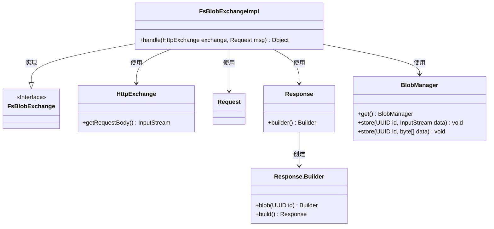
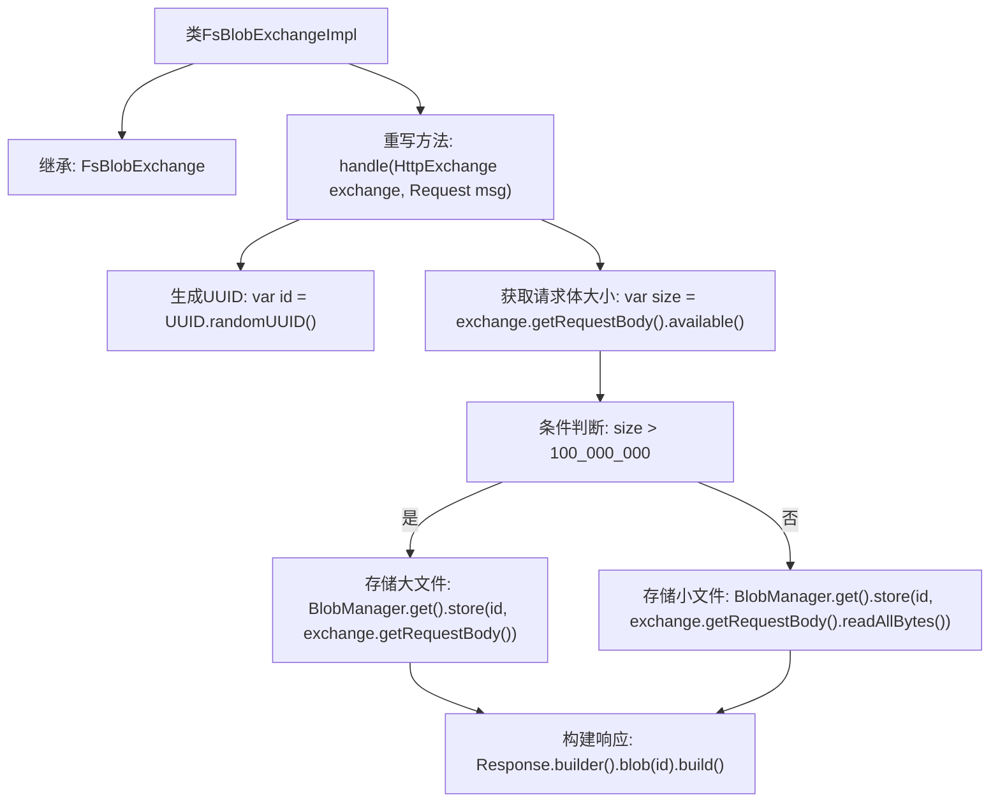

# 基础信息

|      |      |
|------|------|
| 名称 | FsBlobExchangeImpl |
| 编码语言 | .java |
| 代码路径 | xpipe/app/src/main/java/io/xpipe/app/beacon/impl/FsBlobExchangeImpl.java |
| 包名 | io.xpipe.app.beacon.impl |
| 依赖项 | ['io.xpipe.app.beacon.BlobManager', 'io.xpipe.beacon.api.FsBlobExchange', 'com.sun.net.httpserver.HttpExchange', 'lombok.SneakyThrows', 'java.util.UUID'] |
| 概述说明 | FsBlobExchangeImpl处理HTTP请求，存储大文件或小文件数据块，返回包含ID的响应。 |

# 说明

FsBlobExchangeImpl类继承自FsBlobExchange，重写了handle方法。该方法接收HttpExchange和Request参数，生成随机UUID作为ID。检查请求体大小，若超过100MB则直接存储输入流，否则读取全部字节后存储。最后返回包含该ID的Response对象。整个过程处理大文件和小文件的不同存储方式。

# 类列表 Class Summary

| 名称   | 类型  | 说明 |
|-------|------|-------------|
| FsBlobExchangeImpl | class | FsBlobExchangeImpl处理HTTP请求，存储请求体数据到BlobManager，返回包含ID的响应。 |

## 类 FsBlobExchangeImpl

|      |      |
|------|------|
| 访问范围 | public |
| 类型 | class |
| 名称 | FsBlobExchangeImpl |
| 说明 | FsBlobExchangeImpl处理HTTP请求，存储请求体数据到BlobManager，返回包含ID的响应。 |

### UML类图

这段代码展示了一个文件系统Blob交换的实现类FsBlobExchangeImpl，它继承自FsBlobExchange接口。主要功能是处理HTTP交换请求，根据请求体大小决定以流或字节数组形式存储数据到BlobManager，并返回包含Blob ID的响应。类图清晰地呈现了实现关系（FsBlobExchangeImpl实现接口）和依赖关系（与HttpExchange、Request、Response及BlobManager的交互），其中Response通过建造者模式构造。核心逻辑涉及大数据量时的分块处理机制，体现了对资源管理的考量。

### 内部方法调用关系图

这段代码流程图描述了FsBlobExchangeImpl类处理HTTP请求的核心逻辑。流程从生成唯一ID开始，检测请求体大小后分两种处理路径：大于100MB时直接流式存储，小于时读取字节数组存储，最后统一返回包含ID的响应。整个过程体现了对大数据量的优化处理，通过条件分支避免内存溢出风险，同时保持接口一致性。

### 字段列表 Field List

| 名称  | 类型  | 说明 |
|-------|-------|------|

### 方法列表 Method List

| 名称  | 类型  | 说明 |
|-------|-------|------|
| handle | Object | 处理HTTP请求，存储请求体数据，返回包含ID的响应。 |

