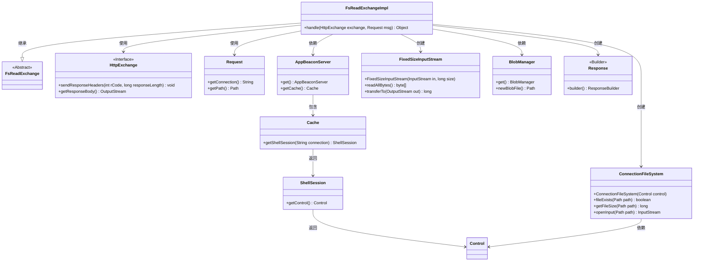
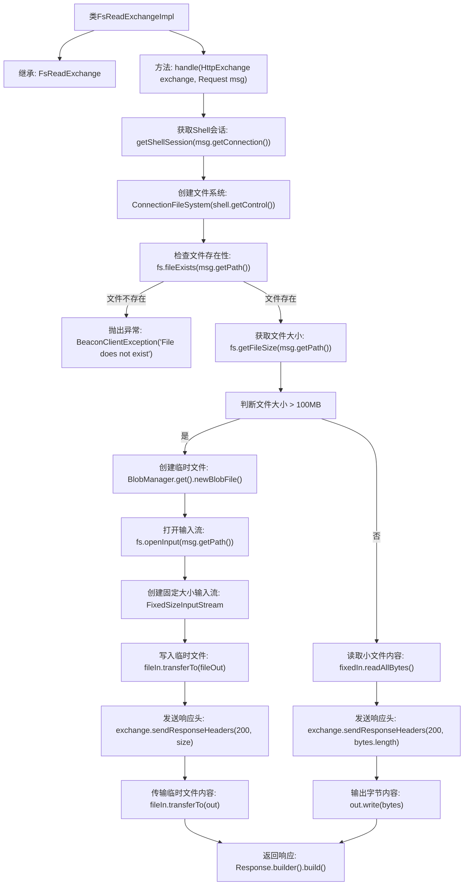

# 基础信息

|      |      |
|------|------|
| 名称 | FsReadExchangeImpl |
| 编码语言 | .java |
| 代码路径 | xpipe/app/src/main/java/io/xpipe/app/beacon/impl/FsReadExchangeImpl.java |
| 包名 | io.xpipe.app.beacon.impl |
| 依赖项 | ['io.xpipe.app.beacon.AppBeaconServer', 'io.xpipe.app.beacon.BlobManager', 'io.xpipe.app.ext.ConnectionFileSystem', 'io.xpipe.app.util.FixedSizeInputStream', 'io.xpipe.beacon.BeaconClientException', 'io.xpipe.beacon.api.FsReadExchange', 'com.sun.net.httpserver.HttpExchange', 'lombok.SneakyThrows', 'java.io.BufferedInputStream', 'java.io.OutputStream', 'java.nio.file.Files'] |
| 概述说明 | FsReadExchangeImpl类处理文件读取请求，检查文件存在性及大小，分大小传输文件内容。 |

# 说明

FsReadExchangeImpl类继承自FsReadExchange，重写handle方法处理HTTP请求。首先通过缓存获取Shell会话并检查文件是否存在。若文件大于100MB，则创建临时文件并分块传输；否则直接读取字节数组并写入响应。处理完成后返回空响应对象。整个过程包含异常处理、文件大小判断及不同传输策略。

# 类列表 Class Summary

| 名称   | 类型  | 说明 |
|-------|------|-------------|
| FsReadExchangeImpl | class | FsReadExchangeImpl处理文件读取请求，检查文件存在性及大小，分大小处理传输，返回响应。 |

## 类 FsReadExchangeImpl

|      |      |
|------|------|
| 访问范围 | public |
| 类型 | class |
| 名称 | FsReadExchangeImpl |
| 说明 | FsReadExchangeImpl处理文件读取请求，检查文件存在性及大小，分大小处理传输，返回响应。 |

### UML类图

这段代码实现了一个文件读取处理器，继承自FsReadExchange基类，主要处理HTTP文件请求。当文件小于100MB时直接读取字节返回，大于100MB时使用临时文件中转。类图展示了核心类之间的关系，包括文件系统操作、HTTP交互、会话管理和流处理等组件，通过分层设计实现了大文件分块传输和内存优化。

### 内部方法调用关系图

这段代码是FsReadExchangeImpl类的实现，主要处理HTTP文件读取请求。当文件存在时，根据文件大小采取不同处理方式：大于100MB时使用临时文件中转传输，小于等于100MB时直接读取字节数组传输。流程图清晰展示了从获取Shell会话、检查文件存在性、大小判断到最终响应返回的完整处理流程，包含异常处理和大文件分块传输的关键路径。

### 字段列表 Field List

| 名称  | 类型  | 说明 |
|-------|-------|------|

### 方法列表 Method List

| 名称  | 类型  | 说明 |
|-------|-------|------|
| handle | Object | 处理HTTP请求，检查文件存在性，按大小分块传输或直接发送。 |

