# 基础信息

|      |      |
|------|------|
| 名称 | FsScriptExchangeImpl |
| 编码语言 | .java |
| 代码路径 | xpipe/app/src/main/java/io/xpipe/app/beacon/impl/FsScriptExchangeImpl.java |
| 包名 | io.xpipe.app.beacon.impl |
| 依赖项 | ['io.xpipe.app.beacon.AppBeaconServer', 'io.xpipe.app.beacon.BlobManager', 'io.xpipe.app.util.ScriptHelper', 'io.xpipe.beacon.api.FsScriptExchange', 'com.sun.net.httpserver.HttpExchange', 'lombok.SneakyThrows', 'java.nio.charset.StandardCharsets'] |
| 概述说明 | FsScriptExchangeImpl类处理HTTP请求，执行脚本并返回结果路径。 |

# 说明

该内容描述了一个名为FsScriptExchangeImpl的类，继承自FsScriptExchange。它重写了handle方法，用于处理HTTP交换和请求消息。方法首先通过AppBeaconServer获取Shell会话，然后从BlobManager读取数据并转换为UTF-8字符串。接着使用Shell方言预处理脚本内容，通过ScriptHelper创建可执行脚本文件，最后返回包含文件路径的响应对象。整个过程涉及会话管理、数据读取、脚本处理和响应构建。

# 类列表 Class Summary

| 名称   | 类型  | 说明 |
|-------|------|-------------|
| FsScriptExchangeImpl | class | FsScriptExchangeImpl类处理HTTP请求，执行脚本并返回结果路径。 |

## 类 FsScriptExchangeImpl

|      |      |
|------|------|
| 访问范围 | public |
| 类型 | class |
| 名称 | FsScriptExchangeImpl |
| 说明 | FsScriptExchangeImpl类处理HTTP请求，执行脚本并返回结果路径。 |

### UML类图

```mermaid
classDiagram
    class FsScriptExchangeImpl {
        +Object handle(HttpExchange exchange, Request msg)
    }
    class FsScriptExchange {
        <<Interface>>
    }
    class HttpExchange
    class Request {
        +String getConnection()
        +String getBlob()
    }
    class AppBeaconServer {
        +static AppBeaconServer get()
        +Cache getCache()
    }
    class Cache {
        +ShellSession getShellSession(String connection)
    }
    class ShellSession {
        +Control getControl()
    }
    class Control {
        +ShellDialect getShellDialect()
    }
    class ShellDialect {
        +String prepareScriptContent(String data)
    }
    class BlobManager {
        +static BlobManager get()
        +Blob getBlob(String blobId)
    }
    class Blob {
        +byte[] readAllBytes()
    }
    class ScriptHelper {
        +static File createExecScript(Control control, String data)
    }
    class Response {
        +static Builder builder()
    }
    class Builder {
        +Builder path(File file)
        +Response build()
    }

    FsScriptExchangeImpl --|> FsScriptExchange : 实现
    FsScriptExchangeImpl --> HttpExchange : 依赖
    FsScriptExchangeImpl --> Request : 依赖
    FsScriptExchangeImpl --> AppBeaconServer : 依赖
    FsScriptExchangeImpl --> BlobManager : 依赖
    FsScriptExchangeImpl --> ScriptHelper : 依赖
    FsScriptExchangeImpl --> Response : 依赖
    Request --> BlobManager : 关联
    AppBeaconServer --> Cache : 组合
    Cache --> ShellSession : 聚合
    ShellSession --> Control : 组合
    Control --> ShellDialect : 组合
    BlobManager --> Blob : 创建
    ScriptHelper --> Control : 依赖
    Response --> Builder : 创建
```

这段代码描述了一个脚本交换实现类`FsScriptExchangeImpl`，它继承自接口`FsScriptExchange`，主要处理HTTP交换请求和消息。通过获取Shell会话、读取Blob数据、预处理脚本内容并创建可执行脚本文件，最终构建响应路径。类图展示了从请求处理到响应生成的全过程依赖关系，涉及会话管理、数据预处理、文件操作等多个组件协作。

### 内部方法调用关系图

这段流程图展示了FsScriptExchangeImpl类中handle方法的完整处理流程。方法首先通过连接信息获取Shell会话，然后读取并解码传入的Blob数据，接着对脚本内容进行预处理，创建可执行脚本文件，最后构建包含脚本路径的响应对象。整个过程体现了从接收请求到生成响应的完整数据处理链条，各步骤间存在严格的先后依赖关系。

### 字段列表 Field List

| 名称  | 类型  | 说明 |
|-------|-------|------|

### 方法列表 Method List

| 名称  | 类型  | 说明 |
|-------|-------|------|
| handle | Object | 重写方法处理HTTP请求，读取数据并执行脚本后返回结果。 |

