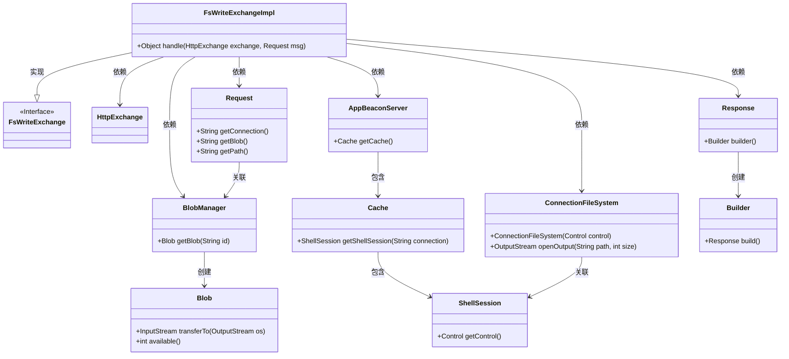
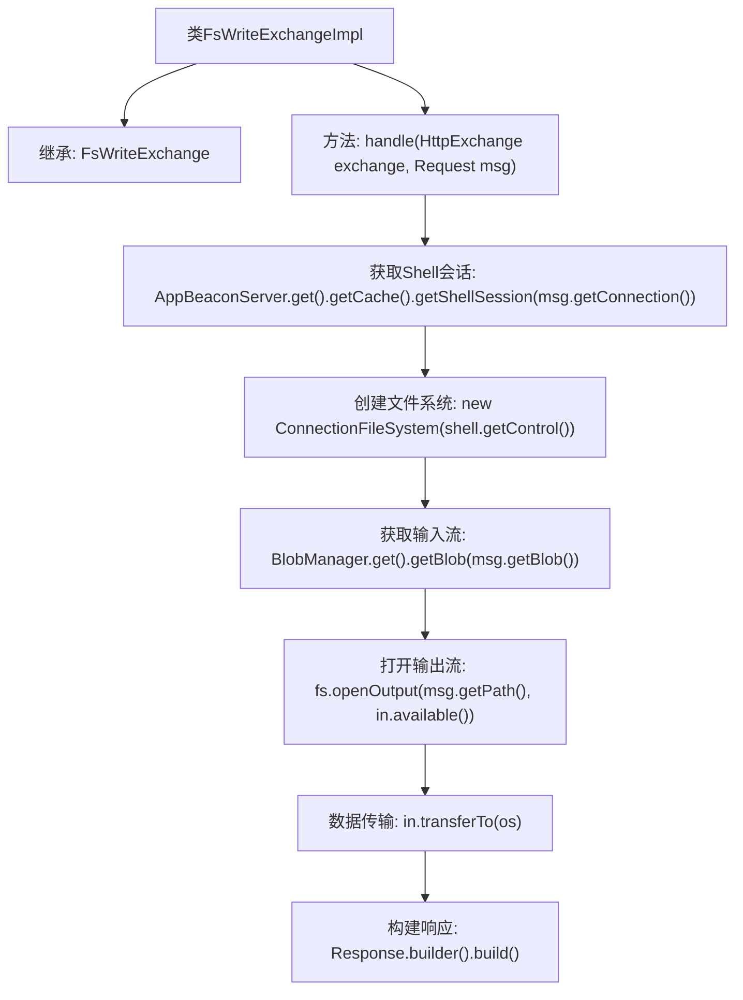

# 基础信息

|      |      |
|------|------|
| 名称 | FsWriteExchangeImpl |
| 编码语言 | .java |
| 代码路径 | xpipe/app/src/main/java/io/xpipe/app/beacon/impl/FsWriteExchangeImpl.java |
| 包名 | io.xpipe.app.beacon.impl |
| 依赖项 | ['io.xpipe.app.beacon.AppBeaconServer', 'io.xpipe.app.beacon.BlobManager', 'io.xpipe.app.ext.ConnectionFileSystem', 'io.xpipe.beacon.api.FsWriteExchange', 'com.sun.net.httpserver.HttpExchange', 'lombok.SneakyThrows'] |
| 概述说明 | FsWriteExchangeImpl类处理文件写入请求，通过BlobManager和ConnectionFileSystem实现数据传输。 |

# 说明

这段内容描述了一个名为FsWriteExchangeImpl的类，继承自FsWriteExchange。它实现了handle方法，用于处理HTTP交换和请求消息。方法首先通过AppBeaconServer获取缓存中的Shell会话，然后创建ConnectionFileSystem实例。接着使用BlobManager获取请求中的二进制数据，并通过文件系统打开输出流将数据传输到指定路径。最后返回一个空的响应构建器。整个过程涉及会话管理、文件操作和数据处理。

# 类列表 Class Summary

| 名称   | 类型  | 说明 |
|-------|------|-------------|
| FsWriteExchangeImpl | class | FsWriteExchangeImpl类处理文件写入请求，通过BlobManager和ConnectionFileSystem实现数据传输。 |

## 类 FsWriteExchangeImpl

|      |      |
|------|------|
| 访问范围 | public |
| 类型 | class |
| 名称 | FsWriteExchangeImpl |
| 说明 | FsWriteExchangeImpl类处理文件写入请求，通过BlobManager和ConnectionFileSystem实现数据传输。 |

### UML类图

该代码实现了一个文件写入处理器，通过继承`FsWriteExchange`接口处理HTTP请求。主要流程包括：从缓存获取Shell会话、创建文件系统连接、读取二进制数据并写入目标路径，最后返回空响应。涉及10个核心类，包括请求/响应处理、会话管理、文件操作等组件，通过多层依赖协作完成文件传输功能。

### 内部方法调用关系图

这段代码是FsWriteExchangeImpl类的实现，继承自FsWriteExchange类。主要功能是处理HTTP交换请求，通过获取Shell会话和创建文件系统，将请求中的Blob数据传输到指定路径的文件中。流程包括获取Shell会话、创建文件系统实例、获取输入流、打开输出流、数据传输和构建响应。整个过程使用了try-with-resources确保资源正确释放，最终返回一个空的响应对象。

### 字段列表 Field List

| 名称  | 类型  | 说明 |
|-------|-------|------|

### 方法列表 Method List

| 名称  | 类型  | 说明 |
|-------|-------|------|
| handle | Object | 处理HTTP请求，获取Shell会话并传输文件数据。 |

