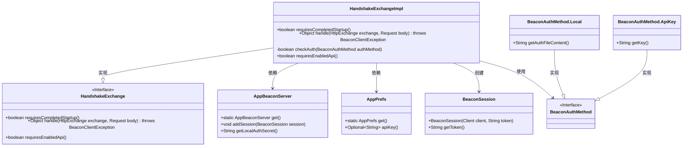
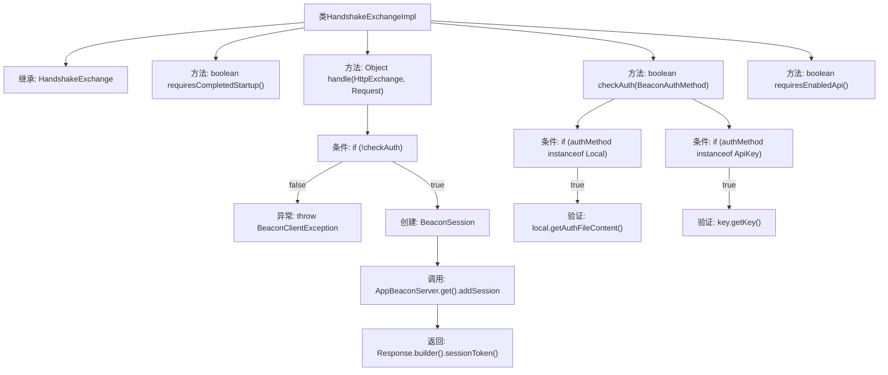

# 基础信息

|      |      |
|------|------|
| 名称 | HandshakeExchangeImpl |
| 编码语言 | .java |
| 代码路径 | xpipe/app/src/main/java/io/xpipe/app/beacon/impl/HandshakeExchangeImpl.java |
| 包名 | io.xpipe.app.beacon.impl |
| 依赖项 | ['io.xpipe.app.beacon.AppBeaconServer', 'io.xpipe.app.beacon.BeaconSession', 'io.xpipe.app.prefs.AppPrefs', 'io.xpipe.beacon.BeaconAuthMethod', 'io.xpipe.beacon.BeaconClientException', 'io.xpipe.beacon.api.HandshakeExchange', 'com.sun.net.httpserver.HttpExchange', 'java.util.UUID'] |
| 概述说明 | HandshakeExchangeImpl处理握手请求，验证本地或API密钥认证，成功则创建并返回会话令牌。 |

# 说明

HandshakeExchangeImpl类继承自HandshakeExchange，实现了握手交换逻辑。它包含三个主要方法：requiresCompletedStartup返回false表示不需要完成启动；handle方法处理HTTP交换，验证认证后创建并存储Beacon会话，返回包含会话令牌的响应；checkAuth方法支持本地文件和API密钥两种认证方式，分别验证其内容与服务器配置是否匹配。requiresEnabledApi返回false表示不需要启用API。整个类专注于握手过程中的认证和会话管理。

# 类列表 Class Summary

| 名称   | 类型  | 说明 |
|-------|------|-------------|
| HandshakeExchangeImpl | class | 处理握手请求的类，验证认证方式并返回会话令牌。 |

## 类 HandshakeExchangeImpl

|      |      |
|------|------|
| 访问范围 | public |
| 类型 | class |
| 名称 | HandshakeExchangeImpl |
| 说明 | 处理握手请求的类，验证认证方式并返回会话令牌。 |

### UML类图

这段类图展示了`HandshakeExchangeImpl`类及其相关依赖关系。`HandshakeExchangeImpl`实现了`HandshakeExchange`接口，主要处理握手交换逻辑，包含认证检查(`checkAuth`)、会话创建等功能。它依赖于`AppBeaconServer`和`AppPrefs`获取配置信息，使用`BeaconAuthMethod`接口及其实现类(`Local`和`ApiKey`)进行认证，并创建`BeaconSession`对象。整体结构清晰地展现了认证流程中各组件间的协作关系，体现了模块化设计和接口隔离原则。

### 内部方法调用关系图

这段代码流程图描述了HandshakeExchangeImpl类的核心逻辑结构。该类继承自HandshakeExchange，主要实现握手交换过程中的认证处理。关键方法handle()会先调用checkAuth()进行认证校验，失败时抛出异常，成功则创建会话并返回响应。checkAuth()方法支持两种认证方式：本地文件认证和API密钥认证，分别通过类型检查和内容比对实现。整体流程清晰展现了认证失败处理、会话创建和响应构建的完整链路。

### 字段列表 Field List

| 名称  | 类型  | 说明 |
|-------|-------|------|

### 方法列表 Method List

| 名称  | 类型  | 说明 |
|-------|-------|------|
| handle | Object | 检查认证后创建会话并返回令牌 |
| requiresCompletedStartup | boolean | 方法重写，返回false表示无需完成启动即可执行。 |
| checkAuth | boolean | 检查认证方法，本地文件或API密钥匹配则返回真，否则假。 |
| requiresEnabledApi | boolean | 重写方法，返回false表示无需启用API。 |

