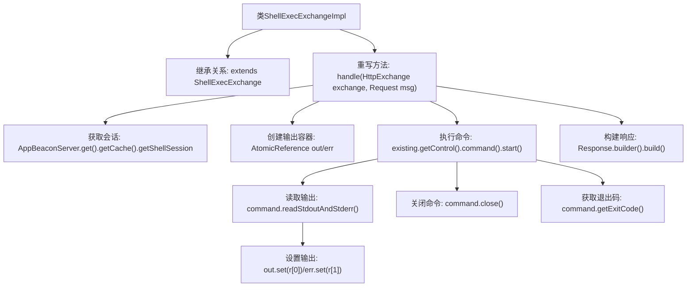

# 基础信息

|      |      |
|------|------|
| 名称 | ShellExecExchangeImpl |
| 编码语言 | .java |
| 代码路径 | xpipe/app/src/main/java/io/xpipe/app/beacon/impl/ShellExecExchangeImpl.java |
| 包名 | io.xpipe.app.beacon.impl |
| 依赖项 | ['io.xpipe.app.beacon.AppBeaconServer', 'io.xpipe.beacon.api.ShellExecExchange', 'com.sun.net.httpserver.HttpExchange', 'lombok.SneakyThrows', 'java.util.concurrent.atomic.AtomicReference'] |
| 概述说明 | ShellExecExchangeImpl类处理HTTP请求，执行命令并返回输出、错误和退出码。 |

# 说明

ShellExecExchangeImpl类继承ShellExecExchange，重写handle方法处理HTTP交换和请求。方法首先通过AppBeaconServer获取缓存中的Shell会话，使用AtomicReference存储标准输出和错误输出。通过会话控制对象执行命令并启动进程，读取输出结果后关闭进程并获取退出码。最后构建包含输出结果和退出码的响应对象返回。整个过程捕获并处理可能的异常。

# 类列表 Class Summary

| 名称   | 类型  | 说明 |
|-------|------|-------------|
| ShellExecExchangeImpl | class | ShellExecExchangeImpl类处理HTTP请求，执行命令并返回输出、错误和退出码。 |


## 类 ShellExecExchangeImpl

|      |      |
|------|------|
| 访问范围 | public |
| 类型 | class |
| 名称 | ShellExecExchangeImpl |
| 说明 | ShellExecExchangeImpl类处理HTTP请求，执行命令并返回输出、错误和退出码。 |


### UML类图

```mermaid
classDiagram
    class ShellExecExchangeImpl {
        +Object handle(HttpExchange exchange, Request msg)
    }
    class ShellExecExchange {
        <<Abstract>>
    }
    class Request {
        +String getConnection()
        +String getCommand()
    }
    class Response {
        <<Builder>>
        +builder() Response$Builder
    }
    class Response$Builder {
        +stdout(String) Response$Builder
        +stderr(String) Response$Builder
        +exitCode(long) Response$Builder
        +build() Response
    }
    class AppBeaconServer {
        +get() AppBeaconServer
        +getCache() Cache
    }
    class Cache {
        +getShellSession(String) ShellSession
    }
    class ShellSession {
        +getControl() ShellControl
    }
    class ShellControl {
        +command(String) ShellCommandBuilder
    }
    class ShellCommandBuilder {
        +start() ShellCommand
    }
    class ShellCommand {
        +readStdoutAndStderr() String[]
        +close()
        +getExitCode() long
    }

    ShellExecExchangeImpl --|> ShellExecExchange : 继承
    ShellExecExchangeImpl --> Request : 依赖
    ShellExecExchangeImpl --> HttpExchange : 依赖
    ShellExecExchangeImpl --> Response : 依赖
    ShellExecExchangeImpl --> AppBeaconServer : 依赖
    AppBeaconServer --> Cache : 包含
    Cache --> ShellSession : 关联
    ShellSession --> ShellControl : 关联
    ShellControl --> ShellCommandBuilder : 创建
    ShellCommandBuilder --> ShellCommand : 创建
    Response ..> Response$Builder : 构造
```

这段代码展示了一个Shell命令执行交换的实现类ShellExecExchangeImpl，它继承自ShellExecExchange，通过处理HTTP交换和请求消息来执行Shell命令。代码涉及多个类之间的协作，包括获取Shell会话、构建和执行命令、收集输出和错误流、构建响应等。类图清晰地展示了这些类之间的关系和依赖，包括继承、关联、创建和构造等。


### 内部方法调用关系图



这段代码流程图展示了ShellExecExchangeImpl类处理HTTP请求执行Shell命令的全过程。从获取现有Shell会话开始，通过原子引用容器捕获命令执行的标准输出和错误流，最终构建包含退出码的响应对象。流程清晰体现了异常安全处理（try-with-resources）和异步输出收集（AtomicReference）等关键设计，特别注重了命令执行生命周期的完整管理。

### 字段列表 Field List

| 名称  | 类型  | 说明 |
|-------|-------|------|

### 方法列表 Method List

| 名称  | 类型  | 说明 |
|-------|-------|------|
| handle | Object | 处理HTTP请求，执行命令并返回输出、错误和退出码。 |


