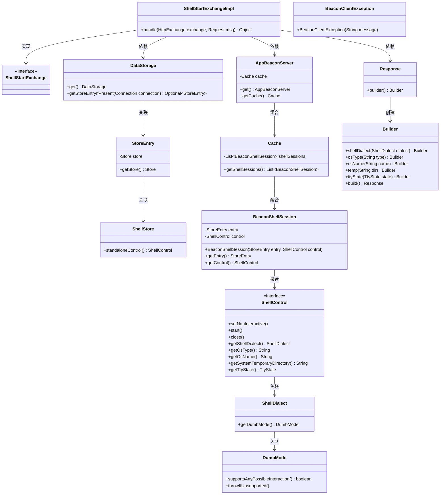
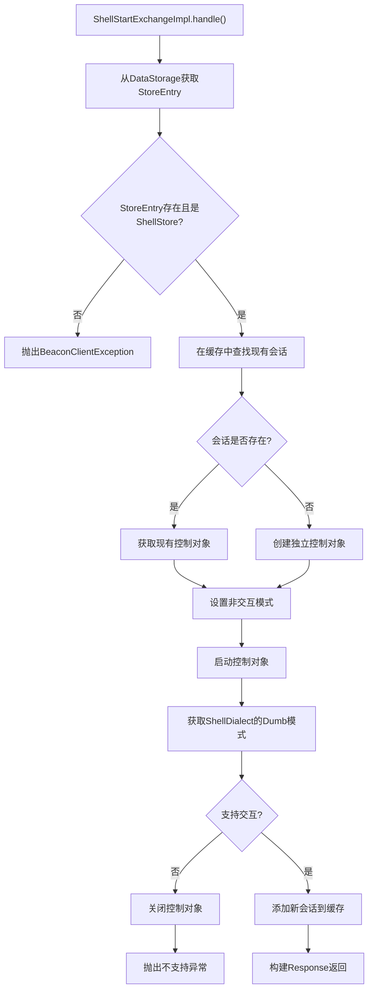

# 基础信息

|      |      |
|------|------|
| 名称 | ShellStartExchangeImpl |
| 编码语言 | .java |
| 代码路径 | xpipe/app/src/main/java/io/xpipe/app/beacon/impl/ShellStartExchangeImpl.java |
| 包名 | io.xpipe.app.beacon.impl |
| 依赖项 | ['io.xpipe.app.beacon.AppBeaconServer', 'io.xpipe.app.beacon.BeaconShellSession', 'io.xpipe.app.ext.ShellStore', 'io.xpipe.app.storage.DataStorage', 'io.xpipe.beacon.BeaconClientException', 'io.xpipe.beacon.api.ShellStartExchange', 'com.sun.net.httpserver.HttpExchange', 'lombok.SneakyThrows'] |
| 概述说明 | ShellStartExchangeImpl处理HTTP请求，验证连接并管理Shell会话，返回控制信息和状态。 |

# 说明

ShellStartExchangeImpl类继承ShellStartExchange，处理HTTP交换请求。首先检查数据存储中是否存在对应连接，若非Shell连接则抛出异常。随后检查现有Shell会话缓存，存在则复用控制实例，否则启动独立控制实例。设置非交互模式并启动控制实例，检查Shell方言是否支持交互，不支持则关闭并抛出异常。若为新会话则加入缓存。最后返回包含Shell方言、操作系统信息、临时目录和TTY状态的响应对象。

# 类列表 Class Summary

| 名称   | 类型  | 说明 |
|-------|------|-------------|
| ShellStartExchangeImpl | class | ShellStartExchangeImpl处理HTTP请求，验证连接类型，管理Shell会话，返回控制信息。 |

## 类 ShellStartExchangeImpl

|      |      |
|------|------|
| 访问范围 | public |
| 类型 | class |
| 名称 | ShellStartExchangeImpl |
| 说明 | ShellStartExchangeImpl处理HTTP请求，验证连接类型，管理Shell会话，返回控制信息。 |

### UML类图

这段代码描述了一个Shell会话启动的实现类`ShellStartExchangeImpl`，它处理HTTP交换请求并返回Shell会话响应。类图展示了从数据存储获取连接信息、验证Shell存储类型、管理Shell会话缓存、控制Shell交互模式到构建响应对象的完整流程。核心组件包括会话存储管理(DataStorage/StoreEntry)、服务器缓存(AppBeaconServer/Cache)、Shell控制接口(ShellControl)和响应构建器模式(Response/Builder)，形成了清晰的职责链结构。

### 内部方法调用关系图

这段代码流程图展示了ShellStartExchangeImpl类中handle方法的完整执行流程。该方法首先验证连接有效性，检查是否存在现有会话，然后创建或复用控制对象，设置非交互模式并启动控制。接着验证交互支持能力，最后构建包含系统信息的响应对象。整个过程包含多个验证点和分支逻辑，确保只对有效的shell连接进行处理，并妥善管理会话生命周期。

### 字段列表 Field List

| 名称  | 类型  | 说明 |
|-------|-------|------|

### 方法列表 Method List

| 名称  | 类型  | 说明 |
|-------|-------|------|
| handle | Object | 处理HTTP请求，验证连接并管理Shell会话，返回控制信息。 |

