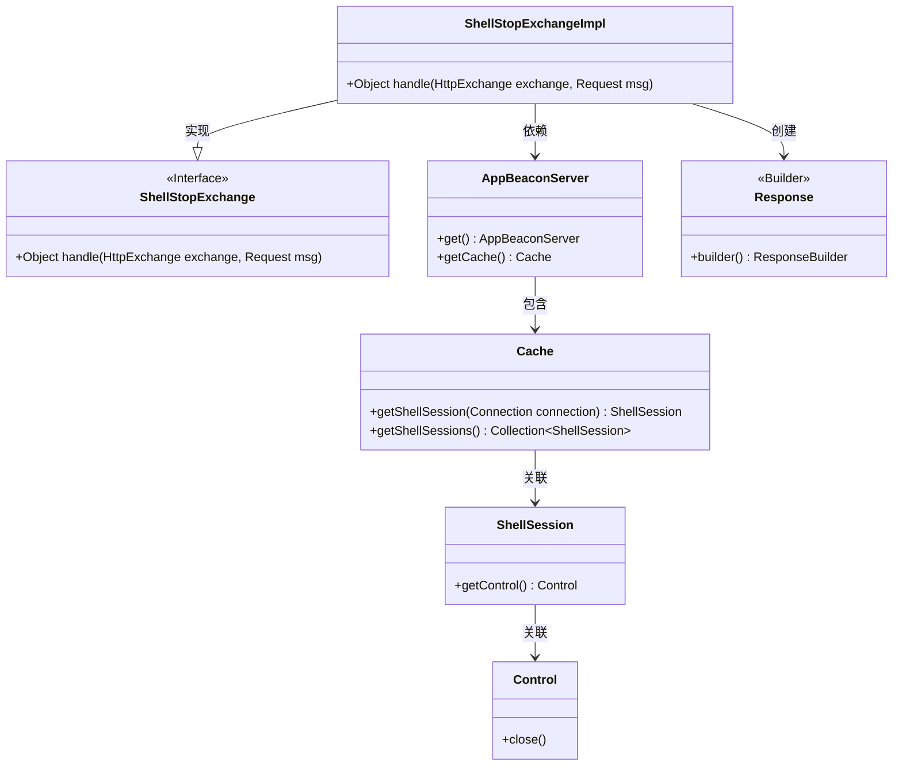
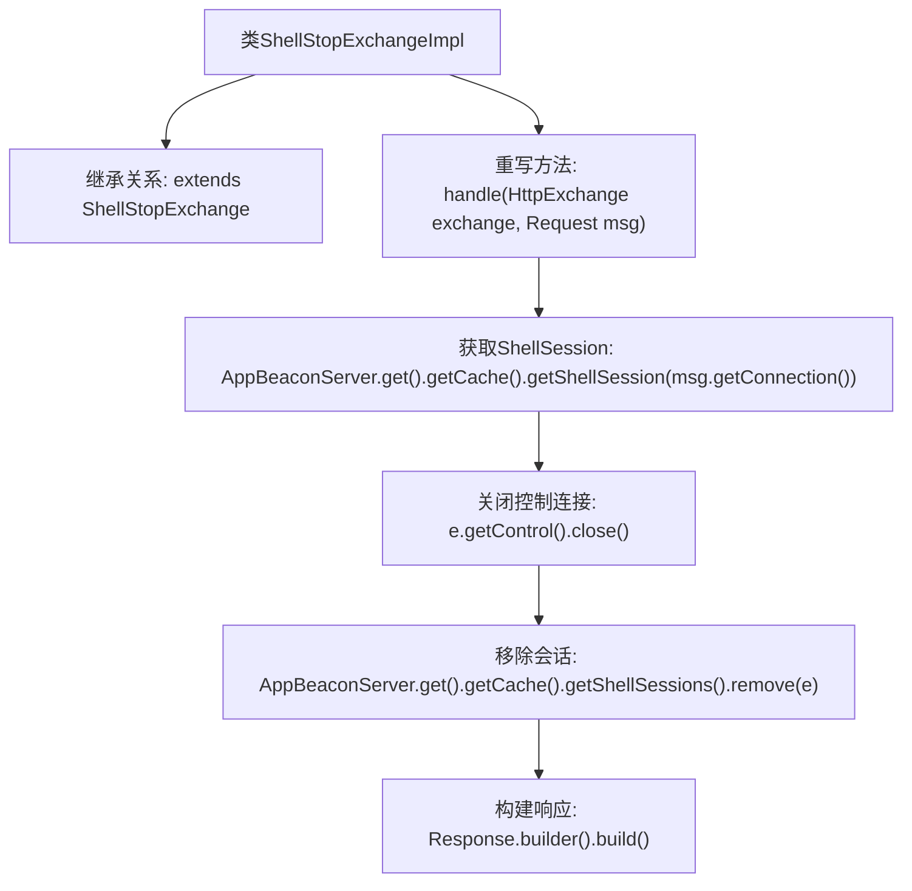

# 基础信息

|      |      |
|------|------|
| 名称 | ShellStopExchangeImpl |
| 编码语言 | .java |
| 代码路径 | xpipe/app/src/main/java/io/xpipe/app/beacon/impl/ShellStopExchangeImpl.java |
| 包名 | io.xpipe.app.beacon.impl |
| 依赖项 | ['io.xpipe.app.beacon.AppBeaconServer', 'io.xpipe.beacon.api.ShellStopExchange', 'com.sun.net.httpserver.HttpExchange', 'lombok.SneakyThrows'] |
| 概述说明 | ShellStopExchangeImpl类处理关闭Shell会话并清理缓存。 |

# 说明

ShellStopExchangeImpl类继承自ShellStopExchange，重写handle方法处理HTTP交换请求。方法通过AppBeaconServer获取缓存中的Shell会话，关闭会话控制并移除缓存中的会话记录，最后返回空的响应对象。整个过程不抛出异常，使用SneakyThrows注解处理潜在异常。

# 类列表 Class Summary

| 名称   | 类型  | 说明 |
|-------|------|-------------|
| ShellStopExchangeImpl | class | ShellStopExchangeImpl类处理关闭Shell会话请求，移除缓存并返回空响应。 |

## 类 ShellStopExchangeImpl

|      |      |
|------|------|
| 访问范围 | public |
| 类型 | class |
| 名称 | ShellStopExchangeImpl |
| 说明 | ShellStopExchangeImpl类处理关闭Shell会话请求，移除缓存并返回空响应。 |

### UML类图

这段代码展示了一个ShellStopExchange接口的实现类ShellStopExchangeImpl，用于处理HTTP交换请求并关闭Shell会话。类图清晰地呈现了各组件间的关系：实现类通过AppBeaconServer获取缓存中的Shell会话，调用其控制对象执行关闭操作，最后返回构建的响应对象。整个流程涉及6个核心类，包含实现、依赖、关联等多种关系，体现了会话终止功能的完整调用链。

### 内部方法调用关系图

该流程图展示了ShellStopExchangeImpl类的核心处理逻辑。类继承自ShellStopExchange，重写了handle方法，依次执行：通过连接标识获取ShellSession实例，关闭会话控制通道，从缓存中移除该会话，最后返回空响应。整个过程实现了Shell会话的安全终止和资源清理功能，涉及服务端缓存管理和网络连接控制操作。

### 字段列表 Field List

| 名称  | 类型  | 说明 |
|-------|-------|------|

### 方法列表 Method List

| 名称  | 类型  | 说明 |
|-------|-------|------|
| handle | Object | 处理HTTP请求，关闭并移除Shell会话。 |

