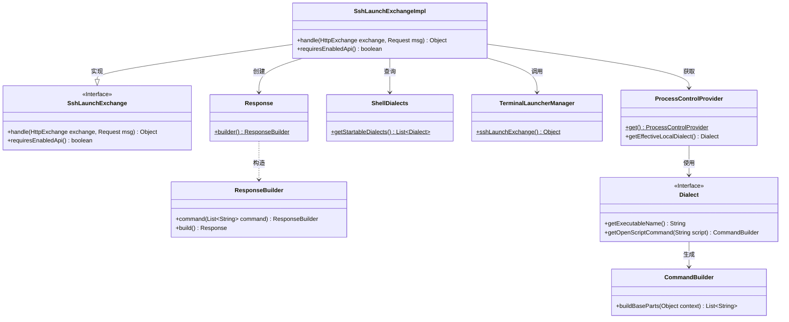
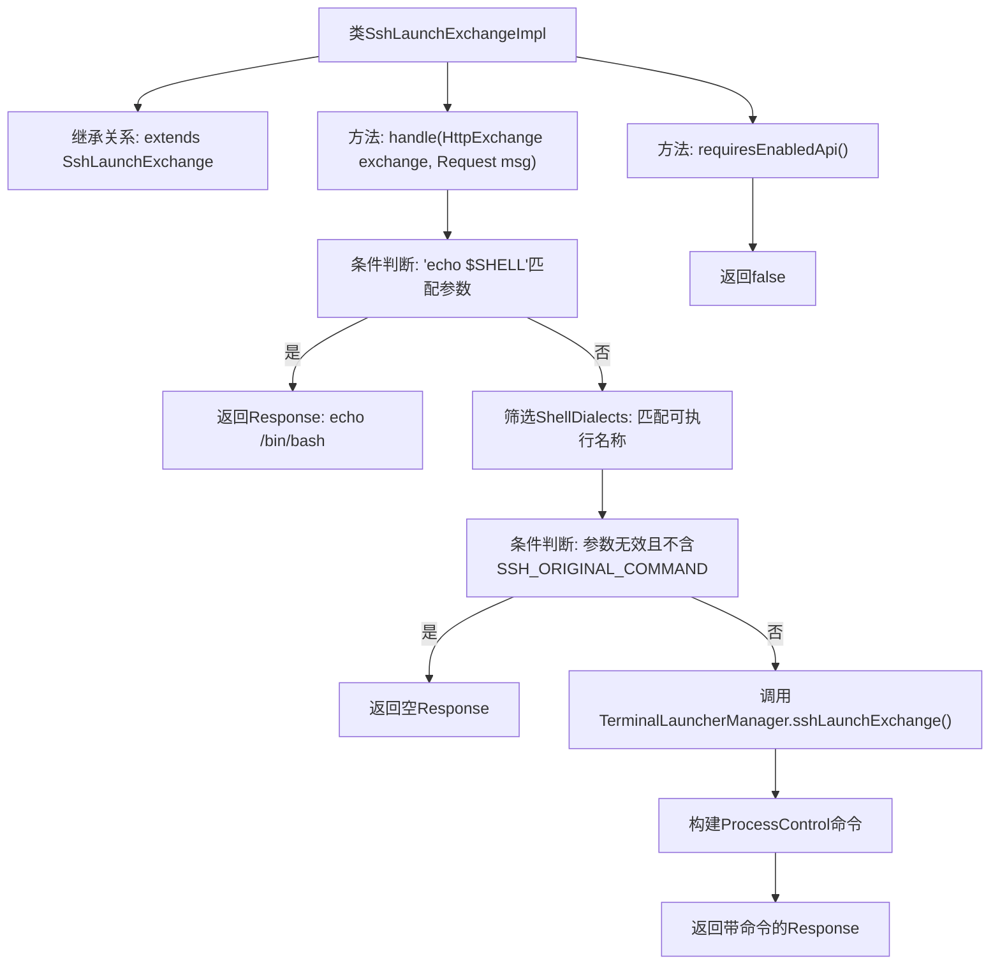

# 基础信息

|      |      |
|------|------|
| 名称 | SshLaunchExchangeImpl |
| 编码语言 | .java |
| 代码路径 | xpipe/app/src/main/java/io/xpipe/app/beacon/impl/SshLaunchExchangeImpl.java |
| 包名 | io.xpipe.app.beacon.impl |
| 依赖项 | ['io.xpipe.app.ext.ProcessControlProvider', 'io.xpipe.app.terminal.TerminalLauncherManager', 'io.xpipe.beacon.api.SshLaunchExchange', 'io.xpipe.core.process.ShellDialects', 'com.sun.net.httpserver.HttpExchange', 'java.util.List'] |
| 概述说明 | SshLaunchExchangeImpl处理SSH请求，验证参数并返回响应，支持终端启动和命令执行。 |

# 说明

该代码定义了一个名为SshLaunchExchangeImpl的类，继承自SshLaunchExchange。主要功能是处理SSH启动请求：当收到"echo $SHELL"命令时返回/bin/bash路径；若参数匹配可启动的Shell方言则进行相应处理，否则返回空命令；最后通过TerminalLauncherManager和ProcessControlProvider构建并返回响应命令。该类不要求启用API。

# 类列表 Class Summary

| 名称   | 类型  | 说明 |
|-------|------|-------------|
| SshLaunchExchangeImpl | class | SSH启动交换实现类，处理请求返回响应，支持Shell命令和终端启动。 |

## 类 SshLaunchExchangeImpl

|      |      |
|------|------|
| 访问范围 | public |
| 类型 | class |
| 名称 | SshLaunchExchangeImpl |
| 说明 | SSH启动交换实现类，处理请求返回响应，支持Shell命令和终端启动。 |

### UML类图

这段代码展示了一个SSH启动交换的实现类`SshLaunchExchangeImpl`，它继承自接口`SshLaunchExchange`。主要功能包括处理HTTP交换请求，根据不同的参数条件返回相应的响应命令。类图中清晰地展示了各个类之间的关系，包括实现接口、依赖创建和调用关系。核心逻辑涉及Shell方言处理、终端启动器管理和进程控制提供者等组件协作，最终构建并返回响应命令列表。

### 内部方法调用关系图

该流程图展示了SshLaunchExchangeImpl类的核心逻辑，主要处理SSH请求的分支判断。首先检查参数是否为shell查询，否则尝试匹配可执行方言，若均不满足则返回空响应。正常流程会通过TerminalLauncherManager生成终端启动命令，最终返回包含脚本命令的响应对象。类还包含一个固定返回false的API启用状态检查方法。

### 字段列表 Field List

| 名称  | 类型  | 说明 |
|-------|-------|------|

### 方法列表 Method List

| 名称  | 类型  | 说明 |
|-------|-------|------|
| handle | Object | 处理HTTP请求，根据参数返回不同响应：若为"echo $SHELL"返回/bin/bash；若无匹配方言且不含SSH命令返回空；否则生成终端启动命令响应。 |
| requiresEnabledApi | boolean | 重写方法，返回false表示无需启用API。 |

