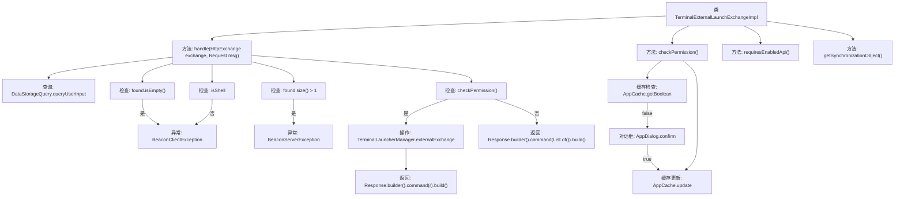
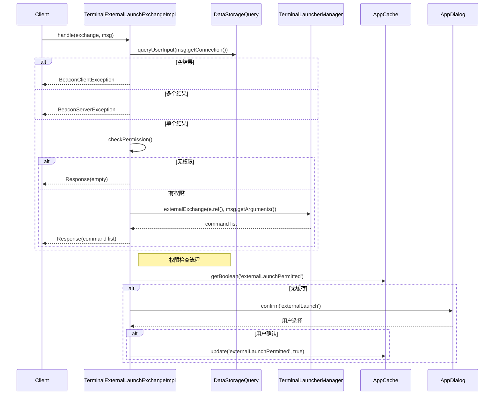

# 基础信息

|      |      |
|------|------|
| 名称 | TerminalExternalLaunchExchangeImpl |
| 编码语言 | .java |
| 代码路径 | xpipe/app/src/main/java/io/xpipe/app/beacon/impl/TerminalExternalLaunchExchangeImpl.java |
| 包名 | io.xpipe.app.beacon.impl |
| 依赖项 | ['io.xpipe.app.core.AppCache', 'io.xpipe.app.core.window.AppDialog', 'io.xpipe.app.ext.ShellStore', 'io.xpipe.app.storage.DataStorage', 'io.xpipe.app.storage.DataStorageQuery', 'io.xpipe.app.storage.DataStoreEntry', 'io.xpipe.app.terminal.TerminalLauncherManager', 'io.xpipe.beacon.BeaconClientException', 'io.xpipe.beacon.BeaconServerException', 'io.xpipe.beacon.api.TerminalExternalLaunchExchange', 'com.sun.net.httpserver.HttpExchange', 'java.util.List'] |
| 概述说明 | 终端外部启动实现类，处理连接查询、权限检查及执行命令。 |

# 说明

TerminalExternalLaunchExchangeImpl类继承TerminalExternalLaunchExchange，处理HTTP交换请求。主要逻辑包括：查询用户输入的连接信息，若不存在或多于一个则抛出异常；检查连接是否为Shell类型，否则报错；通过权限检查后调用TerminalLauncherManager执行外部交换并返回响应。权限检查通过AppCache缓存确认结果，未缓存时弹窗询问用户。类还实现requiresEnabledApi返回false，同步对象为DataStorage单例。

# 类列表 Class Summary

| 名称   | 类型  | 说明 |
|-------|------|-------------|
| TerminalExternalLaunchExchangeImpl | class | 终端外部启动实现类，处理连接查询、权限检查及执行命令。 |

## 类 TerminalExternalLaunchExchangeImpl

|      |      |
|------|------|
| 访问范围 | public |
| 类型 | class |
| 名称 | TerminalExternalLaunchExchangeImpl |
| 说明 | 终端外部启动实现类，处理连接查询、权限检查及执行命令。 |

### UML类图

```mermaid
classDiagram
    class TerminalExternalLaunchExchange {
        <<Interface>>
        +handle(HttpExchange exchange, Request msg) Object
        +requiresEnabledApi() boolean
        +getSynchronizationObject() Object
    }

    class TerminalExternalLaunchExchangeImpl {
        +handle(HttpExchange exchange, Request msg) Object
        -checkPermission() boolean
        +requiresEnabledApi() boolean
        +getSynchronizationObject() Object
    }

    class DataStorageQuery {
        +queryUserInput(String connection) List~DataStoreEntry~
    }

    class DataStorage {
        +get() DataStorage
        +getStorePath(DataStoreEntry e) Path
    }

    class ShellStore {
        <<Interface>>
    }

    class DataStoreEntry {
        +getName() String
        +getStore() Object
        +ref() String
    }

    class TerminalLauncherManager {
        +externalExchange(String ref, List~String~ args) List~String~
    }

    class AppCache {
        +getBoolean(String key, boolean defaultValue) boolean
        +update(String key, boolean value) void
    }

    class AppDialog {
        +confirm(String key) boolean
    }

    TerminalExternalLaunchExchangeImpl --|> TerminalExternalLaunchExchange : 实现
    TerminalExternalLaunchExchangeImpl --> DataStorageQuery : 调用查询
    TerminalExternalLaunchExchangeImpl --> DataStorage : 获取存储路径
    TerminalExternalLaunchExchangeImpl --> TerminalLauncherManager : 调用启动器
    TerminalExternalLaunchExchangeImpl --> AppCache : 检查权限缓存
    TerminalExternalLaunchExchangeImpl --> AppDialog : 请求用户确认
    DataStoreEntry ..> ShellStore : 关联存储类型
```

这段代码展示了一个终端外部启动交换的实现类，主要处理HTTP交换请求，验证连接权限并执行外部终端启动。类图清晰地呈现了实现类与接口的继承关系，以及它与数据存储查询、权限检查、终端启动管理等组件的交互。核心逻辑包括：查询用户输入连接、验证连接类型、检查启动权限、执行外部交换并返回响应。权限检查采用缓存机制优化，避免重复弹窗确认。

### 内部方法调用关系图

这段代码实现了一个终端外部启动交换处理器，主要处理HTTP交换请求并执行外部终端启动。流程图展示了类结构和方法调用关系，时序图详细描述了权限验证和外部启动的交互流程。核心功能包括：连接查询验证、Shell类型检查、权限缓存管理（带用户确认对话框）以及外部终端启动执行。异常处理覆盖了连接不存在、多连接匹配和非Shell连接等情况，权限系统采用缓存优化减少用户交互。

### 字段列表 Field List

| 名称  | 类型  | 说明 |
|-------|-------|------|

### 方法列表 Method List

| 名称  | 类型  | 说明 |
|-------|-------|------|
| checkPermission | boolean | 检查外部启动权限，缓存允许则直接返回，否则弹窗确认并更新缓存。 |
| handle | Object | 处理HTTP请求，查询用户连接，验证权限后执行终端命令并返回结果。 |
| requiresEnabledApi | boolean | 重写方法，返回false表示无需启用API。 |
| getSynchronizationObject | Object | 重写方法，返回DataStorage单例对象。 |

