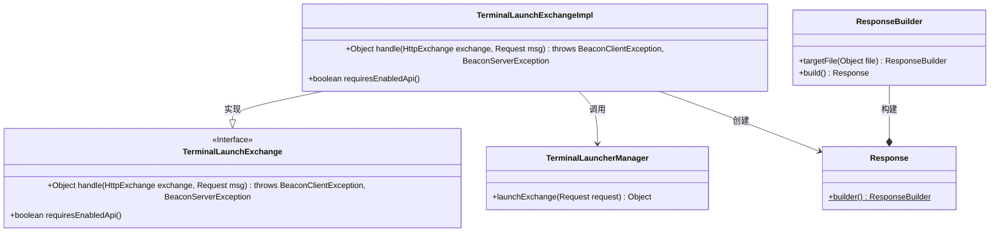

# 基础信息

|      |      |
|------|------|
| 名称 | TerminalLaunchExchangeImpl |
| 编码语言 | .java |
| 代码路径 | xpipe/app/src/main/java/io/xpipe/app/beacon/impl/TerminalLaunchExchangeImpl.java |
| 包名 | io.xpipe.app.beacon.impl |
| 依赖项 | ['io.xpipe.app.terminal.TerminalLauncherManager', 'io.xpipe.beacon.BeaconClientException', 'io.xpipe.beacon.BeaconServerException', 'io.xpipe.beacon.api.TerminalLaunchExchange', 'com.sun.net.httpserver.HttpExchange'] |
| 概述说明 | 终端启动交换实现类，处理HTTP请求并返回目标文件响应，无需启用API。 |

# 说明

这是一个名为TerminalLaunchExchangeImpl的类，继承自TerminalLaunchExchange。它重写了两个方法：handle方法处理HttpExchange和Request消息，调用TerminalLauncherManager的launchExchange方法并返回包含目标文件的Response；requiresEnabledApi方法返回false，表示不需要启用API。类功能涉及终端启动交换处理。

# 类列表 Class Summary

| 名称   | 类型  | 说明 |
|-------|------|-------------|
| TerminalLaunchExchangeImpl | class | 终端启动交换实现类，处理HTTP请求并返回目标文件响应，无需启用API。 |

## 类 TerminalLaunchExchangeImpl

|      |      |
|------|------|
| 访问范围 | public |
| 类型 | class |
| 名称 | TerminalLaunchExchangeImpl |
| 说明 | 终端启动交换实现类，处理HTTP请求并返回目标文件响应，无需启用API。 |

### UML类图

这段类图展示了终端启动交换功能的实现结构。TerminalLaunchExchangeImpl类实现了TerminalLaunchExchange接口，提供了处理HTTP交换的核心方法handle()和API启用检查方法requiresEnabledApi()。实现类通过TerminalLauncherManager执行实际启动操作，并使用Response构建器模式生成包含目标文件的响应对象。整体设计遵循接口隔离原则，职责划分清晰，便于扩展和维护。

### 内部方法调用关系图

该流程图展示了TerminalLaunchExchangeImpl类的结构，它继承自TerminalLaunchExchange类，包含两个主要方法：handle方法和requiresEnabledApi方法。handle方法处理HTTP交换请求，通过TerminalLauncherManager启动交换并构建响应；requiresEnabledApi方法返回false表示不需要启用API。整个流程清晰地反映了类的继承关系和方法调用逻辑。

### 字段列表 Field List

| 名称  | 类型  | 说明 |
|-------|-------|------|

### 方法列表 Method List

| 名称  | 类型  | 说明 |
|-------|-------|------|
| requiresEnabledApi | boolean | 方法重写，返回false表示无需启用API。 |
| handle | Object | 重写handle方法，调用TerminalLauncherManager处理请求并返回包含目标文件的响应。 |

