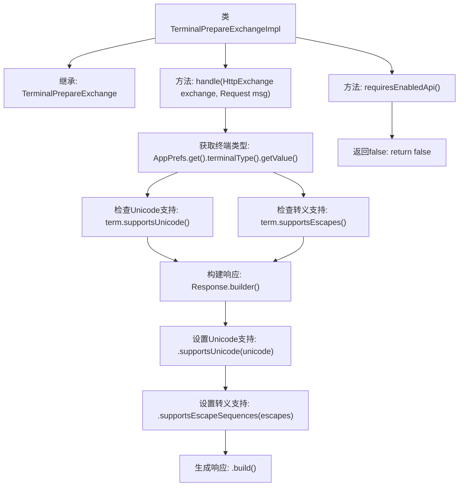

# 基础信息

|      |      |
|------|------|
| 名称 | TerminalPrepareExchangeImpl |
| 编码语言 | .java |
| 代码路径 | xpipe/app/src/main/java/io/xpipe/app/beacon/impl/TerminalPrepareExchangeImpl.java |
| 包名 | io.xpipe.app.beacon.impl |
| 依赖项 | ['io.xpipe.app.prefs.AppPrefs', 'io.xpipe.beacon.api.TerminalPrepareExchange', 'com.sun.net.httpserver.HttpExchange'] |
| 概述说明 | 终端处理类，检查终端类型支持Unicode和转义序列，返回响应配置。无需启用API。 |

# 说明

这是一个名为TerminalPrepareExchangeImpl的Java类，继承自TerminalPrepareExchange。它重写了handle方法，处理HTTP交换和请求消息，通过AppPrefs获取终端类型，检查终端是否支持Unicode和转义序列，并构建包含这些信息的响应对象。此外，它重写requiresEnabledApi方法，返回false表示不需要启用API。

# 类列表 Class Summary

| 名称   | 类型  | 说明 |
|-------|------|-------------|
| TerminalPrepareExchangeImpl | class | 终端处理类，检查终端类型支持Unicode和转义序列，返回响应结果，无需启用API。 |


## 类 TerminalPrepareExchangeImpl

|      |      |
|------|------|
| 访问范围 | public |
| 类型 | class |
| 名称 | TerminalPrepareExchangeImpl |
| 说明 | 终端处理类，检查终端类型支持Unicode和转义序列，返回响应结果，无需启用API。 |


### UML类图

```mermaid
classDiagram
    class TerminalPrepareExchange {
        <<Interface>>
        +Object handle(HttpExchange exchange, Request msg)
        +boolean requiresEnabledApi()
    }

    class TerminalPrepareExchangeImpl {
        +Object handle(HttpExchange exchange, Request msg)
        +boolean requiresEnabledApi()
    }

    class AppPrefs {
        +TerminalType terminalType()
    }

    class TerminalType {
        +boolean supportsUnicode()
        +boolean supportsEscapes()
    }

    class Response {
        +Builder builder()
    }

    class Response$Builder {
        +Builder supportsUnicode(boolean unicode)
        +Builder supportsEscapeSequences(boolean escapes)
        +Response build()
    }

    TerminalPrepareExchangeImpl --|> TerminalPrepareExchange : 实现
    TerminalPrepareExchangeImpl --> AppPrefs : 依赖
    AppPrefs --> TerminalType : 关联
    TerminalPrepareExchangeImpl --> Response : 依赖
    Response --> Response$Builder : 创建
```

这段类图展示了终端准备交换功能的实现结构。TerminalPrepareExchangeImpl实现了TerminalPrepareExchange接口，通过AppPrefs获取终端类型配置，使用TerminalType检查Unicode和转义序列支持能力，最后通过Response的建造者模式构建响应对象。图中清晰地呈现了类之间的实现、依赖和关联关系，核心功能是动态生成基于终端特性的响应配置。


### 内部方法调用关系图



这段代码流程图展示了TerminalPrepareExchangeImpl类的结构和工作流程。该类继承自TerminalPrepareExchange，主要包含两个方法：handle()处理HTTP请求，通过获取终端类型并检查其Unicode和转义序列支持来构建响应；requiresEnabledApi()始终返回false表示不需要启用API。核心流程从获取终端配置开始，经过特性检测后生成包含支持信息的响应对象。

### 字段列表 Field List

| 名称  | 类型  | 说明 |
|-------|-------|------|

### 方法列表 Method List

| 名称  | 类型  | 说明 |
|-------|-------|------|
| handle | Object | 处理HTTP请求，返回终端支持的Unicode和转义序列状态。 |
| requiresEnabledApi | boolean | 重写方法，返回false表示无需启用API。 |


