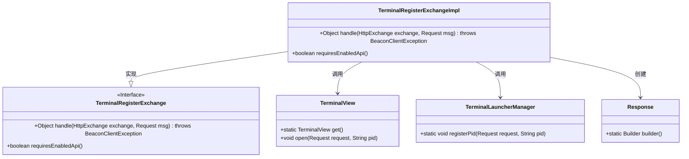
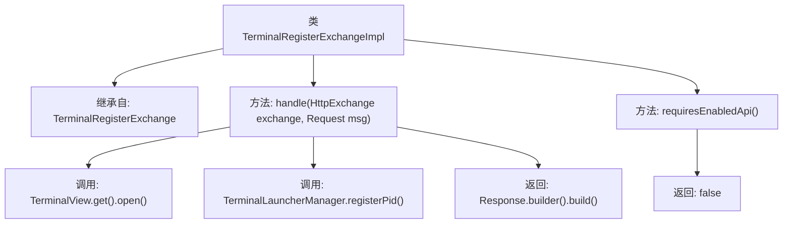

# 基础信息

|      |      |
|------|------|
| 名称 | TerminalRegisterExchangeImpl |
| 编码语言 | .java |
| 代码路径 | xpipe/app/src/main/java/io/xpipe/app/beacon/impl/TerminalRegisterExchangeImpl.java |
| 包名 | io.xpipe.app.beacon.impl |
| 依赖项 | ['io.xpipe.app.terminal.TerminalLauncherManager', 'io.xpipe.app.terminal.TerminalView', 'io.xpipe.beacon.BeaconClientException', 'io.xpipe.beacon.api.TerminalRegisterExchange', 'com.sun.net.httpserver.HttpExchange'] |
| 概述说明 | 终端注册交换实现类，处理请求并打开终端视图，注册进程ID，无需启用API。 |

# 说明

这是一个名为TerminalRegisterExchangeImpl的类，继承自TerminalRegisterExchange。它重写了两个方法：handle方法处理HTTP交换和请求，调用TerminalView打开请求并获取进程ID，同时通过TerminalLauncherManager注册进程ID，最后返回一个空的Response对象；requiresEnabledApi方法返回false，表示不需要启用API。

# 类列表 Class Summary

| 名称   | 类型  | 说明 |
|-------|------|-------------|
| TerminalRegisterExchangeImpl | class | 终端注册交换实现类，处理请求并返回响应，无需启用API。 |

## 类 TerminalRegisterExchangeImpl

|      |      |
|------|------|
| 访问范围 | public |
| 类型 | class |
| 名称 | TerminalRegisterExchangeImpl |
| 说明 | 终端注册交换实现类，处理请求并返回响应，无需启用API。 |

### UML类图

这段代码展示了一个终端注册交换的实现类TerminalRegisterExchangeImpl，它继承自接口TerminalRegisterExchange。主要功能是通过handle方法处理HTTP交换请求，调用TerminalView打开终端并注册进程ID，最后返回一个空的Response对象。类图中清晰地展示了实现关系以及与其他工具类的调用依赖，包括TerminalView、TerminalLauncherManager和Response构建器。

### 内部方法调用关系图

这段代码展示了一个终端注册交换实现类TerminalRegisterExchangeImpl，继承自TerminalRegisterExchange。主要包含两个方法：handle方法处理HTTP交换和请求，调用视图打开和管理器注册PID后返回响应；requiresEnabledApi方法固定返回false表示无需启用API。流程图清晰展示了类继承关系和方法调用链，体现了终端注册的核心逻辑。

### 字段列表 Field List

| 名称  | 类型  | 说明 |
|-------|-------|------|

### 方法列表 Method List

| 名称  | 类型  | 说明 |
|-------|-------|------|
| handle | Object | 重写handle方法，打开终端视图并注册PID，返回空响应。 |
| requiresEnabledApi | boolean | 重写方法，返回false表示无需启用API。 |

