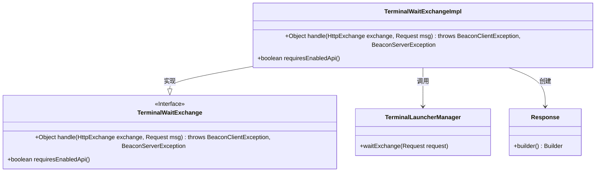
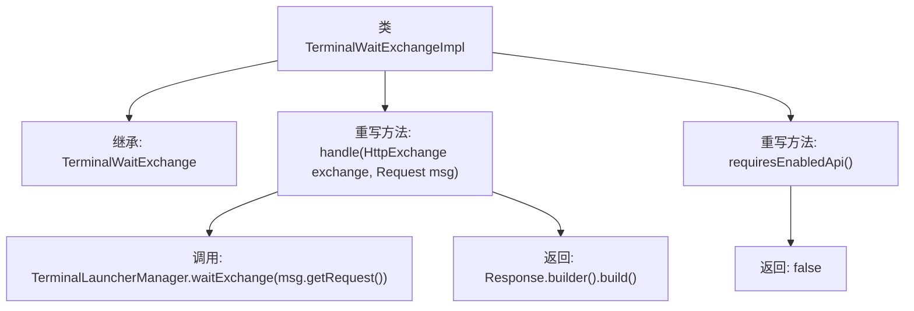

# 基础信息

|      |      |
|------|------|
| 名称 | TerminalWaitExchangeImpl |
| 编码语言 | .java |
| 代码路径 | xpipe/app/src/main/java/io/xpipe/app/beacon/impl/TerminalWaitExchangeImpl.java |
| 包名 | io.xpipe.app.beacon.impl |
| 依赖项 | ['io.xpipe.app.terminal.TerminalLauncherManager', 'io.xpipe.beacon.BeaconClientException', 'io.xpipe.beacon.BeaconServerException', 'io.xpipe.beacon.api.TerminalWaitExchange', 'com.sun.net.httpserver.HttpExchange'] |
| 概述说明 | 终端等待交换实现类，处理HTTP请求并返回响应，无需启用API。 |

# 说明

这是一个名为TerminalWaitExchangeImpl的类，继承自TerminalWaitExchange。它重写了两个方法：handle方法处理HTTP交换和请求消息，调用TerminalLauncherManager的waitExchange方法并返回空响应；requiresEnabledApi方法返回false，表示不需要启用API。类功能涉及终端启动管理和HTTP请求处理。

# 类列表 Class Summary

| 名称   | 类型  | 说明 |
|-------|------|-------------|
| TerminalWaitExchangeImpl | class | 终端等待交换实现类，处理HTTP请求并返回响应，无需启用API。 |

## 类 TerminalWaitExchangeImpl

|      |      |
|------|------|
| 访问范围 | public |
| 类型 | class |
| 名称 | TerminalWaitExchangeImpl |
| 说明 | 终端等待交换实现类，处理HTTP请求并返回响应，无需启用API。 |

### UML类图

该类图展示了TerminalWaitExchangeImpl类实现TerminalWaitExchange接口的结构关系。TerminalWaitExchangeImpl通过handle方法处理HTTP交换请求，调用TerminalLauncherManager的waitExchange方法，并返回Response对象。requiresEnabledApi方法返回false表示不需要启用API。图中清晰呈现了接口实现、方法调用和对象创建的依赖关系，体现了请求处理的核心流程。

### 内部方法调用关系图

该流程图描述了TerminalWaitExchangeImpl类的结构及其方法调用关系。该类继承自TerminalWaitExchange，重写了handle和requiresEnabledApi两个方法。handle方法处理HTTP交换请求，调用TerminalLauncherManager的waitExchange方法，并返回一个构建的Response对象；requiresEnabledApi方法直接返回false，表示不需要启用API。整个流程清晰地展示了类的方法调用和返回路径。

### 字段列表 Field List

| 名称  | 类型  | 说明 |
|-------|-------|------|

### 方法列表 Method List

| 名称  | 类型  | 说明 |
|-------|-------|------|
| requiresEnabledApi | boolean | 重写方法，返回false表示无需启用API。 |
| handle | Object | 重写handle方法，等待请求后返回空响应。 |

