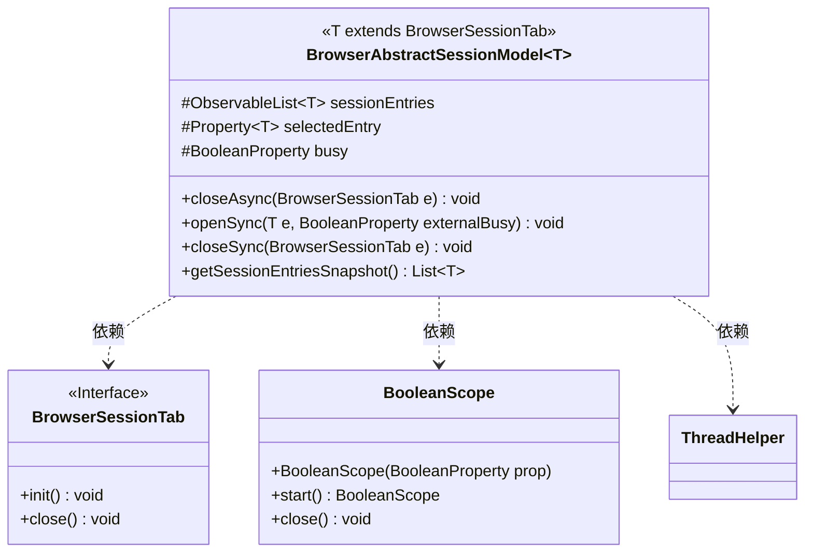
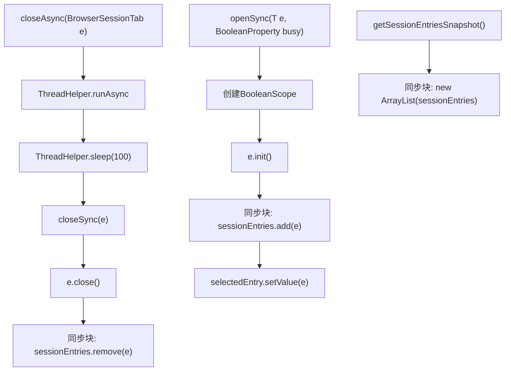
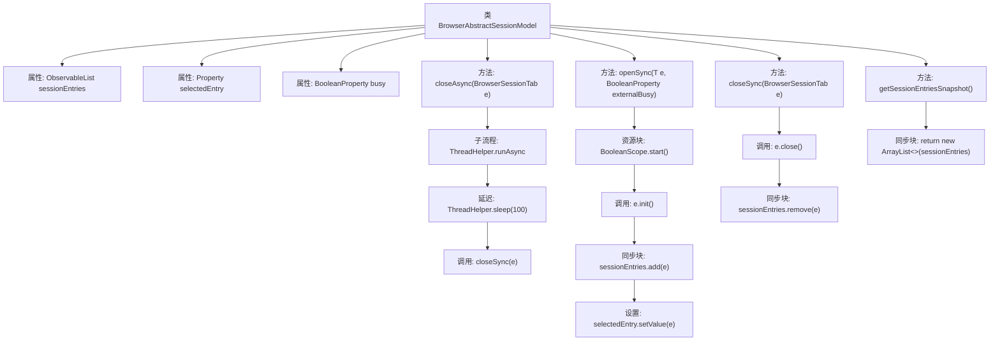

# 基础信息

|      |      |
|------|------|
| 名称 | BrowserAbstractSessionModel |
| 编码语言 | .java |
| 代码路径 | xpipe/app/src/main/java/io/xpipe/app/browser/BrowserAbstractSessionModel.java |
| 包名 | io.xpipe.app.browser |
| 依赖项 | ['io.xpipe.app.util.BooleanScope', 'io.xpipe.app.util.ThreadHelper', 'javafx.beans.property.BooleanProperty', 'javafx.beans.property.Property', 'javafx.beans.property.SimpleBooleanProperty', 'javafx.beans.property.SimpleObjectProperty', 'javafx.collections.FXCollections', 'javafx.collections.ObservableList', 'lombok.Getter', 'java.util.ArrayList', 'java.util.List'] |
| 概述说明 | 浏览器会话模型类，管理标签页列表、选中项和忙碌状态，支持异步关闭和同步打开/关闭操作。 |

# 说明

这是一个抽象浏览器会话模型类，用于管理浏览器标签页会话。它包含三个核心属性：可观察的会话条目列表、当前选中条目属性和忙碌状态属性。提供了异步关闭标签页方法，通过延迟100毫秒避免初始化冲突。同步打开方法会初始化新标签页并添加到列表，同时自动选中新标签页。同步关闭方法会关闭标签页并从列表中移除。还提供了获取会话条目快照的方法，确保线程安全。所有关键操作都通过同步块保证线程安全。

# 类列表 Class Summary

| 名称   | 类型  | 说明 |
|-------|------|-------------|
| BrowserAbstractSessionModel | class | 浏览器会话模型类，管理标签页列表、选中项及状态，提供同步/异步打开关闭方法。 |

## 类 BrowserAbstractSessionModel

|      |      |
|------|------|
| 访问范围 | @Getter;public |
| 类型 | class |
| 名称 | BrowserAbstractSessionModel |
| 说明 | 浏览器会话模型类，管理标签页列表、选中项及状态，提供同步/异步打开关闭方法。 |

### UML类图

这段代码定义了一个浏览器会话管理抽象类`BrowserAbstractSessionModel`，使用泛型`T`约束为`BrowserSessionTab`的子类。核心功能包括异步/同步关闭标签页、同步打开标签页以及获取会话条目快照。通过`synchronized`保证线程安全，使用`BooleanScope`管理忙状态，依赖`ThreadHelper`实现异步操作。类图展示了与`BrowserSessionTab`接口和工具类的依赖关系，流程图清晰呈现了三个主要方法的执行逻辑。

### 内部方法调用关系图

这段代码定义了一个泛型类BrowserAbstractSessionModel，用于管理浏览器会话标签页的抽象模型。主要功能包括异步关闭标签页(closeAsync)、同步打开标签页(openSync)和同步关闭标签页(closeSync)，以及获取会话条目快照(getSessionEntriesSnapshot)。所有对sessionEntries列表的操作都通过synchronized关键字进行同步保护，确保线程安全。openSync方法使用BooleanScope管理外部忙碌状态，closeAsync通过ThreadHelper实现异步延迟关闭以避免初始化冲突。

### 字段列表 Field List

| 名称  | 类型  | 说明 |
|-------|-------|------|
| sessionEntries = FXCollections.observableArrayList() | ObservableList<T> | 受保护的最终可观察列表sessionEntries，使用FXCollections.observableArrayList初始化。 |
| busy = new SimpleBooleanProperty() | BooleanProperty | 受保护的最终布尔属性busy，初始化为SimpleBooleanProperty实例。 |
| selectedEntry = new SimpleObjectProperty<>() | Property<T> | 受保护的最终属性selectedEntry，类型为Property<T>，初始化为SimpleObjectProperty。 |

### 方法列表 Method List

| 名称  | 类型  | 说明 |
|-------|-------|------|
| closeAsync | void | 异步关闭浏览器标签页，延迟100毫秒避免初始化冲突。 |
| openSync | void | 同步打开方法，初始化对象并加入会话列表，设置选中项，处理并发。 |
| closeSync | void | 关闭浏览器标签页并同步移除会话条目。 |
| getSessionEntriesSnapshot | List<T> | 同步返回会话条目快照列表 |

