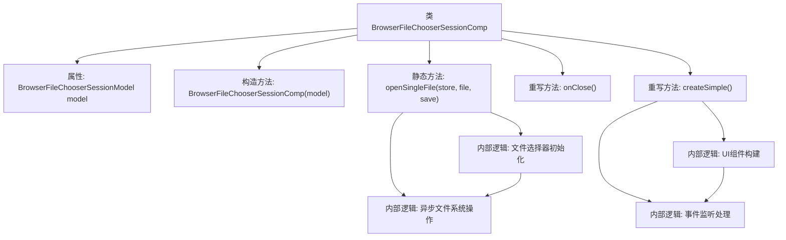
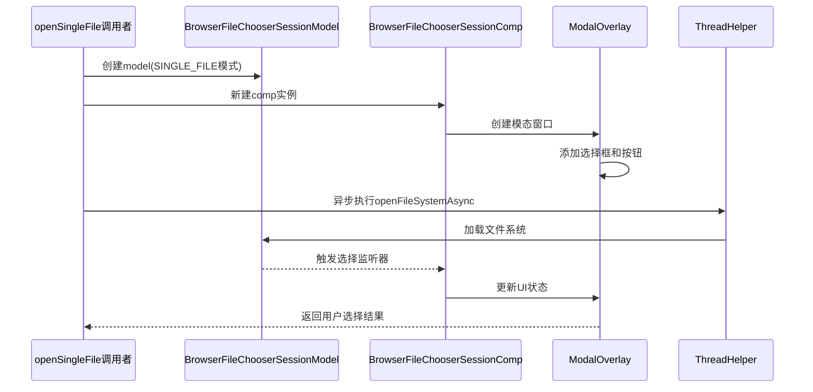

# 基础信息

|      |      |
|------|------|
| 名称 | BrowserFileChooserSessionComp |
| 编码语言 | .java |
| 代码路径 | xpipe/app/src/main/java/io/xpipe/app/browser/BrowserFileChooserSessionComp.java |
| 包名 | io.xpipe.app.browser |
| 依赖项 | ['io.xpipe.app.browser.file.BrowserConnectionListComp', 'io.xpipe.app.browser.file.BrowserConnectionListFilterComp', 'io.xpipe.app.browser.file.BrowserEntry', 'io.xpipe.app.browser.file.BrowserFileSystemTabComp', 'io.xpipe.app.browser.file.BrowserFileSystemTabModel', 'io.xpipe.app.comp.Comp', 'io.xpipe.app.comp.base', 'io.xpipe.app.comp.store.StoreEntryWrapper', 'io.xpipe.app.comp.store.StoreViewState', 'io.xpipe.app.core.AppFontSizes', 'io.xpipe.app.core.AppLayoutModel', 'io.xpipe.app.ext.ShellStore', 'io.xpipe.app.storage.DataStoreEntryRef', 'io.xpipe.app.util.BindingsHelper', 'io.xpipe.app.util.FileReference', 'io.xpipe.app.util.PlatformThread', 'io.xpipe.app.util.ThreadHelper', 'io.xpipe.core.store.FileSystemStore', 'javafx.beans.property.BooleanProperty', 'javafx.beans.property.SimpleObjectProperty', 'javafx.beans.property.SimpleStringProperty', 'javafx.collections.ListChangeListener', 'javafx.scene.layout.Region', 'javafx.scene.layout.StackPane', 'javafx.scene.shape.Rectangle', 'java.util.List', 'java.util.function.BiConsumer', 'java.util.function.Consumer', 'java.util.function.Predicate', 'java.util.function.Supplier'] |
| 概述说明 | 浏览器文件选择器组件，支持单文件选择和保存操作，包含书签列表和文件系统导航功能。 |

# 说明

该代码定义了一个浏览器文件选择器会话组件BrowserFileChooserSessionComp，继承自模态叠加内容组件。主要功能包括：通过openSingleFile方法打开单文件选择对话框，支持打开或保存文件操作；包含文件系统导航、书签过滤和选择功能；使用模态窗口展示界面，左侧显示书签列表，右侧显示文件系统内容；支持异步加载文件系统和处理用户选择。组件还实现了关闭文件系统和创建简单界面的逻辑，包括处理存储条目操作和界面布局。

# 类列表 Class Summary

| 名称   | 类型  | 说明 |
|-------|------|-------------|
| BrowserFileChooserSessionComp | class | 浏览器文件选择器组件，支持单文件选择和保存操作，包含模型管理和异步文件系统交互。 |

## 类 BrowserFileChooserSessionComp

|      |      |
|------|------|
| 访问范围 | public |
| 类型 | class |
| 名称 | BrowserFileChooserSessionComp |
| 说明 | 浏览器文件选择器组件，支持单文件选择和保存操作，包含模型管理和异步文件系统交互。 |

### UML类图

```mermaid
classDiagram
    class ModalOverlayContentComp {
        <<abstract>>
        +protected void onClose()
        +protected Region createSimple()
    }

    class BrowserFileChooserSessionComp {
        -BrowserFileChooserSessionModel model
        +BrowserFileChooserSessionComp(BrowserFileChooserSessionModel model)
        +static void openSingleFile(Supplier~DataStoreEntryRef~? extends FileSystemStore~~ store, Consumer~FileReference~ file, boolean save)
        +void onClose()
        +Region createSimple()
    }

    class BrowserFileChooserSessionModel {
        +BrowserFileChooserSessionModel(BrowserFileSystemTabModel.SelectionMode selectionMode)
        +void setOnFinish(Consumer~List~FileReference~~ onFinish)
        +void finishChooser()
        +void closeFileSystem()
        +void openFileSystemAsync(DataStoreEntryRef~? extends FileSystemStore~ entryRef, Object p1, Object p2)
        +Property~BrowserEntry~ getSelectedEntry()
        +ObservableList~BrowserEntry~ getFileSelection()
    }

    class BrowserFileSystemTabComp {
        +BrowserFileSystemTabComp(BrowserEntry selected, boolean showHidden)
        +Region createRegion()
    }

    class BrowserConnectionListFilterComp {
        +BrowserConnectionListFilterComp(Property~Object~ category, Property~String~ filter)
    }

    class BrowserConnectionListComp {
        +BrowserConnectionListComp(ObservableValue~Object~ selectedEntry, Predicate~StoreEntryWrapper~ applicable, BiConsumer~StoreEntryWrapper, BooleanProperty~ action, Property~Object~ category, Property~String~ filter)
    }

    class LeftSplitPaneComp {
        +LeftSplitPaneComp(Region left, Region right)
        +LeftSplitPaneComp withInitialWidth(double width)
        +Region createRegion()
    }

    ModalOverlayContentComp <|-- BrowserFileChooserSessionComp
    BrowserFileChooserSessionComp --> BrowserFileChooserSessionModel : 包含
    BrowserFileChooserSessionComp --> BrowserFileSystemTabComp : 创建实例
    BrowserFileChooserSessionComp --> BrowserConnectionListFilterComp : 创建实例
    BrowserFileChooserSessionComp --> BrowserConnectionListComp : 创建实例
    BrowserFileChooserSessionComp --> LeftSplitPaneComp : 创建实例
```

该代码实现了一个浏览器文件选择器会话组件，继承自模态覆盖层内容组件。核心类BrowserFileChooserSessionComp通过BrowserFileChooserSessionModel管理文件选择状态，包含静态方法openSingleFile用于打开单文件选择对话框。组件创建时构建了包含连接列表过滤区、书签列表和文件系统标签页的左右分栏界面，支持异步文件系统操作和选择状态监听。类图展示了7个主要类及其继承/组合关系，体现了GUI组件与数据模型的分离设计。

### 内部方法调用关系图

该流程图展示了BrowserFileChooserSessionComp类的核心结构和交互逻辑。类继承自ModalOverlayContentComp，主要实现文件选择器功能，包含模型初始化、异步文件操作、UI构建和事件处理四个关键模块。时序图详细描述了openSingleFile方法的执行过程，从创建模型实例、构建UI组件到异步加载文件系统，最终通过模态窗口返回用户选择结果。代码特别注重线程安全处理，通过PlatformThread和ThreadHelper确保UI更新和耗时操作的正确执行顺序。

### 字段列表 Field List

| 名称  | 类型  | 说明 |
|-------|-------|------|
| model | BrowserFileChooserSessionModel | 私有浏览器文件选择会话模型。 |

### 方法列表 Method List

| 名称  | 类型  | 说明 |
|-------|-------|------|
| openSingleFile | void | 打开单文件选择器，支持保存或打开操作，异步加载文件系统。 |
| onClose | void | 重写onClose方法，关闭文件系统。 |
| createSimple | Region | 创建界面区域，包含左侧书签列表和右侧文件系统面板，支持异步打开ShellStore。 |

