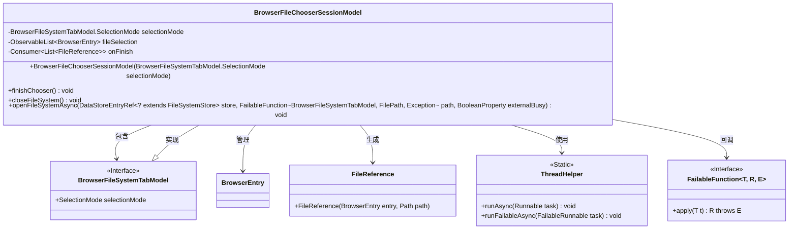
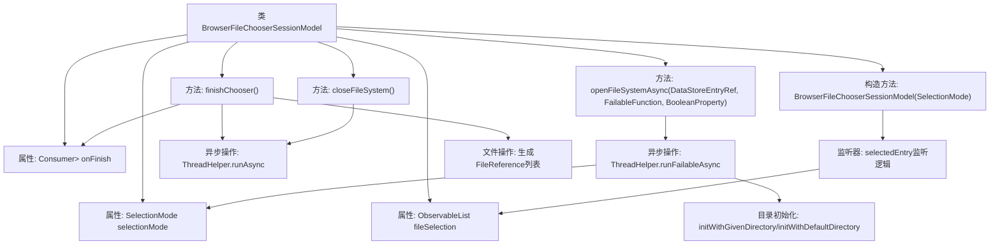

# 基础信息

|      |      |
|------|------|
| 名称 | BrowserFileChooserSessionModel |
| 编码语言 | .java |
| 代码路径 | xpipe/app/src/main/java/io/xpipe/app/browser/BrowserFileChooserSessionModel.java |
| 包名 | io.xpipe.app.browser |
| 依赖项 | ['io.xpipe.app.browser.file.BrowserEntry', 'io.xpipe.app.browser.file.BrowserFileSystemTabModel', 'io.xpipe.app.storage.DataStoreEntryRef', 'io.xpipe.app.util.BooleanScope', 'io.xpipe.app.util.FileReference', 'io.xpipe.app.util.ThreadHelper', 'io.xpipe.core.store.FilePath', 'io.xpipe.core.store.FileSystemStore', 'io.xpipe.core.util.FailableFunction', 'javafx.beans.property.BooleanProperty', 'javafx.beans.property.SimpleBooleanProperty', 'javafx.collections.FXCollections', 'javafx.collections.ListChangeListener', 'javafx.collections.ObservableList', 'lombok.Getter', 'lombok.Setter', 'java.util.ArrayList', 'java.util.List', 'java.util.function.Consumer'] |
| 概述说明 | 文件选择会话模型，含选择模式、文件列表监听及完成回调功能。 |

# 说明

BrowserFileChooserSessionModel是一个用于管理文件选择会话的类，继承自BrowserAbstractSessionModel。它包含选择模式（selectionMode）和文件选择列表（fileSelection），并提供了完成选择（onFinish）的回调。构造函数初始化选择模式并监听选中条目变化，同步更新文件选择列表。finishChooser方法处理选中的文件，关闭当前会话并触发回调。closeFileSystem方法关闭当前文件系统会话。openFileSystemAsync方法异步打开文件系统，初始化模型并设置目录路径。所有操作均通过线程安全机制确保同步。

# 类列表 Class Summary

| 名称   | 类型  | 说明 |
|-------|------|-------------|
| BrowserFileChooserSessionModel | class | BrowserFileChooserSessionModel类处理文件选择会话，支持选择模式、文件列表监听和异步操作。 |

## 类 BrowserFileChooserSessionModel

|      |      |
|------|------|
| 访问范围 | @Getter;public |
| 类型 | class |
| 名称 | BrowserFileChooserSessionModel |
| 说明 | BrowserFileChooserSessionModel类处理文件选择会话，支持选择模式、文件列表监听和异步操作。 |

### UML类图

这段代码展示了一个文件选择器会话模型，主要用于管理文件系统的选择和操作。BrowserFileChooserSessionModel继承自BrowserAbstractSessionModel，通过BrowserFileSystemTabModel控制文件选择模式，使用ObservableList跟踪文件选择状态，并提供了异步打开文件系统、完成选择和关闭文件系统等功能。类图中清晰地展示了各个类之间的关系，包括依赖、实现和包含等。

### 内部方法调用关系图

该流程图展示了BrowserFileChooserSessionModel类的核心结构和主要方法调用关系。类包含文件选择模式、选中文件列表和完成回调三个关键属性，通过构造方法初始化选择模式并设置文件选择监听器。主要方法包括完成选择(finishChooser)、关闭文件系统(closeFileSystem)和异步打开文件系统(openFileSystemAsync)，这些方法都涉及线程安全操作和异步任务处理。流程图清晰地呈现了属性初始化、监听器设置、异步操作执行以及文件系统交互等关键流程路径。

### 字段列表 Field List

| 名称  | 类型  | 说明 |
|-------|-------|------|
| onFinish | Consumer<List<FileReference>> | 设置私有消费者回调，处理完成时的文件引用列表。 |
| fileSelection = FXCollections.observableArrayList() | ObservableList<BrowserEntry> | 私有可观察列表存储浏览器文件选择项。 |
| selectionMode | BrowserFileSystemTabModel.SelectionMode | 私有变量selectionMode，类型为BrowserFileSystemTabModel.SelectionMode。 |

### 方法列表 Method List

| 名称  | 类型  | 说明 |
|-------|-------|------|
| finishChooser | void | 方法finishChooser完成文件选择：同步关闭当前条目，异步处理选中文件，返回文件引用列表。 |
| closeFileSystem | void | 同步关闭文件系统，异步执行关闭操作。 |
| openFileSystemAsync | void | 异步打开文件系统，检查存储有效性，创建并初始化模型，处理路径或默认目录，线程安全更新状态。 |

