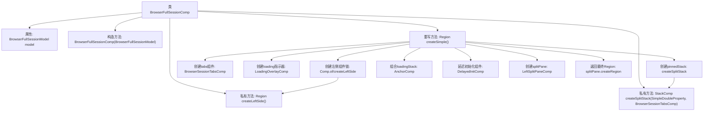

# 基础信息

|      |      |
|------|------|
| 名称 | BrowserFullSessionComp |
| 编码语言 | .java |
| 代码路径 | xpipe/app/src/main/java/io/xpipe/app/browser/BrowserFullSessionComp.java |
| 包名 | io.xpipe.app.browser |
| 依赖项 | ['io.xpipe.app.browser.file.BrowserConnectionListComp', 'io.xpipe.app.browser.file.BrowserConnectionListFilterComp', 'io.xpipe.app.browser.file.BrowserTransferComp', 'io.xpipe.app.comp.Comp', 'io.xpipe.app.comp.SimpleComp', 'io.xpipe.app.comp.base', 'io.xpipe.app.comp.store.StoreEntryWrapper', 'io.xpipe.app.comp.store.StoreViewState', 'io.xpipe.app.core.AppLayoutModel', 'io.xpipe.app.core.window.AppMainWindow', 'io.xpipe.app.ext.ShellStore', 'io.xpipe.app.util.BindingsHelper', 'io.xpipe.app.util.PlatformThread', 'io.xpipe.app.util.ThreadHelper', 'javafx.application.Platform', 'javafx.beans.binding.Bindings', 'javafx.beans.property.BooleanProperty', 'javafx.beans.property.SimpleDoubleProperty', 'javafx.beans.property.SimpleObjectProperty', 'javafx.beans.property.SimpleStringProperty', 'javafx.geometry.Insets', 'javafx.scene.layout.AnchorPane', 'javafx.scene.layout.Region', 'javafx.scene.shape.Rectangle', 'java.util.HashMap', 'java.util.List', 'java.util.function.BiConsumer', 'java.util.function.Predicate'] |
| 概述说明 | 浏览器会话组件，包含左右分屏、标签页和加载指示器。 |

# 说明

BrowserFullSessionComp是一个基于SimpleComp的组件，用于构建浏览器会话界面。它包含左侧连接列表和右侧标签页区域，通过分割面板管理布局。左侧区域包含可过滤的连接列表和本地传输状态组件，右侧区域通过BrowserSessionTabsComp管理多个标签页，并支持动态调整宽度。组件还包含加载指示器和延迟初始化逻辑，确保界面响应性和布局持久化。整体设计注重交互细节，如边界处理、视图顺序和裁剪效果。

# 类列表 Class Summary

| 名称   | 类型  | 说明 |
|-------|------|-------------|
| BrowserFullSessionComp | class | 浏览器会话组件，包含左右分屏、标签页、加载指示器和书签列表功能。 |

## 类 BrowserFullSessionComp

|      |      |
|------|------|
| 访问范围 | public |
| 类型 | class |
| 名称 | BrowserFullSessionComp |
| 说明 | 浏览器会话组件，包含左右分屏、标签页、加载指示器和书签列表功能。 |

### UML类图

```mermaid
classDiagram
    class BrowserFullSessionComp {
        -BrowserFullSessionModel model
        +BrowserFullSessionComp(BrowserFullSessionModel model)
        +Region createSimple()
        -Region createLeftSide()
        -StackComp createSplitStack(SimpleDoubleProperty rightSplit, BrowserSessionTabsComp tabs)
    }

    class BrowserFullSessionModel {
        <<Interface>>
        +ObservableList~BrowserSessionTab~ getAllTabs()
        +ObjectProperty~BrowserSessionTab~ getEffectiveRightTab()
        +ObjectProperty~Boolean~ getBusy()
        +ObservableList~StoreEntryWrapper~ getSessionEntries()
        +ObjectProperty~BrowserSessionTab~ getSelectedEntry()
        +TransferStageModel getLocalTransfersStage()
    }

    class BrowserSessionTabsComp {
        +DoubleProperty getHeaderHeight()
    }

    class LoadingOverlayComp {
        <<Interface>>
        +static LoadingOverlayComp noProgress(Comp empty, ObjectProperty~Boolean~ busy)
    }

    class LeftSplitPaneComp {
        +withInitialWidth(double width) LeftSplitPaneComp
        +withOnDividerChange(Consumer~Double~ callback) LeftSplitPaneComp
    }

    class BrowserConnectionListComp {
        +BrowserConnectionListComp(ObjectProperty~StoreEntryWrapper~ selectedEntry, Predicate~StoreEntryWrapper~ applicable, BiConsumer~StoreEntryWrapper, BooleanProperty~ action, ObjectProperty~String~ category, StringProperty filter)
    }

    class BrowserTransferComp {
        +hide(BooleanBinding condition) BrowserTransferComp
        +prefHeight(double height) BrowserTransferComp
        +maxHeight(double height) BrowserTransferComp
    }

    BrowserFullSessionComp --> BrowserFullSessionModel : 依赖
    BrowserFullSessionComp --> BrowserSessionTabsComp : 组合
    BrowserFullSessionComp --> LoadingOverlayComp : 依赖
    BrowserFullSessionComp --> LeftSplitPaneComp : 组合
    BrowserFullSessionComp --> BrowserConnectionListComp : 组合
    BrowserFullSessionComp --> BrowserTransferComp : 组合
    BrowserSessionTabsComp --> BrowserFullSessionModel : 依赖
    BrowserConnectionListComp --> BrowserFullSessionModel : 依赖
```

该代码实现了一个浏览器会话管理组件，主要包含左侧连接列表和右侧标签页区域的分割布局。BrowserFullSessionComp作为核心类，通过组合模式管理多个子组件：BrowserSessionTabsComp处理标签页头部，BrowserConnectionListComp显示可用的连接列表，BrowserTransferComp展示传输状态。模型层BrowserFullSessionModel提供数据支持，包括会话标签、选中项等状态管理。组件间通过属性绑定实现动态布局调整，并处理各种视图状态变化。

### 内部方法调用关系图

这段代码实现了一个浏览器会话界面的复合组件，主要包含左侧连接列表和右侧标签页区域。流程图展示了从BrowserFullSessionComp类开始，通过构造方法初始化模型，然后通过createSimple()方法构建完整界面结构的过程。该方法依次创建左侧面板、标签页组件、加载指示器，并通过SplitPane将左右区域组合，最终返回可显示的Region对象。私有方法createLeftSide()和createSplitStack()分别处理左侧列表和右侧标签页栈的详细构建逻辑。

### 字段列表 Field List

| 名称  | 类型  | 说明 |
|-------|-------|------|
| model | BrowserFullSessionModel | 私有浏览器会话模型对象。 |

### 方法列表 Method List

| 名称  | 类型  | 说明 |
|-------|-------|------|
| createSimple | Region | 创建带左右分栏的浏览器界面，包含标签页、加载指示器和延迟初始化逻辑，支持宽度调整和样式控制。 |
| createLeftSide | Region | 创建左侧区域，包含书签过滤列表和本地下载面板，支持异步操作和动态显示控制。 |
| createSplitStack | StackComp | 创建分屏堆栈组件，管理标签页缓存和宽度调整。 |

