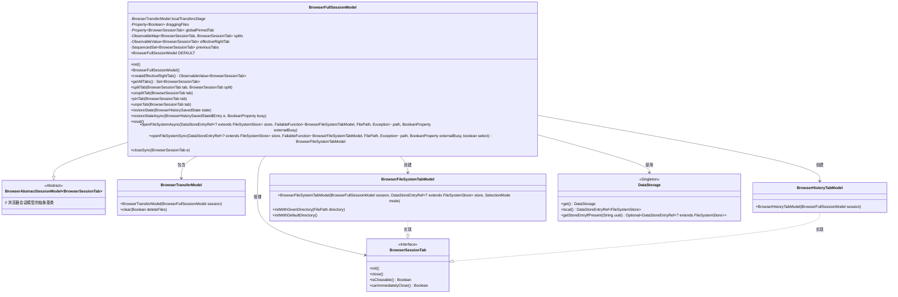
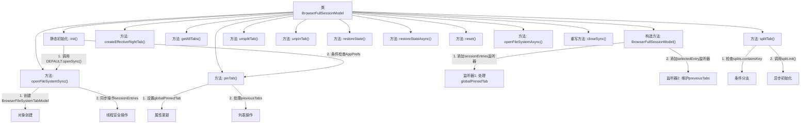

# 基础信息

|      |      |
|------|------|
| 名称 | BrowserFullSessionModel |
| 编码语言 | .java |
| 代码路径 | xpipe/app/src/main/java/io/xpipe/app/browser/BrowserFullSessionModel.java |
| 包名 | io.xpipe.app.browser |
| 依赖项 | ['io.xpipe.app.browser.file.BrowserFileSystemTabModel', 'io.xpipe.app.browser.file.BrowserHistorySavedState', 'io.xpipe.app.browser.file.BrowserHistoryTabModel', 'io.xpipe.app.browser.file.BrowserTransferModel', 'io.xpipe.app.prefs.AppPrefs', 'io.xpipe.app.storage.DataStorage', 'io.xpipe.app.storage.DataStoreEntryRef', 'io.xpipe.app.util.BooleanScope', 'io.xpipe.app.util.ThreadHelper', 'io.xpipe.core.store.FilePath', 'io.xpipe.core.store.FileSystemStore', 'io.xpipe.core.util.FailableFunction', 'javafx.beans.binding.Bindings', 'javafx.beans.property.BooleanProperty', 'javafx.beans.property.Property', 'javafx.beans.property.SimpleBooleanProperty', 'javafx.beans.property.SimpleObjectProperty', 'javafx.beans.value.ObservableValue', 'javafx.collections.FXCollections', 'javafx.collections.ListChangeListener', 'javafx.collections.ObservableMap', 'lombok.Getter', 'lombok.SneakyThrows', 'java.util'] |
| 概述说明 | 浏览器会话管理类，含标签页拆分、固定、恢复状态及文件系统操作功能。 |

# 说明

BrowserFullSessionModel是一个浏览器会话管理类，继承自BrowserAbstractSessionModel，用于管理浏览器标签页、分屏、固定标签等功能。它包含默认实例DEFAULT，初始化时会根据配置打开历史标签页或本地文件系统标签页。类中维护了本地传输模型、文件拖拽状态、全局固定标签、分屏标签映射等属性，并通过createEffectiveRightTab方法动态计算右侧标签页。提供了分屏、取消分屏、固定标签、取消固定标签、恢复状态、重置会话等方法。文件系统标签页的同步和异步打开逻辑封装在openFileSystemSync和openFileSystemAsync中。关闭标签页时会同步处理关联的分屏标签。整体设计注重线程安全和状态管理。

# 类列表 Class Summary

| 名称   | 类型  | 说明 |
|-------|------|-------------|
| BrowserFullSessionModel | class | 浏览器会话管理类，含标签页拆分、固定、恢复状态及文件系统操作功能。 |

## 类 BrowserFullSessionModel

|      |      |
|------|------|
| 访问范围 | @Getter;public |
| 类型 | class |
| 名称 | BrowserFullSessionModel |
| 说明 | 浏览器会话管理类，含标签页拆分、固定、恢复状态及文件系统操作功能。 |

### UML类图

这段类图展示了BrowserFullSessionModel作为浏览器会话管理核心类的结构，它继承自BrowserAbstractSessionModel并管理多种浏览器标签页类型。该类包含标签页分割、固定、状态恢复等核心功能，通过组合模式管理BrowserTransferModel文件传输模块，并与DataStorage单例交互获取存储数据。系统支持多种标签页实现（文件系统标签和历史记录标签），通过复杂的属性绑定和观察者模式实现动态界面更新。

### 内部方法调用关系图

这段代码实现了一个浏览器会话管理模型，主要功能包括：1) 管理浏览器标签页的创建、拆分和关闭；2) 维护全局固定标签和分屏标签状态；3) 处理文件系统操作和状态恢复。通过多个监听器和异步操作实现了线程安全的标签页管理，特别关注了分屏标签、固定标签和历史标签的维护逻辑。核心方法如openFileSystemSync实现了复杂的同步/异步混合操作，同时保证了线程安全性。

### 字段列表 Field List

| 名称  | 类型  | 说明 |
|-------|-------|------|
| draggingFiles = new SimpleBooleanProperty() | Property<Boolean> | 私有布尔属性draggingFiles，使用SimpleBooleanProperty初始化。 |
| DEFAULT = new BrowserFullSessionModel() | BrowserFullSessionModel | 静态常量DEFAULT，类型为BrowserFullSessionModel。 |
| localTransfersStage = new BrowserTransferModel(this) | BrowserTransferModel | 私有浏览器传输模型实例化本地传输阶段。 |
| globalPinnedTab = new SimpleObjectProperty<>() | Property<BrowserSessionTab> | 私有属性，存储浏览器全局固定标签页的会话对象。 |
| splits = FXCollections.observableHashMap() | ObservableMap<BrowserSessionTab, BrowserSessionTab> | 私有可观察映射，存储浏览器会话标签的分割关系。 |
| effectiveRightTab = createEffectiveRightTab() | ObservableValue<BrowserSessionTab> | 私有观察值effectiveRightTab通过createEffectiveRightTab方法创建。 |
| previousTabs = new LinkedHashSet<>() | SequencedSet<BrowserSessionTab> | 私有最终有序集合previousTabs，存储BrowserSessionTab类型元素。 |

### 方法列表 Method List

| 名称  | 类型  | 说明 |
|-------|-------|------|
| restoreStateAsync | void | 异步恢复浏览器历史状态，根据UUID获取存储条目并打开文件系统。 |
| getAllTabs | Set<BrowserSessionTab> | 获取所有浏览器标签页集合，包括会话标签、分页标签和全局固定标签。 |
| openFileSystemAsync | void | 异步打开文件系统，检查存储非空后调用同步方法。 |
| init | void | 初始化方法：默认打开浏览器历史标签，若配置为启动时固定本地机器，则打开并固定本地文件系统标签。 |
| pinTab | void | 方法pinTab用于固定标签页，若标签非当前固定页则更新，并调整选中项至前一个可关闭标签页。 |
| createEffectiveRightTab | ObservableValue<BrowserSessionTab> | 创建绑定对象，根据选中项和全局固定标签返回有效标签。 |
| splitTab | void | 拆分标签页方法：检查并存储标签页，异步初始化新标签页。 |
| reset | void | 重置浏览器会话：清除全局固定标签，异步关闭可立即关闭的连接，延迟1秒后清空本地传输文件。 |
| closeSync | void | 关闭浏览器标签页时同步处理分割视图并移除历史记录。 |
| openFileSystemSync | BrowserFileSystemTabModel | 同步打开文件系统标签页，初始化模型并处理路径选择，返回模型实例。 |
| restoreState | void | 异步恢复浏览器历史记录状态，逐个处理条目避免并行负载。 |
| unpinTab | void | 取消固定标签页的异步操作。 |
| unsplitTab | void | 合并标签页并异步关闭原标签页。 |

