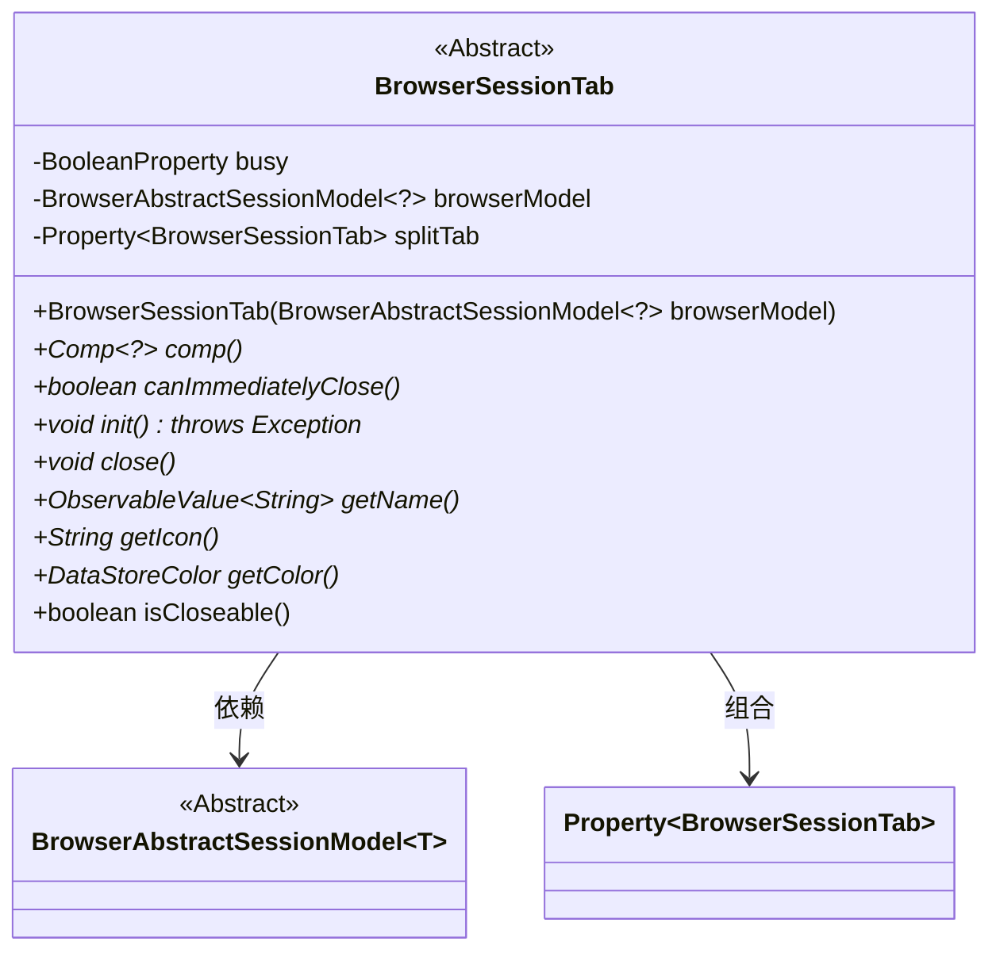

# 基础信息

|      |      |
|------|------|
| 名称 | BrowserSessionTab |
| 编码语言 | .java |
| 代码路径 | xpipe/app/src/main/java/io/xpipe/app/browser/BrowserSessionTab.java |
| 包名 | io.xpipe.app.browser |
| 依赖项 | ['io.xpipe.app.comp.Comp', 'io.xpipe.app.storage.DataStoreColor', 'javafx.beans.property.BooleanProperty', 'javafx.beans.property.Property', 'javafx.beans.property.SimpleBooleanProperty', 'javafx.beans.property.SimpleObjectProperty', 'javafx.beans.value.ObservableValue', 'lombok.Getter'] |
| 概述说明 | 抽象类定义浏览器会话标签页，含状态属性、模型引用及标签页拆分功能，提供组件、关闭、初始化等抽象方法。 |

# 说明

这是一个名为BrowserSessionTab的抽象类，用于管理浏览器会话标签页。它包含多个关键属性和方法：busy表示忙碌状态，browserModel存储浏览器会话模型，splitTab处理标签页分割。构造函数接收浏览器会话模型。抽象方法包括创建组件comp()、判断能否立即关闭canImmediatelyClose()、初始化init()、关闭close()、获取名称getName()、图标getIcon()和颜色getColor()。默认方法isCloseable()返回true表示可关闭。该类提供了浏览器标签页的基础框架，具体实现由子类完成。

# 类列表 Class Summary

| 名称   | 类型  | 说明 |
|-------|------|-------------|
| BrowserSessionTab | class | 抽象类BrowserSessionTab定义浏览器会话标签页，包含忙碌状态、浏览器模型和拆分标签页属性，提供组件、关闭、初始化等方法及名称、图标、颜色等抽象获取接口。 |

## 类 BrowserSessionTab

|      |      |
|------|------|
| 访问范围 | @Getter;public abstract |
| 类型 | class |
| 名称 | BrowserSessionTab |
| 说明 | 抽象类BrowserSessionTab定义浏览器会话标签页，包含忙碌状态、浏览器模型和拆分标签页属性，提供组件、关闭、初始化等方法及名称、图标、颜色等抽象获取接口。 |

### UML类图

这段代码展示了一个抽象类`BrowserSessionTab`，它定义了浏览器会话标签页的基础结构和行为。该类包含核心属性如忙碌状态(busy)、关联的浏览器模型(browserModel)和分割标签页(splitTab)，并声明了多个抽象方法如组件创建(comp)、初始化(init)和关闭(close)等操作。通过泛型参数`?`表示浏览器模型可接受任意类型，同时使用属性对象(Property)管理状态。该类与`BrowserAbstractSessionModel`存在依赖关系，体现了标签页与浏览器模型的关联性。

### 内部方法调用关系图

```mermaid
graph TD
    A["抽象类BrowserSessionTab"]
    B["属性: BooleanProperty busy"]
    C["属性: BrowserAbstractSessionModel<?> browserModel"]
    D["属性: Property<BrowserSessionTab> splitTab"]
    E["构造方法: BrowserSessionTab(BrowserAbstractSessionModel<?>)"]
    F["抽象方法: Comp<?> comp()"]
    G["抽象方法: boolean canImmediatelyClose()"]
    H["抽象方法: void init() throws Exception"]
    I["抽象方法: void close()"]
    J["抽象方法: ObservableValue<String> getName()"]
    K["抽象方法: String getIcon()"]
    L["抽象方法: DataStoreColor getColor()"]
    M["具体方法: boolean isCloseable()"]

    A --> B
    A --> C
    A --> D
    A --> E
    A --> F
    A --> G
    A --> H
    A --> I
    A --> J
    A --> K
    A --> L
    A --> M
```

该流程图展示了BrowserSessionTab抽象类的完整结构，包含3个核心属性、1个构造方法和8个方法声明（其中7个为抽象方法）。类通过browserModel属性与BrowserAbstractSessionModel关联，splitTab属性实现了自引用关系。所有抽象方法需要子类实现，仅isCloseable()提供了默认实现。结构体现了浏览器会话标签页的基础行为规范，包括组件获取、生命周期管理和UI相关属性等功能。

### 字段列表 Field List

| 名称  | 类型  | 说明 |
|-------|-------|------|
| busy = new SimpleBooleanProperty() | BooleanProperty | 保护型布尔属性busy，初始化为简单布尔属性。 |
| browserModel | BrowserAbstractSessionModel<?> | 受保护的最终浏览器会话模型对象。 |
| splitTab = new SimpleObjectProperty<>() | Property<BrowserSessionTab> | 保护属性splitTab，类型为Property<BrowserSessionTab>，初始化为SimpleObjectProperty。 |

### 方法列表 Method List

| 名称  | 类型  | 说明 |
|-------|-------|------|
| close | void | 抽象方法close，无参数无返回值。 |
| getName | ObservableValue<String> | 抽象方法返回可观察字符串值。 |
| canImmediatelyClose | boolean | 抽象方法，检查是否可立即关闭。 |
| getColor | DataStoreColor | 获取数据存储颜色抽象方法 |
| isCloseable | boolean | 方法返回true表示可关闭。 |
| getIcon | String | 获取图标的抽象方法。 |
| comp | Comp<?> | 抽象组件方法返回泛型比较对象 |
| init | void | 抽象方法init，可能抛出异常。 |

