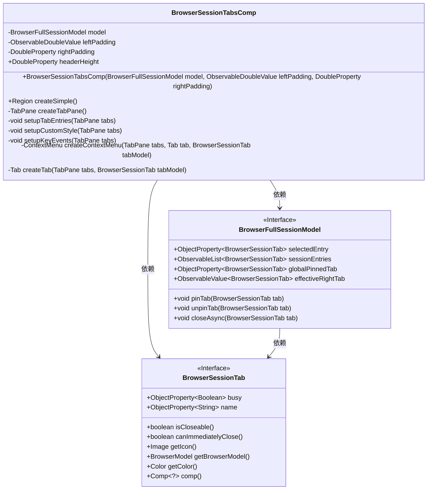
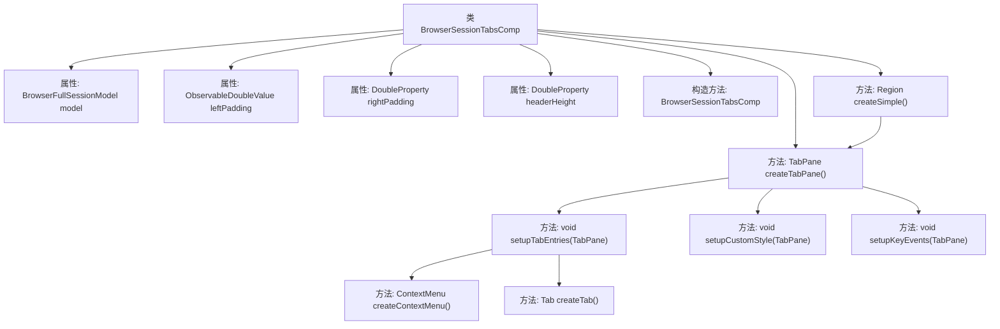

# 基础信息

|      |      |
|------|------|
| 名称 | BrowserSessionTabsComp |
| 编码语言 | .java |
| 代码路径 | xpipe/app/src/main/java/io/xpipe/app/browser/BrowserSessionTabsComp.java |
| 包名 | io.xpipe.app.browser |
| 依赖项 | ['io.xpipe.app.comp.Comp', 'io.xpipe.app.comp.SimpleComp', 'io.xpipe.app.comp.base.PrettyImageHelper', 'io.xpipe.app.core.App', 'io.xpipe.app.core.AppI18n', 'io.xpipe.app.prefs.AppPrefs', 'io.xpipe.app.util.BooleanScope', 'io.xpipe.app.util.ContextMenuHelper', 'io.xpipe.app.util.LabelGraphic', 'io.xpipe.app.util.PlatformThread', 'javafx.application.Platform', 'javafx.beans.binding.Bindings', 'javafx.beans.property.DoubleProperty', 'javafx.beans.property.SimpleBooleanProperty', 'javafx.beans.property.SimpleDoubleProperty', 'javafx.beans.value.ObservableDoubleValue', 'javafx.collections.ListChangeListener', 'javafx.css.PseudoClass', 'javafx.geometry.Insets', 'javafx.geometry.Pos', 'javafx.scene.control', 'javafx.scene.control.skin.TabPaneSkin', 'javafx.scene.input', 'javafx.scene.layout.Region', 'javafx.scene.layout.StackPane', 'atlantafx.base.controls.RingProgressIndicator', 'atlantafx.base.theme.Styles', 'lombok.Getter', 'java.util', 'atlantafx.base.theme.Styles.DENSE', 'atlantafx.base.theme.Styles.toggleStyleClass', 'javafx.scene.control.TabPane.TabClosingPolicy.ALL_TABS'] |
| 概述说明 | 浏览器标签页组件，支持拖拽排序、快捷键操作和自定义样式。 |

# 说明

BrowserSessionTabsComp是一个用于管理浏览器会话标签页的JavaFX组件。它继承自SimpleComp，包含BrowserFullSessionModel模型和左右边距属性。主要功能包括创建可拖拽、可重排序的标签页面板，支持自定义样式、键盘快捷键操作（如Ctrl+W关闭标签）、上下文菜单（含固定/关闭标签选项），以及标签页状态同步。组件会动态调整布局边距，处理标签选择与模型同步，并为每个标签添加进度指示器和图标。标签内容使用SplitPane布局，右侧留白区域宽度会动态绑定到rightPadding属性。

# 类列表 Class Summary

| 名称   | 类型  | 说明 |
|-------|------|-------------|
| BrowserSessionTabsComp | class | 浏览器标签页组件，管理标签页创建、样式和交互逻辑。 |

## 类 BrowserSessionTabsComp

|      |      |
|------|------|
| 访问范围 | public |
| 类型 | class |
| 名称 | BrowserSessionTabsComp |
| 说明 | 浏览器标签页组件，管理标签页创建、样式和交互逻辑。 |

### UML类图

这段代码实现了一个浏览器标签页管理组件BrowserSessionTabsComp，它继承自SimpleComp，主要功能是创建和管理浏览器会话标签页。该组件通过BrowserFullSessionModel获取标签页数据，使用TabPane展示标签页，并处理标签页的创建、选择、关闭等交互逻辑。代码中包含了丰富的功能如：响应式布局调整、键盘快捷键处理、右键菜单、标签页拖拽排序等。组件与BrowserFullSessionModel和BrowserSessionTab接口紧密协作，实现了模型与视图的双向绑定。

### 内部方法调用关系图

流程图描述：该流程图展示了BrowserSessionTabsComp类的核心结构和调用关系。类包含5个主要属性和7个关键方法，其中createSimple()作为入口方法会调用createTabPane()创建标签页容器，后者又依次调用setupTabEntries()初始化标签页、setupCustomStyle()设置样式和setupKeyEvents()处理键盘事件。setupTabEntries()内部通过createTab()创建单个标签页，并调用createContextMenu()生成右键菜单。整个流程体现了浏览器标签页组件的分层构建逻辑。

### 字段列表 Field List

| 名称  | 类型  | 说明 |
|-------|-------|------|
| model | BrowserFullSessionModel | 私有浏览器会话模型对象。 |
| rightPadding | DoubleProperty | 私有双精度属性右内边距 |
| headerHeight | DoubleProperty | 双精度属性headerHeight的私有final getter方法 |
| leftPadding | ObservableDoubleValue | 私有不可变左内边距观察值 |

### 方法列表 Method List

| 名称  | 类型  | 说明 |
|-------|-------|------|
| setupCustomStyle | void | 设置TabPane自定义样式，调整布局和边距绑定窗口宽度。 |
| createSimple | Region | 创建带标签页和顶部背景的堆栈面板，绑定高度和宽度属性。 |
| createTabPane | TabPane | 创建TabPane，设置拖拽、宽度、关闭策略及样式，同步初始化标签页和键盘事件。 |
| setupKeyEvents | void | 为TabPane设置快捷键：关闭当前/所有标签、切换标签页、功能键导航。 |
| setupTabEntries | void | 设置标签页：恢复状态、处理选择和关闭事件，同步模型与UI。 |
| createContextMenu | ContextMenu | 创建标签页右键菜单，含固定、选择、关闭等功能。 |
| createTab | Tab | 创建标签页方法：设置菜单、图标、文本绑定、布局调整及样式处理。 |

