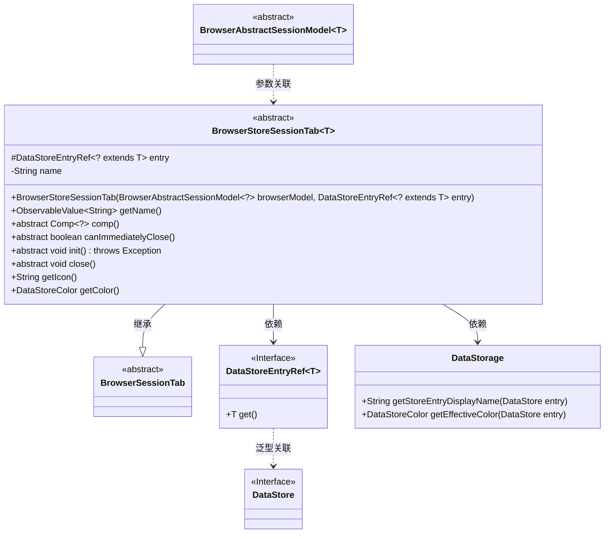
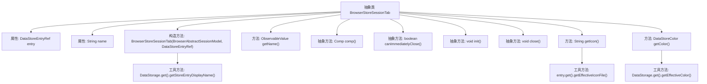

# 基础信息

|      |      |
|------|------|
| 名称 | BrowserStoreSessionTab |
| 编码语言 | .java |
| 代码路径 | xpipe/app/src/main/java/io/xpipe/app/browser/BrowserStoreSessionTab.java |
| 包名 | io.xpipe.app.browser |
| 依赖项 | ['io.xpipe.app.comp.Comp', 'io.xpipe.app.storage.DataStorage', 'io.xpipe.app.storage.DataStoreColor', 'io.xpipe.app.storage.DataStoreEntryRef', 'io.xpipe.core.store.DataStore', 'javafx.beans.property.SimpleStringProperty', 'javafx.beans.value.ObservableValue', 'lombok.Getter'] |
| 概述说明 | 抽象类BrowserStoreSessionTab扩展BrowserSessionTab，含数据存储引用、名称及图标颜色方法，需实现组件、关闭等抽象方法。 |

# 说明

这是一个名为BrowserStoreSessionTab的抽象类，继承自BrowserSessionTab，用于管理浏览器会话标签页。该类使用泛型T限定为DataStore的子类。主要包含以下功能：通过构造函数接收浏览器模型和存储条目引用，初始化名称属性；提供获取名称、图标和颜色的方法；定义抽象方法用于创建组件、判断是否可立即关闭、初始化和关闭操作。关键属性包括受保护的存储条目引用entry和私有的名称name。

# 类列表 Class Summary

| 名称   | 类型  | 说明 |
|-------|------|-------------|
| BrowserStoreSessionTab | class | 抽象类BrowserStoreSessionTab扩展BrowserSessionTab，含entry和name属性，提供名称、图标、颜色及组件操作。 |

## 类 BrowserStoreSessionTab

|      |      |
|------|------|
| 访问范围 | @Getter;public abstract |
| 类型 | class |
| 名称 | BrowserStoreSessionTab |
| 说明 | 抽象类BrowserStoreSessionTab扩展BrowserSessionTab，含entry和name属性，提供名称、图标、颜色及组件操作。 |

### UML类图

类图描述：
该图展示了一个抽象类BrowserStoreSessionTab的继承关系和依赖关系，该类继承自BrowserSessionTab，并使用了泛型T扩展DataStore接口。它包含对DataStoreEntryRef接口和DataStorage工具类的依赖，其中DataStoreEntryRef通过泛型与DataStore关联。BrowserStoreSessionTab定义了多个抽象方法如comp()、init()等，以及具体实现的方法如getName()、getIcon()等，用于管理浏览器会话标签页的相关操作和数据。

### 内部方法调用关系图

该流程图展示了BrowserStoreSessionTab抽象类的完整结构，包含2个protected/private属性、1个构造方法和7个成员方法（其中4个为抽象方法）。关键流程包括：构造时通过DataStorage工具类初始化name属性；getName()方法返回包装成Observable的name值；getIcon()和getColor()方法分别通过entry和DataStorage工具类获取数据。抽象方法comp()、canImmediatelyClose()、init()和close()需要由子类实现，体现了模板方法设计模式。所有方法调用关系清晰呈现，特别标注了与外部工具类的交互过程。

### 字段列表 Field List

| 名称  | 类型  | 说明 |
|-------|-------|------|
| name | String | 私有字符串变量name |
| entry | DataStoreEntryRef<? extends T> | 受保护的最终数据存储条目引用，泛型T或其子类。 |

### 方法列表 Method List

| 名称  | 类型  | 说明 |
|-------|-------|------|
| init | void | 抽象方法init()，可能抛出异常。 |
| getIcon | String | 重写getIcon方法，返回entry的有效图标文件路径。 |
| getName | ObservableValue<String> | 重写getName方法，返回字符串属性ObservableValue。 |
| close | void | 抽象关闭方法，无返回值。 |
| canImmediatelyClose | boolean | 抽象方法：检查是否可立即关闭。 |
| comp | Comp<?> | 抽象方法comp()返回泛型比较对象。 |
| getColor | DataStoreColor | 重写getColor方法，返回DataStorage中entry的有效颜色。 |

