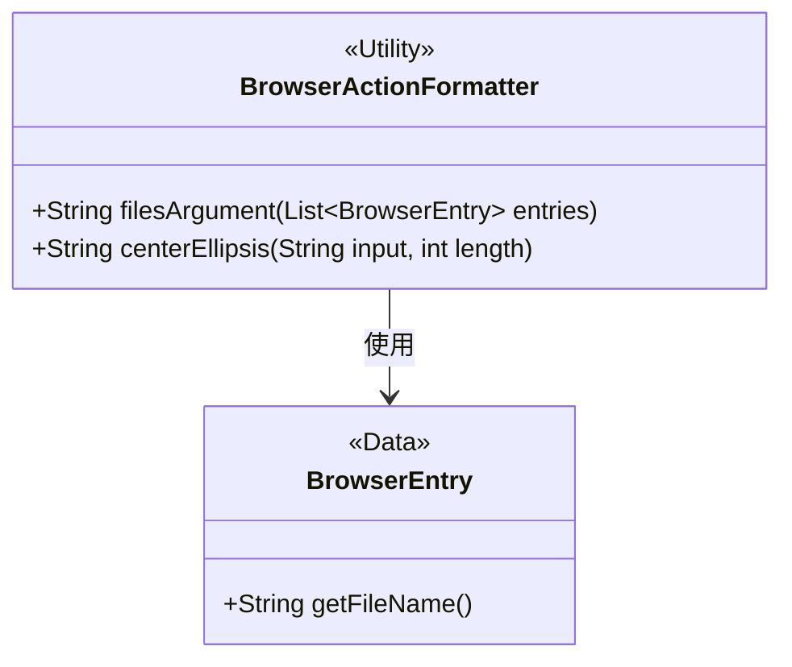
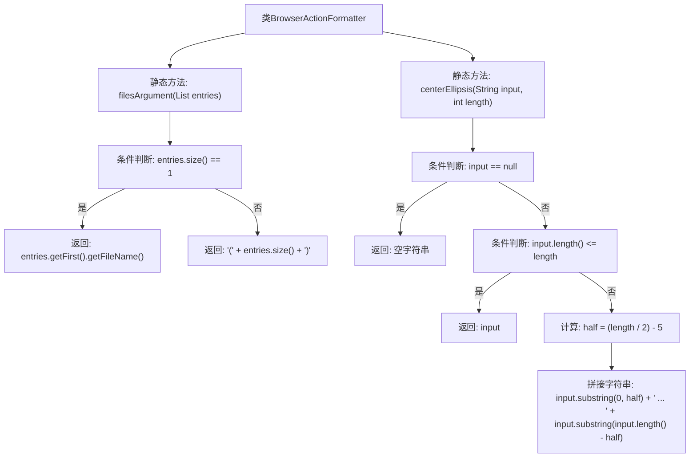

# 基础信息

|      |      |
|------|------|
| 名称 | BrowserActionFormatter |
| 编码语言 | .java |
| 代码路径 | xpipe/app/src/main/java/io/xpipe/app/browser/action/BrowserActionFormatter.java |
| 包名 | io.xpipe.app.browser.action |
| 依赖项 | ['io.xpipe.app.browser.file.BrowserEntry', 'java.util.List'] |
| 概述说明 | BrowserActionFormatter类提供两个方法：filesArgument处理文件列表显示，centerEllipsis截断字符串并添加省略号。 |

# 说明

BrowserActionFormatter类包含两个静态方法。filesArgument方法接收BrowserEntry列表参数，当列表仅含一个元素时返回其文件名，否则返回包含元素数量的括号字符串。centerEllipsis方法处理字符串截断，若输入为null返回空字符串，长度不足时返回原字符串，否则将字符串从中间截断并在两端保留部分字符，中间用省略号连接。两个方法均用于格式化浏览器相关操作的输出显示。

# 类列表 Class Summary

| 名称   | 类型  | 说明 |
|-------|------|-------------|
| BrowserActionFormatter | class | BrowserActionFormatter类提供两个方法：filesArgument处理文件名显示，centerEllipsis截断字符串并添加省略号。 |

## 类 BrowserActionFormatter

|      |      |
|------|------|
| 访问范围 | public |
| 类型 | class |
| 名称 | BrowserActionFormatter |
| 说明 | BrowserActionFormatter类提供两个方法：filesArgument处理文件名显示，centerEllipsis截断字符串并添加省略号。 |

### UML类图

类图描述：
BrowserActionFormatter是一个工具类，提供两个静态方法：filesArgument处理浏览器条目列表，当只有一个条目时返回文件名，否则返回条目数量；centerEllipsis用于字符串截断，当超过指定长度时在中间显示省略号。该类依赖BrowserEntry类获取文件名信息，BrowserEntry是一个简单的数据类。这两个类共同完成浏览器相关操作的格式化功能。

### 内部方法调用关系图

这段代码流程图展示了BrowserActionFormatter类的两个核心静态方法。filesArgument方法根据文件列表长度返回单个文件名或数量标记，包含1个条件分支。centerEllipsis方法实现字符串中间截断功能，通过3层条件判断处理null值、短字符串和长字符串三种情况，对长字符串采用首尾各截取半长并添加省略号的策略。两个方法均采用防御性编程处理边界情况，体现了对输入参数的严格校验。

### 字段列表 Field List

| 名称  | 类型  | 说明 |
|-------|-------|------|

### 方法列表 Method List

| 名称  | 类型  | 说明 |
|-------|-------|------|
| centerEllipsis | String | 字符串居中省略，超长时显示前后部分加省略号。 |
| filesArgument | String | 静态方法根据条目数量返回单个文件名或条目数。 |

