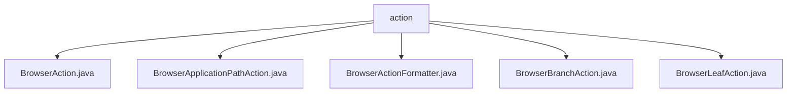

# 基础信息

|      |      |
|------|------|
| 名称 | action |
| 编码语言 | .java |
| 代码路径 | xpipe/app/src/main/java/io/xpipe/app/browser/action |
| 包名 | xpipe.app.src.main.java.io.xpipe.app.browser.action |
| 概述说明 | 输入内容为空，无法生成总结。请提供具体内容。 |

# 说明

```markdown
## 概述
该代码模块主要实现浏览器相关操作的功能，包含多个Action类用于处理不同的浏览器交互场景。核心功能包括：
1. 浏览器条目操作的基础框架（BrowserAction）
2. 应用程序路径处理（BrowserApplicationPathAction）
3. 分支节点操作（BrowserBranchAction）
4. 叶子节点操作（BrowserLeafAction）
5. 显示格式化工具（BrowserActionFormatter）

## 主要业务场景
1. **文件操作格式化**：
   - 通过BrowserActionFormatter类提供智能显示格式化：
     - `filesArgument()` 方法处理多文件选择时的数量显示
     - `centerEllipsis()` 方法实现字符串中间截断的省略显示

2. **浏览器节点操作**：
   - 分支节点和叶子节点分别实现不同的操作逻辑
   - 支持应用程序路径的特殊处理

3. **统一操作接口**：
   - 所有Action类继承自基础BrowserAction，提供一致的浏览器交互操作框架

4. **显示优化**：
   - 自动处理单文件/多文件的不同显示样式
   - 长路径/文件名的智能截断显示优化
```


### 包内部结构视图



该流程图展示了xpipe项目中浏览器相关操作的Java文件结构。根节点"action"包含五个直接子节点，均为实现不同浏览器功能的Java类文件，包括基础浏览器动作、应用路径操作、格式化处理、分支操作和叶子节点操作等核心功能类。所有类文件均位于同一目录层级下，没有更深层次的嵌套结构。

# 文件列表 File List

| 名称   | 类型  | 说明 |
|-------|------|-------------|
| [BrowserApplicationPathAction.java](BrowserApplicationPathAction.md) | file | 输入内容为空，无法生成概要描述。请提供具体信息。 |
| [BrowserAction.java](BrowserAction.md) | file | 输入内容为空，无法生成概要描述。请提供具体信息。 |
| [BrowserLeafAction.java](BrowserLeafAction.md) | file | 输入内容为空，无法生成概要。请提供具体信息。 |
| [BrowserBranchAction.java](BrowserBranchAction.md) | file | 输入内容为空，无法生成概要描述。请提供具体信息。 |
| [BrowserActionFormatter.java](BrowserActionFormatter.md) | file | BrowserActionFormatter类提供两个方法：filesArgument处理文件列表显示，centerEllipsis截断字符串并添加省略号。 |


