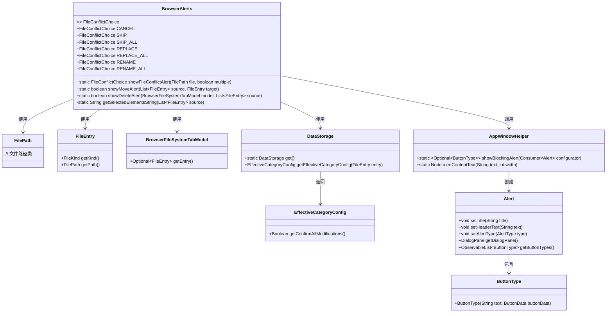
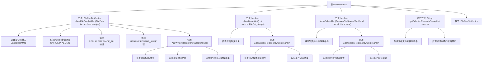

# 基础信息

|      |      |
|------|------|
| 名称 | BrowserAlerts |
| 编码语言 | .java |
| 代码路径 | xpipe/app/src/main/java/io/xpipe/app/browser/file/BrowserAlerts.java |
| 包名 | io.xpipe.app.browser.file |
| 依赖项 | ['io.xpipe.app.core.AppI18n', 'io.xpipe.app.core.window.AppWindowHelper', 'io.xpipe.app.storage.DataStorage', 'io.xpipe.core.store.FileEntry', 'io.xpipe.core.store.FileKind', 'io.xpipe.core.store.FilePath', 'javafx.scene.control.Alert', 'javafx.scene.control.ButtonBar', 'javafx.scene.control.ButtonType', 'java.util.LinkedHashMap', 'java.util.List', 'java.util.stream.Collectors'] |
| 概述说明 | 代码实现文件冲突、移动和删除操作的弹窗提示功能。 |

# 说明

BrowserAlerts类提供文件操作冲突和确认的弹窗功能。showFileConflictAlert方法处理文件冲突，根据是否多文件提供取消、跳过、替换、重命名等选项，并设置弹窗标题、内容和宽度。showMoveAlert方法在移动包含目录的文件时显示确认弹窗，包含目标路径和文件列表。showDeleteAlert方法在删除文件前确认，若配置不要求确认且无目录则直接返回true。getSelectedElementsString方法生成文件列表字符串，最多显示10项。FileConflictChoice枚举定义了冲突处理选项。

# 类列表 Class Summary

| 名称   | 类型  | 说明 |
|-------|------|-------------|
| BrowserAlerts | class | 显示文件冲突、移动和删除的对话框，提供多种操作选项。 |

## 类 BrowserAlerts

|      |      |
|------|------|
| 访问范围 | public |
| 类型 | class |
| 名称 | BrowserAlerts |
| 说明 | 显示文件冲突、移动和删除的对话框，提供多种操作选项。 |

### UML类图

类图描述：该图展示了BrowserAlerts工具类的结构及其关联关系。核心是提供三种静态弹窗方法：文件冲突提示(showFileConflictAlert)、移动确认(showMoveAlert)和删除确认(showDeleteAlert)。它依赖FilePath、FileEntry等数据模型，通过AppWindowHelper调用JavaFX的Alert组件实现交互。枚举FileConflictChoice定义了7种冲突处理选项，私有方法getSelectedElementsString用于生成文件列表摘要。整体采用分层设计，业务逻辑与UI展示分离，符合单一职责原则。

### 内部方法调用关系图

该流程图展示了BrowserAlerts类的核心结构和交互逻辑。类包含三个主要弹窗方法：文件冲突处理、移动确认和删除确认，均通过AppWindowHelper实现阻塞式弹窗。文件冲突处理根据multiple参数动态生成不同按钮组合，移动/删除操作会先检查条件再弹窗。私有方法getSelectedElementsString用于格式化文件列表显示，枚举类型定义了冲突处理选项。所有弹窗最终都返回用户操作结果，流程体现了清晰的职责分离和条件判断逻辑。

### 字段列表 Field List

| 名称  | 类型  | 说明 |
|-------|-------|------|

### 方法列表 Method List

| 名称  | 类型  | 说明 |
|-------|-------|------|
| showFileConflictAlert | FileConflictChoice | 显示文件冲突对话框，提供取消、跳过、替换、重命名等选项，支持批量操作。 |
| showMoveAlert | boolean | 检查源文件是否含目录，无则返回真；有则弹窗确认移动操作，根据用户选择返回布尔值。 |
| showDeleteAlert | boolean | 静态方法检查是否显示删除确认弹窗，根据配置和文件类型决定，默认返回用户确认结果。 |
| getSelectedElementsString | String | 静态方法生成选中文件列表字符串，最多显示10项，超量提示剩余数量。 |

