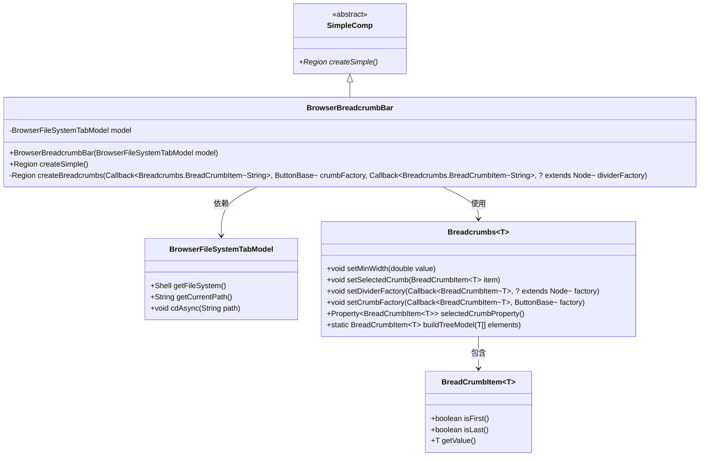
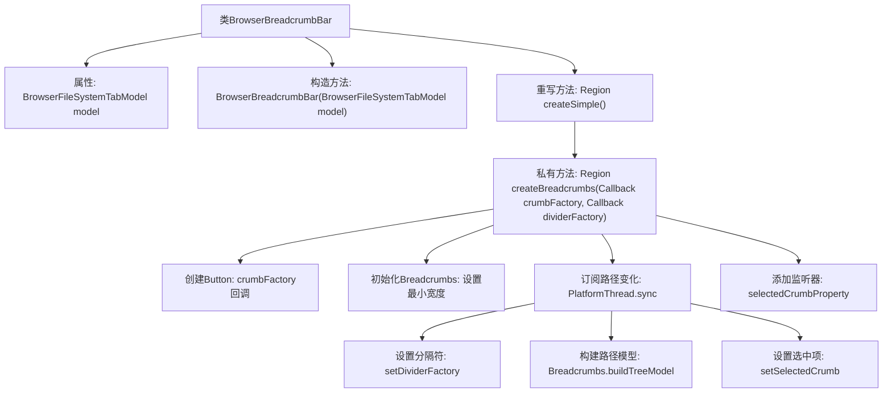

# 基础信息

|      |      |
|------|------|
| 名称 | BrowserBreadcrumbBar |
| 编码语言 | .java |
| 代码路径 | xpipe/app/src/main/java/io/xpipe/app/browser/file/BrowserBreadcrumbBar.java |
| 包名 | io.xpipe.app.browser.file |
| 依赖项 | ['io.xpipe.app.comp.SimpleComp', 'io.xpipe.app.util.PlatformThread', 'io.xpipe.core.store.FileNames', 'javafx.scene.Node', 'javafx.scene.control.Button', 'javafx.scene.control.ButtonBase', 'javafx.scene.control.Label', 'javafx.scene.layout.Region', 'javafx.util.Callback', 'atlantafx.base.controls.Breadcrumbs', 'java.util.ArrayList'] |
| 概述说明 | 浏览器面包屑导航栏类，根据文件路径生成按钮并处理导航事件。 |

# 说明

BrowserBreadcrumbBar是一个继承自SimpleComp的类，用于构建文件系统导航面包屑栏。它依赖BrowserFileSystemTabModel获取当前路径信息。核心方法createSimple通过crumbFactory创建按钮形式的路径节点，处理根路径显示为"/"。createBreadcrumbs方法动态生成面包屑导航：监听路径变化，根据操作系统类型设置路径分隔符，处理路径层级结构，并通过Breadcrumbs类构建树形模型。当用户点击面包屑时，会触发异步路径切换。该类封装了路径显示与交互逻辑，支持自定义节点和分隔符样式。

# 类列表 Class Summary

| 名称   | 类型  | 说明 |
|-------|------|-------------|
| BrowserBreadcrumbBar | class | 浏览器面包屑导航栏类，根据文件路径生成导航按钮，支持路径切换。 |

## 类 BrowserBreadcrumbBar

|      |      |
|------|------|
| 访问范围 | public |
| 类型 | class |
| 名称 | BrowserBreadcrumbBar |
| 说明 | 浏览器面包屑导航栏类，根据文件路径生成导航按钮，支持路径切换。 |

### UML类图

这段代码描述了一个浏览器面包屑导航栏的实现，BrowserBreadcrumbBar继承自抽象类SimpleComp，通过BrowserFileSystemTabModel获取文件系统路径信息，并使用Breadcrumbs组件构建可视化导航。核心功能包括动态生成路径按钮、处理路径分隔符、响应路径切换事件等，实现了文件系统路径的可视化导航和交互操作。类图中展示了组件间的依赖关系，包括模型交互、UI构建和事件处理等关键环节。

### 内部方法调用关系图

这段流程图描述了BrowserBreadcrumbBar类的核心结构和功能流程。该类继承自SimpleComp，主要功能是通过面包屑导航显示文件系统路径。关键流程包括：1) 构造时注入Tab模型；2) createSimple()方法创建基础UI组件；3) createBreadcrumbs私有方法处理路径逻辑，包括动态生成按钮、处理路径分隔符、构建树形模型和响应路径变更事件。整个过程采用响应式编程，通过监听模型变化实时更新UI状态。

### 字段列表 Field List

| 名称  | 类型  | 说明 |
|-------|-------|------|
| model | BrowserFileSystemTabModel | 私有浏览器文件系统标签模型实例。 |

### 方法列表 Method List

| 名称  | 类型  | 说明 |
|-------|-------|------|
| createSimple | Region | 重写createSimple方法，生成面包屑导航按钮并返回区域。 |
| createBreadcrumbs | Region | 创建面包屑导航，处理路径分隔符和点击事件。 |

